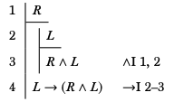
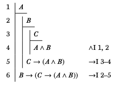
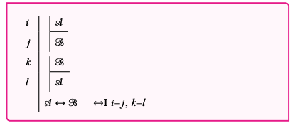
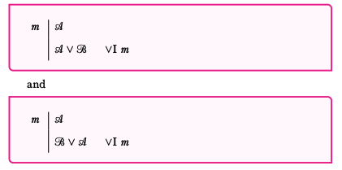
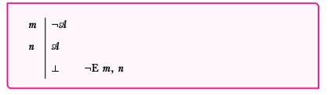
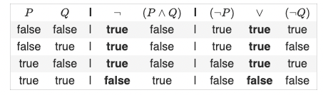
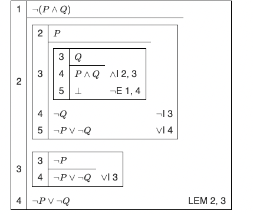
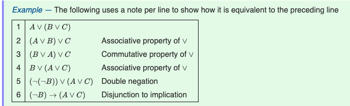
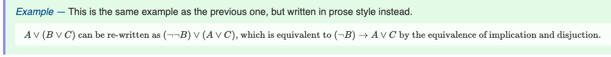

<!-- 
Math for computer science textbook: https://www.cs.virginia.edu/~emo7bf/cs2120/s2023/files/mcs.pdf

Forall x: https://www.cs.virginia.edu/~emo7bf/cs2120/s2023/files/forallx.pdf

forall x solution book: http://forallx.openlogicproject.org/solutions/forallxsol.pdf

cd notes
pandoc -f markdown-implicit_figures -s -o book-notes.pdf book-notes.md

-->

# $\forall_{x} 21.4-24$ and MCS 3.6 and skim $\forall_{x} 25, 26$ and bus example, and practice exercises in $\forall_{x}$ 22, 23 and Spring 2020 Class Examples

## $\forall_{x} 21.4-24

### Quantifiers

The symbol $\forall$ is the __universal quantifier__. So, for example, we could symbolize the sentence "Everyone is happy" with the expression $\forall_{x} H(x)$. The expression $\forall_{x}$ represents that you can pick anyone and put them in _x_, and the subsequent H(_x_) means, of that thing you picked, it is happy. 

The __existential quantifier__, $\exists$, also requires a variable. We can represent the sentence "Someone is angry" as $\exists_{x} A(x)$ - "there is something, x ,such that x is angry." 

More examples of these quantifiers include:

* No one is angry: $\neg \exists_{x} A(x)$
* There is someone who is not happy: $\exists_{x} \neg H(x)$
* Not everyone is happy: $\neg \forall_{x} H(x)$

### Domains

__Domain__ is a collection of things that we are talking about. Quantifiers _range over_ the domain. Additionally, in FOL, the domain must include at least one thing.

* A domain must have _at least_ one member. A name must pick out _exactly_ one member of the domain, but a member of the domain may be picked out by one name, many names, or none at all.

#### Non-referring terms

Each name must pick out exactly one member of the domain. A name cannot refer to more than one thing; it is a _singular_ term. If you are talking about something that isn't in the domain, any sentence/expression is _meaningless_ if it talks about a non-existent thing. 

### Common quantifier phrases

Take these four example sentences:

1. Every coin in my pocket is a quarter 
1. Some coin on the table is a dime 
1. Not all the coins on the table are dimes 
1. None of the coins in my pocket are dimes. 

And take these four statements under the domain "all coins:"

1. P(x) ___x is in my pocket
1. T(x) ___x is on the table
1. Q(x) ___x is a quarter
1. D(x) ___x is a dime

A sentence can be symbolized as $\forall_{x}(F(x) \rightarrow G(x))$ if it can eb paraphrased in English as "every F is G." We can symbolize sentence (1) as $\forall_x (P(x) \rightarrow (Q(x))$. htis is because it is paraphrased as "for any coin, _if_ that coin is in my pocket _then_ it is a quarter." We can symbolize sentence (2) as $\exists_x (T(x) \rightarrow D(x))$

A sentence can be symbolized as $\exists_x (F(x) \land G(x))$ if it can be paraphrased in English as 'some F is G.' Sentence (3) can be paraphrased as "it is not the case that every coin on the table is a dime," so it can be written $\neg \forall_x (T(x) \rightarrow D(x))$ or $\exists_x(T(x) \land \neg D(x))$ Finally, Sentence (4) can be paraphrased as "it is not the case that there is some dime in my pocket" and symbolized as $\neg \exists_x (P(x) \land D(X))$. Note how this can also be written as $\forall_x (P(x) \rightarrow \neg D(x))$. 

### Empty Predicates

A predicate that applies to nothing in the domain is called an __empty predicate__. Suppose we wanted to symbolize the two sentences in the domain of animals

1. every monkey knows sign language
1. Some monkey knows sign language

* M(x): ___x is a monkey
* S(x): ___x knows sign language

Sentence (1) can be symbolized as $\forall_x (M(x) \rightarrow S(x))$ and sentence (2) as $\exists_x (M(x) \land (S(x))$. Consider the scenario where the domain contains no monkeys. it is possible for sentence (1) to be true while sentence (2) is false. 

This idea can be boiled down into this definition: When _F_ is an empty predicate, a sentence $\forall_x (F(x) \rightarrow ...)$ will be vacuously true.

### Picking a Domain

Picking domains changes the way that you write sentences in FOL. For example, the sentence "every rose has a thorn" in the domain of "all roses by _only_ roses" can be expressed as $\forall_x T(x)$ (where T(x) is ___x has a thorn). However, if we were to expand the domain to "people and plants," then the sentence "every rose has a thorn" is symbolized by $\forall_x (R(x) \rightarrow T(x))$, where T(x) is ___x has a thorn and R(x) is ___x is a rose. 

### Paraphrase and Scope

For the two sentences over the domain "people:"

1. If Kim is a bassist, then she is a rockstar
1. If a person is a bassist, then she is a rockstar. 

* B(x): ___x is a bassist
* R(x): ___x is a rock star 

Sentence (1) is expressed as $B(k) \rightarrow R(k)$ whereas sentence (2) is expressed as $\forall_x (B(x) \rightarrow R(x))$

Now what if we wanted to express the sentences:

1. If everyone is a bassist, then Lars is a bassist
1. If everyone is such that, if they are a bassist, then Lars is a bassist

We can express sentence (1) as $\forall_x B(x) \rightarrow B(l)$ where _l_ represents Lars. We can also express sentence (2) as $\forall_x (B(x) \rightarrow B(l))$. Notice the difference in parenthesis/scope. 

### Many-placed predicates

Other predicates conern the _relation_ between two things. These are __two-place__ predicates. So, in order to express sentences ike ___ loves ___, then we need to keep track of the gaps.

In the domain of "people," let _i_ be _Irme_ and _k_ be _Karl_. We can express the sentence "Karl loves Irme" as L(k, i). Sentences like "Karl loves Irme, but not vice versa" can be written as $L(k, i) \land \neg L(i, k)$. Make sure to pay attention to the order of the places!

### Order of Quantifiers

Consider:

1. For every person x, there is some person that x loves
1. There is some particular person whom every person loves. 

We can symbolize (1) as $\forall_x \exists_y L(x, y)$. Sentence (2) can be symbolized as $\exists_y \forall_x L(x, y)$. The point is, make sure to keep track of order. A simple example to emphasize this is the logical fallacy "every dog has its day $\therefore$ there is a day for all the dogs." Nope!
That's cringe :open_mouth:

### More Symbolization Examples

Over the domain "people and dogs," and 

* D(x): ___x is a dog
* F(x, y): ___x is a friend of ___y
* O(x, y): ___x owns ___y
* _g_: Geraldo

Let's try to symbolize:

1. Geraldo is a dog owner
1. Someone is a dog owner
1. All of Geraldo's friends are dog owners
1. Every dog owner is a friend of a dog owner

* Sentence (1) can be paraphrased as "There is a dog that Geraldo owns": $\exists_x(D(x) \land O(g, x))$
* Sentence (2) can be paraphrased as "There is some y such that Y is a dog owner": $\exists_y(\text{y is a dog owner})$ -> $\exists_y \exists_x (D(x) \land O(y, x))$. Notice how we basically just put sentence (1) inside of of the "y is a dog owner" part! :cool:
* Sentence (3) can be paraphrased as "Everyone who is a friend of Geraldo is a dog owner": $\forall_x [F(x, g) \rightarrow \text{x is a dog owner}]$ -> $\forall_x[F(x, g) \rightarrow \exists_z(D(z) \rightarrow O(x, z))]$
* Sentence (4) can be written as "For any x that is a dog owner, there is a dog owner who x is a friend of." $\forall_x[\text{x is a dog owner} \rightarrow \exists_y(\text{y is a dog owner} \land F(x, y))]$ -> $\forall_x [\exists_z(D(z) \land O(x, z)) \rightarrow \exists_y(\exists_z(D(z) \land O(y, z)) \land F(x, y))]$. 

Notice how we used previous statements and built off of them to create more complex sentences. 

### Suppressed Quantifiers

Go read that yourself i'm not paraphrasing 17th century english writing.

### Identity 

Let's say you have a domain of "people" and have the statement O(x, y) ___x owes money to ___y. If you were to say "Pavel owes money to everyone," we write this as $\forall_xO(p, x)$ but this implies that Pavel owes money to himself. We can make reasonable assumptions from living on Earth and understanding the horrifically difficult english language that we meant something like 

1. Pavel owes money to everyone else
1. Pavel owes money to everyone other than Pavel
1. Pavel owes money to everyone except Pavel himself

but that wasn't encoded in the original FOL statement. So how do we express these things??

### Adding Identity

The symbol '=' is a two-place predicate: x=y ___x is identical to ___y. So if we were to build upon the examples from the identity section, we can express the sentences above as $\forall_x(\neg x = p \rightarrow O(p, x))$. This is understood as "for all x, if x is not Pavel, then x is owed money by Pavel."

### There are at least...

Consider the sentences 

1. There is at least one apple
1. There are at least two apples
1. There are at least three apples

* A(x) ___x is an apple

We can symbolize (1) as $\exists_x A(x)$. However, sentence two has more complexity. Not only does it have to state that there are at least two apples, but it also has to encode that there are two _unique_ apples. It thus can be symbolized as $\exists_x \exists_y ((A(x) \land A(y)) \land \neg x = y)$ Continuing with this trend, if we wanted to specify that there are at least _three unique_ apples, then we'd have to say $\exists_x \exists_y \exists_z [((A(x) \land A(y)) \land A(z)) \land ((\neg x = y \land \neg y = z) \land \neg x = z)]$.

### There are at most...

Now consider

1. There is at most one apple
1. There are at most two apples

Sentence (1) can be paraphrased also as "it is not the case that there are at least two apples" or that "if you picked up an apple and then picked up another apple, you picked up the same apple." So you can write it as $\neg \exists_x \exists_y [(A(x) \land A(y)) \land \neg x = y]$ or $\forall_x \forall_y [(A(x) \land A(y)) \rightarrow x = y]$. Same thing with sentence (2), just add the appropriate amount of variables to consider the possibility of two unique apples at most. I'm not gonna write it out.

### There are exactly...

Consider

1. There is exactly one apple
1. There are exactly two apples

(1) can be understood as "there is at least one apple _and_ at most one apple so thus can be written as $\exists_x A(x) \land \forall_x \forall_y[(A(x) \land A(y)) \rightarrow x= y]$, but you can also understand sentence (1) as just "There is a thing _x_ which is an apple, and everything which is an apple is just _x_ itself" which can be written as $\exists_x [ A(x) \land \forall_y (A(y) \rightarrow x = y)]$

(2) can be paraphrased as "There are at least two different apples, and every apple is one of those two apples." This then can be written as $\exists_x \exists_y[((A(x) \land A(y)) \land \neg x= y) \land \forall_z(A(z) \rightarrow (x = z \lor y = z))]$

Finally, consider the very bland statement "There are exactly two things" or "there are exactly two objects." Words like "thing" or "object" apply trivially to everything. So we can thus represent them as $\exists_x \exists_y [\neg x = y \land \forall_z (x = z \lor y =z )]$.

## MCS 3.6 - Predicate Formulas

### Quantifiers

Here are some ways to express "always true" and "sometimes true"

Always True:

|Statement|ReWritten|
|-|-|
For all $x \in D, P(x)$ is true | For all $x \in \mathbb{R}, x^2 \ge 0$
P(x) is true for every _x_ in the set D | $x^2 \ge 0$ for every $x \in \mathbb{R}$

Sometimes True

|Statement|ReWritten|
|-|-|
There is an $x \in D$ such that P(x) is true | There is an $x \in \mathbb{R}$ such that $5x^2 - 7 = 0$
P(x) is true for some _x_ in the set D. | $5x^2-7=0$ for some $x \in \mathbb{R}$

All of these sentences "quantify" how often the predicate is true. Specifically, an asserting that a predicate is always true is called __universal quantification__ and an assertion that a predicate is sometimes true is called __existential quantification__.

### Mixing Quantifiers

Be careful of the order in which you present quantifiers, for it can change the meaning of a sentence.

### Variables over one domain

When all the variables in a formula are taken from the same domain, you don't have to mention that every time. For example, instead of $\forall_x \in D \exists_y \in D . Q(x, y)$ we can just write $\forall_x \exists_y . Q(x, y)$. 

### Negating Quantifiers

Two examples of negation of quantifiers:

$\neg (\forall_x . P(x))$ is equivalent to $\exists_x \neg (P(x))$. An example of this in english is:

1. Not every likes ice cream.
1. There is someone who does not like ice cream.

$\neg (\exists_x . P(x))$ is equivalent to $\forall_x \neg(P(x))$. AN example of this in english is:

1. There is no one who likes being mocked.
1. Everyone dislikes being mocked.

### Validity of Predicate Formulas

For a predicate formula to be valid it must be true no matter what the domain of discourse may be. 

## Skim $\forall_x \text{Chapters 25 \& 26}$

The notes are only on the very important things of this chapter since I only skimmed it.

There are 6 kinds of symbols in FOL

1. Predicates - _A, B, C, D, ..., Z_ or with subscripts. 
1. Names - _a, b, c, ..., z_ or with subscripts.
1. Variables - _s, t, u, v, w, x, y, z_ or with subscripts
1. Connectives - $\neg, \land, \lor, \rightarrow, \leftrightarrow$
1. Brackets - (,)
1. Quantifiers - $\forall, \exists$

## Bus Example

### Introduction

Question - What does the statement "everyone can fit in a bus" mean? Answer: It depends on __context__. So, what is context? Context is the change in the likely meaning of an ambiguous word or situation. How do we know what a given context means? Some of it is intrinsic ("this part has to mean _x_ or that part won't make sense") whereas other parts are mostly _cultural_, i.e. we assume the statement "everyone can fit into a car to mean..."

|Everyone can fit in a | Suggests (to me)|
|-|-|
car | Partition: several cars, more car seats than people
costume | Any can fit each: costumes are baggy enough for any build
auditorium | Any can fit in each seat: each auditorium has more seats than people

### Partition

> Everyone can fit in a bus by dividing people between buses

$\exists$: A partition.

Let _B_ be the set of buses, _P_ be the set of people and _c_: $B \rightarrow \mathbb{N}$ be a function giving the capacity of a bus. Then this case is: 

$$\exists_f : B \rightarrow \mathcal{P}(P) . (\forall_b \in B . \vert f(b) \vert \le c(b)) \land (\forall_p \in P . \exists_b \in B . p \in f(b))$$

That is, 

* "there's some mapping from buses to sets of people that both" 
    * "$\exists_f : B \rightarrow \mathcal{P}(P) .$"
* "the number of people mapped to each bus is within the bus' capacity"
    * "$(\forall_b \in B . \vert f(b) \vert \le c(b))$"
* "and every person s in the set mapped to by some bus"
    * "$(\forall_p \in P . \exists_b \in B . p \in f(b))$"

### Any can fit in the set (set fits)

> Everyone can fit in a bus, so we only need one bus

$\forall$ buses, set fits.

Let _B_ be the set of buses, _P_ be the set of people, and _f(x, y)_ be a predicate asserting that _x_ can fit in _y_. Then this case is: 

$$\exists_b \in B . f(P, b)$$

### Any can fit in each

> everyone can fit in a bus, even the largest person in the world.

$\forall \text{ person} \forall \text{ bus, person fits in bus}$

This is formalized in mathematics by saying the "fit in a bus" predicate applies to any person we happen to pick. Let _B_ be the set of buses, _P_ be the set of people, and _f(x, y)_ be a predicate asserting that _x_ can fit in _y_. Then:

$$\forall_p \in P, b \in B . f(p, b)$$

### One can fit in the set

> Everyone can fit in a bus, so we only need one of the big buses.

$\exists \text{ bus, set fits}$

When we say "a bus" we mean one bus. In math, we distinguish these two ideas: $\forall_x$ means "no matter which _x_ we pick" and $\exists_x$ means "it is possible to pick the right _x_." Let _B_ be the set of buses, _P_ be the set of people, and _f(x, y)_ be a predicate asserting _x_ can fit in _y_. Then:

$$\exists_b \in B . f(P, b)$$

### One can fits each

> Everyone can fit in a bus; even the largest person in the world can fit on a big bus

$\exists \text{ bus } \forall \text{ person perosn fits in a bus}$

Let _B_ be the set of buses, _P_ be the set of people, and _f(x, y)_ be a predicate asserting _x_ can fit in _y_. Then the case is:

$$\exists_b \in B . \forall_p \in P . f(p, b)$$

### Each has one that can fit it

> everyone can fit in a bus; there are buses with high doors and ceilings for tall people, buses with wide doors and aisles for wide people, and so on.

$\forall \text{ person } \exists \text{ bus, person fits in bus}$

Let _B_ be the set of buses, _P_ be the set of people, and _f(x, y)_ be a predicate asserting _x_ can fit in _y_. Then the case is:

$$\exists_p \in P . \exists_b \in B . f(p, b)$$

## Practice Exercises in $\forall_x \text{ Chap. 22 \& 23}$

Not doing them since it's more important to do practice she gives us first. May go back to this later, but it could also be in the "practice" section.

## Spring 2020 Class Examples (English to Quantifiers)

$\space$|$\space$|
|-|-|
domain:|people
H(x): | _x_ is happy
C(x): | _x_ is in this class
A(x, y): | _x_ appreciates _y_
_t_ :| The Teacher

* Everyone is happy:
    * $\forall_x . H(x)$
* Everyone in this class is happy
    * $\forall_x . C(x) \rightarrow H(x)$
* Someone is happy:
    * $\exists_x . H(x)$
* Someone in this class is happy
    * $\exists_x . C(x) \land H(x)$
* Everyone is not happy:
    * $\neg \forall_x .  H(x)$
* Someone is unhappy:
    * $\neg \exists_x .  H(x)$
* Only one person is happy (there are multiple ways of saying this):
    * "Someone is happy, and everyone other than them is unhappy"
        * $\exists_x . H(x) \land \forall_y . ((x \neq y) \rightarrow \neg H(y))$
    * "If two people are happy, they are the same person." 
        * $\exists_x . \exists_y . (H(x) \land H(y)) \rightarrow (x = y) \land (\exists_z . H(z)$
        * Note that this both includes "if two people are happy, then they are the same person" and "there is at least one person who is happy."
    * "If two people are distinct, at least one is unhappy."
        * $\exists_{x, y} . (x \neq y) \rightarrow (\neg H(x) \lor \neg H(y)) \land \exists_z . H(z)$
        * Note that this both includes the "if two people are distinct, then at least one is unhappy" and "at least one person is happy."
* Only one person in this class is happy (there are multiple ways of saying this):
    * "Someone in the class is happy, and everyone in the class other than them is unhappy."
        * $\exists_x . (C(x) \land H(x)) \land (\forall_y . (C(y) \land (x \neq y)) \rightarrow \neg H(y))$
    * "If two people are both in the class and both happy, they are the same person"
        * $\exists_{x, y} . (C(x) \land C(y) \land H(x) \land H(y)) \rightarrow (x = y)$
* Everyone appreciates someone (for everyone, there is someone they appreciate)
    * $\forall_x . \exists_y . A(x, y)$
* Everyone appreciate someone else (For everyone, there is someone (not them) that they appreciate)
    * $\forall_x . \exists_y . (A(x, y) \land x \neq y)$
* Everyone appreciates someone who appreciates them (due to ambiguity, there are multiple interpretations):
    * "For everyone, there is someone that they appreciate and appreciates them"
        * $\forall_x .  \exists_y . (A(x, y) \land A(y, x))
    * "For everyone, they appreciate everyone who appreciates them"
        * $\forall_x . \forall_y . A(x, y) \rightarrow A(y, x)$ or $\forall_{x, y} . A(x, y) \rightarrow A(y, x)$ or $\forall_{x, y} . A(x, y) \leftrightarrow A(y, x)$
* Everyone appreciates someone else who appreciates them
    * For everyone, there is someone (not them) that they appreciate and appreciates them:
        * $\forall_x . \exists_y . (x \neq y) \land A(x, y) \land A(y, x)$
        * There's some ambuguity there, so We should write it more formally as $\forall_{x, y} . (x \neq y) \rightarrow (A(x, y) \leftrightarrow A(y, x))$
* Everyone appreciates a person who appreciates them
    * If "a person" means "everyone," we have:
        * $\forall_x . \forall_y . A(x, y) \rightarrow A(y, x)$
    * If "A person" means "someone"
        * $\forall_x . \exists_y . A(x, y) \land A(y, x)$
* Everyone in this class appreciates someone in this class
    * For everyone if they are in this class then there is someone who is in this class and they appreciate them:
        * $\forall_x . C(x) \rightarrow (\exists_y . C(y) \land A(x, y))$
        * Can be rewritten as $\forall_x . \exists_y . C(x) \rightarrow (C(y) \land A(x, y))$
* There's someone in this class that everyone in the class appreciates
    * $\exists_x . C(x) \land (\forall_y . C(y) \rightarrow A(x, y))$
* Those in this class only appreciate people in this class
    * For anyone, if you are in the class then for anyone, if they are not in the class you don't appreciate them
        * $\forall_x . C(x) \rightarrow (\forall_y . \neg C(y) \rightarrow \neg A(x, y))$
    * For any two people, if one appreciates the other and one is in the class, so is the other
        * $\forall_{x, y} . ((A(x, y) \land C(x)) \rightarrow C(y)$
        * Can also be written as $\forall_{x, y} . A(x, y) \rightarrow (C(x) \rightarrow C(y))$
* The teacher only appreciates those who appreciate someone in class
    * For anyone, if the teacher appreciates them then there is someone in the class they appreciate
        * $\forall_x . A(t, x) \rightarrow (\exists_y . C(y) \land A(x, y))$
    * There's someone in the class such that anyone the teacher appreciates appreciates that person.
        * $\exist_x . C(x) . \forall_y . A(t, y) \rightarrow A(x, y)$
    * 

# Predicates: MCS 1.2 and $\forall_{x}$ 21.0 - 21.3 and skim MCS 4.1.0

## Predicates

A __predicate__ is a proposition whose truth depends on the value of one or more variables. So "_n_ is a perfect square" is a predicate, as you don't know whether it's true or false until you know the value of _n_. 

We use special notation to mark a predicate, very similar to function notation in math: $P(n) ::=$ "_n_ is a perfect square." Note that this is a _boolean_! It returns either true (_n_ is a perfect square) or false (_n_ is not a perfect square).

### 21.1 - Decomposing Sentences

Consider the sentence "Will is a logician. All logicians wear funny hats. $\therefore$ will wears a funny hat." It is not sufficient to break down this sentence into three points in TFL, as the sentence "all logicians wear funny hats" is not a proposition that can be encoded in one letter. Thus, we need to use _first-order logic_, or _FOL_ to achieve this. Here's the basic idea of _FOL_:

* __Names__: we indicate these with lowercase letters. For instance, '_b_' might stand for Bertie. 
* __Predicates__: predicates are expressions like '___ is a dog' or '___ is a logician.' They are sentences that are not complete on their own but need a name to be completed.  We use uppercase letters to represent predicates. 
    * The expression D(_b_) will be a sentence that symbolizes "Bertie is a dog."
* __Quantifiers__: For instance $\exists$ represents "There is at least one...", so we could read out $\exists_{x}D(x)$ as 'there is at least one thing, x, such that x is a dog.'

### 21.2 - Names

A _singular term_ is a word/phrase referring to a _specific_ person or place or thing. _Proper names_ pick out individuals. In FOL, names are lowercase letters '_a_' through '_r_.' We can also add subscripts to them like $a, b, c, ..., r, a_{1}, f_{32}, j_{390}$.

### 21.2 - Predicates

The simplest predicates are just properties of individuals (names). In FOL, predicates are capital letters $A$ through $Z$, with or without subscripts. We might write them as:

* $A(x):$ ____ $_{x}$ is angry.
* $H(x):$ ____ $_{x}$ is happy.

You may start to see how we can symbolize English sentences with these notations. For example:

1. "Elsa is angry"
    * $A(e)$
1. "Gregor and Marybeth are angry"
    * $A(g) \land A(e)$
1. "If elsa is angry, then so are Gregor and Marybeth"
    * $A(e) \rightarrow (A(g) \land A(m))$

## MCS 4.1.0 

### Sets

The conventional set is written C = {red, green, blue} or something else. This works fine for small finite sets. Others can be indicated by how to generate a list of them: $D ::= \{1, 2, 4, 8, 16, ...\}$. Also recall that the order of the elements is not significant. 

### Popular Sets

|Symbol|Set|elements|
|-|-|-|
$\emptyset$ | the empty set | none
$\mathbb{N}$ | nonnegative integers | 0, 1, 2, 3...
$\mathbb{Z}$ | integers |...3, 2, 1, 0, 1, 2, 3...
$\mathbb{Q}$ | rational numbers | $\frac{1}{2}$ 16, etc
$\mathbb{R}$ | real numbers | $\pi$, $e$, $\sqrt{2}$
$\mathbb{C}$ | complex numbers | $i$, $\frac{19}{2}$, etc. 

### Comparing and Combining Sets 

$S \subseteq T$ indicates that the set S is a _subset_ of set _T_, which means that every element of S is also an element of T. Think of it as $\le$.  This is stuff you already learned elsewhere so I won't take notes on it again.

# Equivalence Proofs and Direct Proof: MCS 3.4.2 and $\forall x$ 14-15 and equivalences and example proof and proof techniques and direct proof

## MCS 3.4.2 - Proving Equivalences

A proposition with _n_ variables has $2^{n}$ lines, so adding more and more propositions can become more and more tedious. An alternative approach is to use algebra to prove equivalence. To do this, try to remove all things except _not_, _and_, and _or_. Trick such as $A \rightarrow B$ can be turned into not(A) or (B). Below is a list of equivalence axioms. 

* A and B $\leftrightarrow$ B and A (commutativity of _and_)
* (A and B) and C $\leftrightarrow$ A and (B and C) (associativity of _and_)
* $\top$ and A $\leftrightarrow$ A (identity for _and_)
* $\bot$ and A $\leftrightarrow$ $\bot$ (zero for _and_)
* A and A $\leftrightarrow$ A (impotence for _and_)
* A and $\bar{A}$ $\leftrightarrow \bot$ (contradiction for _and_)
* not($\bar{A}$) $\leftrightarrow$ A (double negation)
* A or $\bar{A} \leftrightarrow \top$
* not(A and B) $\leftrightarrow$ $\bar{A}$ or $\bar{B}$ (DeMorgan for _and_)
* not(A or B) $\leftrightarrow$ $\bar{A}$ and $\bar{B}$ (DeMorgan for _or_)

### Example

Here's an example of converting any formula into a normal form. Take, for example, not((A and B) or (A and C)). 

1. Start by applying DeMorgan's Law:
    1. not(A and B) and not(A and C)
1. Now Apply DeMorgan's Law again:
    1. ($\bar{A}$ or $\bar{B}$) and ($\bar{A}$ or $\bar{C}$)
1. Now apply the distributivity of _and_ over or by distributing ($\bar{A}$ or $\bar{B}$) to get:
    1. (($\bar{A}$ and $\bar{A}$) or ($\bar{B}$ and $\bar{A}$)) or (($\bar{A}$ and $\bar{C}$) or ($\bar{B}$ and $\bar{C}$)).
1. Now we can use communativity and associativity to drop parenthesiss around things being _or_'ed:
    1. $\bar{A}$ or ($\bar{B}$ and $\bar{A}$) or ($\bar{A}$ and $\bar{C}$) or ($\bar{B}$ and $\bar{C}$).
1. With some extra magic, we now get:
    1. (A and $\bar{B}$ and $\bar{C}$) or ($\bar{A}$ and $\bar{B}$ and $\bar{C}$) or ($\bar{A}$ and B and C) or ($\bar{A}$ and B and $\bar{C}$) or ($\bar{A}$ and $\bar{B}$ and C) or ($\bar{A}$ and $\bar{B}$ and $\bar{C}$) or

## $\forall X$ 14-15

### Chapter 14: The Very Idea of Natural Deduction

The aim of a _natural deduction system_ is to show that particular arguments are valid in a way that allows us to understand the reasoning that the arguments might involve. Unlike truth tables, we manipulate sentences in accordance with rules that we have set down as good rules. 

One of the most reasonable reasons why one would use natural deduction is because evaluating truth tables with over 1024 lines (2^10) is unreasonable. 

### Chapter 15: Basic Rules for TFL 

We will develop a _natural deduction_ system. For each connective, there will be _introduction_ rules that allow us to prove a sentence that has connective as the main logical operator, and _elimination_ rules, that allow us to prove something given a sentence that has connective as the main logical operator.

#### 15.1: The idea of a formal proof

A _formal proof_ is a sequence of sentences. The last line of a formal proof is the conclusion. As an illustration, consider $\neg (A \lor B) \therefore \neg A \land \neg B$. 

We will start by writing the premise 1. $\neg(A \lor B)$ with a line underneath it. Everything written above the line is an _assumption_, and everything written below the line will either be something that follows form the assumption or a new assumption. Since we hope to conclude that $\neg A \land \neg B$, we will conclude our proof with _n_. $\neg A \land \neg B$.

As another illustration, suppose we wanted to consider $A \lor B, \neg(A \land C), \neg(B \land D) \therefore \neg C \lor D$. The argument has three premises:

1. $A \lor B$
1. $\neg (A \land C)$
1. $\neg (B \land \neg D)$

   _n_. $\neg C \lor D$

 #### 15.2: Conclusion

If we want to show that Ludwig is both reactionary and libertarian, we can use natural deduction to adopt the following: 

* R: Ludwig is reactionary
* L: Ludwig is libertarian

If we were somewhere on lines 8 and 15 for R and L, respectively, then we could write the following proof as follows:

* 8 |  R
* 15| L
*   | $R \land L \qquad \land I 8, 15$

Furthermore, if you had already proved that Ludwig was both libertarian and reactionary, then you could use _elimination_ rules to prove conclude that ludwig is reactionary:

* x | $L \land R$
* | $R \qquad \land E x$

#### 15.3: Conditional

Consider the argument "If Jane is smart then she is fast. Jane is smart $\therefore$ Jane is fast. 

Notice how this follows a straightforward conditional elimination rule ($\rightarrow E$):

* _m_ | $A \rightarrow B$
* _n_ | _A_
* | $B \qquad \rightarrow E m, n$

This rule is also sometimes called _modus ponens_. THis is an elimination rule, because it allows us to obtain a sentence that may not contain '$\rightarrow$' having started with a sentence that does contain '$\rightarrow$.' 

Now, let's consider the instance where we state: "Ludwig is reactionary. Therefore if Ludwig is libertarian, then Ludwig si both reactionary _and_ libertarian."

Notice how an additional assumption ('Ludwig is libertarian') is necessary for the sake of the argument. To indicate that we're no longer dealing with just our original assumption 'R.' We are now in a position to use $\land I$. Now we have shown that, on the additional assumption 'L' that we can obtain '$R \land L$' or that we can conclude '$L \rightarrow (R \land L)$.' The idea of the rule $\rightarrow I$ is invoked when making additional assumptions.

However, one must be diligent when using these, as we must close the subproof to signify when we have returned to the main proof. Thus, we stipulate that "to cite individual lines when applying a rule, those lines must (1) come before the application of the rule, but (2) not occur within a closed subproof."

#### Biconditional

In order to prove $W \leftrightarrow X$ we need to prove _X_ on the assumption _W_ and _W_ on the assumption _X_. The biconditional rule $\leftrightarrow I$ therefore requires two subproofs. See below.

#### Disjunction

Suppose that Ludwig is reactionary. Then Ludwig is either reactionary or libertarian. TO say that Ludwig is either reactionary or libertarian is to say something weaker than to say that Ludwig is reactionary. 

#### Contradiction and Negation

The rule for introducing negation is that we can use it whenever we explicitly contradict ourselves, i.e. whenever we find both a sentence and its negation appearing in our proof:

There are more rules that I couldn't be bothered to include, so read them yourself. Considering what is taught in class almost never overlaps with $\forall X$, don't waste your time unless it's legitimately covered in class.

## Logic Rules (Equivalences)

Two expressions are equivalent if they have the same truth value.

### Simplifications

They are equivlaences that also work backwards. Here are "the big 5:"

|long|simplified|name of rule|
|-|-|-|
$\neg \neg P$ | P | double negation
$\neg \top$ | $\bot$ | definition of $\bot$
$P \land \bot$ | $\bot$ | simplification
$P \land \top$ | P | simplification
$P \lor \bot$ | P | simplification
$P \lor \top$ | $\top$ | simplification

Here's another important table (remember how to read it!)

|operands|$\rightarrow$|$\leftrightarrow$|$\oplus$|$\land$|$\lor$
|-|-|-|-|-|-|
P op P | $\top$ |$\top$| $\bot$ | P | P 
P op $\neg P$ | $\neg P$ |$\bot$ | $\top$| $\bot$|$\top$
$\neg P$ op P | $\neg P$ |$\bot$ | $\top$| $\bot$|$\top$
$\top$ op P | P  | P | $\neg P$ | P |$\top$
P op $\top$ | P  | P | $\neg P$ | P |$\top$
$\bot$ op P | $\top$ | $\neg P$ | P | $\bot$ | P
P op $\bot$ | $\neg P$ | $\neg P$ | P | $\bot$ | P

#### Associative and Commutative Properties

A binary operators is commutative if its operands can be swapped without changing the meaning of the operation. A binary operator is associative if the pair of them can be re-parenthesized without changing the meaning of their joint operation.

|Operator|Associativity|Commutativity|
|-|-|-|
$\neg$ | not a binary operator | not a binary operator
$\land$ | $(P \land Q) \land R \equiv P \land (Q \land R)$ | $P \land Q \equiv Q \land P$
$\lor$ | $(P \lor Q) \lor R \equiv P \lor (Q \lor R)$ | $P \lor Q \equiv Q \lor P$
$\oplus$ | $(P \oplus Q) \oplus R \equiv P \oplus (Q \oplus R)$ | $P \oplus Q \equiv Q \oplus P$
$\rightarrow$ | not associative | not commutative |
$\leftrightarrow$ | $(P \leftrightarrow Q) \leftrightarrow R \equiv P \leftrightarrow (Q \leftrightarrow R)$ | $P \leftrightarrow Q$

Note that mixing operators doesn't always hold. Also, it is common to write several operators in a row with/without parenthesis, such as $P \lor Q \lor R \lor S$ instead of $P \lor (Q \lor (R \lor S))$ Parenthesis can be changed with associativity or because they are redundant. 

#### Other equivalences

|Form 1| Form 2| Name of Rule|
|-|-|-|
$A \rightarrow B$ | $\neg A \lor B$ | definition of implication
$A \land (B \lor C)$ | $(A \land B) \lor (A \land C)$ | Distributive Law
$A \lor (B \land C)$ | $(A \lor B) \land (A \lor C)$ | Distributive Law
$(A \land B) \lor C$ | $(A \lor C) \land (B \lor C)$ | Distributive Law
$(A \lor B) \land C$ | $(A \land C) \lor (B \land C)$ | Distributive Law
$\neg(A \land B)$ | $(\neg A \lor \neg B)$ | DeMorgan's
$\neg(A \lor B)$ | $(\neg A \land \neg B)$ | DeMorgan's
$(A \leftrightarrow B)$ | $A \rightarrow B \land B \rightarrow A$ | definition of implication
$(A \oplus B)$ | $(A \lor B) \land \neg(A \land B)$ |  definition of exclusive or
$A \oplus B$ | $\neg(A \leftrightarrow B)$ | | 
$A \leftrightarrow B$ | $\neg(A \oplus b)$ | xnor
$P \rightarrow (A \lor Q)$ | $(P \land \neg A) \rightarrow Q$ |

### Entails

#### Logical Entailment

|Given|Entails|Name|
|-|-|-|
$\bot$ | _x_ | |
| | $\top$ | | 
| | $A \lor \neg A$| excluded middle
$A \land B$| A | |
A and B | $A \land B$ | 
A | $A \lor B$ | 
$A \lor B$ and $\neg B$ | A | disjunctive syllogism
$A \rightarrow B$ and $B \rightarrow C$ | $A \rightarrow C$ | hypothetical syllogism; transitivity of implication
$A \rightarrow B$ and A | B | modus ponens
$A \rightarrow B$ and $\neg B$ | $\neg A$ | modus tolens
$A \leftrightarrow B$ | $A \rightarrow B$ | 
$A \rightarrow C, B \rightarrow C$, and $A \lor B$| C | 
$A \rightarrow B, C \rightarrow D$, and $A \lor C$ | $B \lor D$
$A \rightarrow B$ | $A \rightarrow (A \land B)$ | 
$\neg(A \land B), A$ | $\neg B$|

#### Assume-and-Prove entailment

A proof assumes that A and derives B entails that $A \rightarrow B$. This is commonly used in the inductive step of a proof by induction: 

* $A \vdash B$
* $\therefore A \rightarrow B$

A proof that assumes A and derives $\bot$ entails that $\neg A$. This is called "proof by contradiction" or an "indirect proof." 

* $A \vdash \bot$
* $\therefore \neg A$

A proof $x \in S \vdash P(x)$ entails $\forall_{x} \in S . P(x).$ This is called "universal induction." 

* $x \in S \vdash P(x)$
* $\therefore \forall_{x} \in S . P(x)$

If P(x) and _x_ is some specific member of S, that entails $\exists_{x} \in S . P(x)$. This is called "existential instantiation." 

* $x \in S$
* P(x)
* $\therefore \exists_{x} \in S . P(x)$

#### Set Entailment

|Given | Entails|
|-|-|
P(x) and $x \in S$ | $\exists_{x} \in S . P(x)$
$\forall_{x} \in S . P(x)$ and $T \subseteq S$ | $\forall_{x} \in T . P(x)$
$\exists_{x} \in S . P(x)$ and $T \supseteq S$  | $\exists_{x} \in T. P(x)$
$\forall_{x} \in S . P(x)$ and $S \neq \emptyset$ | $\exists_{x} \in S. P(x)$
$\vert S \vert \neq \vert T \vert$ | $S \neq T$
$\vert S \vert < \vert T \vert$ | $S \nsupseteq T$
$\exists_{x} \in S . P(x)$ | $S \neq \emptyset$

#### Qualified Entailments

|Given| Entails| Names|
|-|-|-|
$\exists_{x} \in S . P(x)$ | P(s), for any $s \in S$ we care to pick | universal instantiation
$\exists_{x} \in S . P(x)$ | $s \in S \land P(s)$ where _s_ is an otherwise-undefined new variable | existential instantiation
$s \in S \vdash P(s)$ | $\forall_{x} \in S . P(x)$ | universal generalization
$P(s) \land s \in S$ | $\exists_{x} \in S . P(x)$ | existential generalization

### Mathematical Identities

The following are all true for all real numbers where both sides of the equal sign are defined:

* $\log_{a}(a^{x}) = x$
* $a^{\log_{a}(x)} = x$
* $\log_{a}(xy) = \log_{a}(x) + \log_{a}(y)$
* $\log_{a}(\frac{x}{y}) = \log_{a}(x) - \log_{a}(y)$
* $\log_{a}(x^{y}) = y \log_{a}(x)$
* $\log_{a}(x) = \frac{\log_{b}(x)}{\log_{b}(a)}$
* $\log_{a^{b}}(x) = b^{-1}\log_{a}(x)$

Also the following are true:

* $(a \in \mathbb{Z}) \land (a > 1) \vDash$ (_a_ has at least two factors)
* $(a \in \mathbb{Z}) \land (a > 1) \land$ (_a_ has exactly two factors) $\equiv$ (_a_ is prime)
* Each integer greater than 1 has exactly one prime factorization

## Example Proof: DeMorgan's Law

_Theorem 1:_ For any expressions P and Q, the expression $\neg(P \land Q)$ is equivalent to the expression $(\neg P) \lor (\neg Q)$

Option 1: Brute-Force a Truth Table

Option 2: Proof by Cases: prose

_Proof_: Let __N__ represent the expression $\neg(P \land Q)$ and __O__ represent the expression $(\neg P) \lor (\neg Q)$. The proof is by case analysis. There are two cases, either P is true or it is false. 

* Case 1: P is true:
    * __N__ is $\neg(\top \land Q)$; using the identity of _and_, this can be re-written as $\neg Q$. __O__ is $(\neg \top) \lor (\neg Q)$, which is equivalent to $\bot \lor (\neg Q)$; using the identity of __or__, this can be re-written as $\neg Q$. Because __N__ and __O__ are equivalent to the same thing, they are equivalent to each other. Thus the theorem holds in this case. 
* Case 2: P is false:
    * __N__ is $\neg(\bot \land Q)$; using the zero of _and_ this can be re-written as $\neg \bot$ which is $\top$. __O__ is $(\neg \bot) \lor (\neg Q)$ which is equivalent to $\top \lor (\neg Q)$; using the zero of _or_, this can be re-written as $\top$. Thus, because __N__ and __O__ are equivalent to the same thing, they are equivalent to each other. Thus, the theorem holds in this case.

Because the theorem holds in all cases, it is true. $\blacksquare$.

Option 3: TFL

TFL Proofs by cases helps demonstrate two important principles:

1. The goal of proof by cases is to add extra information in each case, visible here as the extra given in each sub-proof
1. The cases need to be exhaustive, so that the _or_ of all of them is equivalent to $\top$. In TFL, this is ensured by adding specific proof rules (such as LEM) that only apply when this is the case. 

## Proof Techniques

### Apply Equivalence Rules

In a small-step proof, write an equivalent expression and cite the rule used to reach it. 

You can also use prose instead:

Also apply rearranging - utilizing the associative, communities, and distributive properties of operators. Use simplifying - removing double negation and the ones and zeroes effects of tautologies and contradictions.

### Apply Entailment

Because $A \equiv B$ implies $A \vDash B$, you can use equivalence rules in a proof that applies entailment. There are many more entailments (called "proof rules") than equivalence rules, so using them can make a proof construction much easier. A proof using "proof rules" is called a _direct proof_. 

## (Guide to a) Direct Proof

### Axioms

An __axiom__ is something we make true without a proof. Sometimes the larger truths used as axioms during a proof are called __logic rules__ or __proof rules__. 

Direct proof rules are of two types:

1. Equivalences: if $A \equiv B$ then A is true whenever B is true and false whenever it is false. 
    * Any expression that is equivalent to true is a __tautology__. Anything that is equivalent to false is called a __contradiction__.
1. Entailments: if $A vDash B$ then _A_ being true is sufficient to establish the truth of _B_, but not vice versa. _B_ could be true even when _A_ is false. 
    * $A \vDash B$ and $A \rightarrow B \equiv \top$ are two ways of saying the same thing
    * if $A \equiv B$ then both $A \vDash B$ and $B \vDash A$.

### Strategy

Proofs are like a puzzle - look where you are and pick the piece that makes the most progress. Some tips include:

* See where you are: you want to proceed from the last step, but in some cases you may want to have several chains you combine on later.
* See what can fit: You can always add double negation and always can add on an $\lor \bot$ or an $\land \top$, though those are rarely helpful.
* Pick one that makes progress: You want to use the rules that get you closer to the goal. Don't undo what you've done. Turn everything into ands, ors, and work on those. Use DeMorgan. If you don't see anything else that works, pick a step that changes the formula a lot (like distribution) or one that simplifies it. 
* Work backwards: When you want to prove that $A \equiv B$, you can start with _A_ and show it is equivalent to _B_, or you can work backwards; start with _B_ and show it's equivalent to _A_. 

# _Propositions_ and _operators_: MCS 1.1 and $\forall x$ 4.3 and MCS3-3.2.0 and $\forall x$ 5 and about $\rightarrow$ and operators

## MCS 1.1

### Propositions

A _proposition_ is a statement that is either true or false. In the examples below, the first is true and the second is false.

* __Proposition 1.1.1__ $2 + 3 = 5$
* __Proposition 1.1.2__ $1+1=3$

Being true or false excludes statements that are not binary answers, and also excludes questions whose truth varies on circumstance. Unfortunately, not all propositions are easy:

* __Proposition 1.1.3__: For every nonnegative integer, n, the value of $n^{2} + n + 41$ is prime.

To check this, we can let $p(n) ::= n^{2} + n + 41$ (::= means "equal by definition). However, we see that p(40) = $40^{2} + 40 + 41 = 41*41$ which is not prime. But, the point of this was to show that in general, you can't check a claim about an infinite set by checking a finite set of its elements, no matter how large the finite set. And, __Proposition 1.1.3__ could also be rewritten as: $\forall_{n} \in \mathbb{N}.$ p(n) is prime.

Some other cool theorems: 

* Fermat's Last Theorem: _There are no positive integers x, y, and z such that  $x^{n} + y^{n} = z^{n}$ for some integer $n > 2$. This was eventually proved incorrect.
* Goldbach's Conjecture: _Every even integer greater than 2 is the sum of two primes_. To this day, no one nows whether it's true or false. 

## $\forall_{x}$ 4.3 - Atomic Sentences

Entirely unhelpful? 

## MCS 3 - 3.2.0

While there is a ton of ambiguity in the english language in common speech, in mathematics it is necessary to formulate speech precisely, as we can't make an exact argument if we're not sure what the statements we're even arguing mean!

### Propositions from Propositions

Propositional variables are used in place of specific propositions and can only take on the values of $\top$ or $\bot$. 

#### 3.1.1 - Not, and, and or 

If P is a proposition, then so is not(P). 

| P | not(P) | 
|---|--|
$\top$ | $\bot$
$\bot$ | $\top$

The truth table for the proposition "P and Q" can be seen below: 

| P | Q | P and Q|
|-|-|-|
T | T | T
T | F | F
F | T | F
F | F | F

The truth table for the proposition "P or Q" can be seen below: 

| P | Q | P or Q|
|-|-|-|
T | T | T
T | F | T
F | T | T
F | F | F

If you want to exclude the possibility of having both, then use the "xor," exclusive-or, opeation:

|P|Q|P xor Q|
|-|-|-|
T | T | F 
T | F | T
F | T | T
F | F | F

#### 3.1.2 - Implies

The combinding operation with the least intuitive technical meaning is "implies." This can also be understood as "An implication is true when the if-part is false or the then-part is true." Here is the truth table:

|P | Q | P implies Q| 
|-|-|-|
T | T | T (tt)
T | F | F (tf)
F | T | T (ft)
F | F | F (ff)

The idea of "implies" can allow us to see whether the proposition evaluates to true or not. For example, "If Goldbach's Conjecture is true, then $x^{2} \ge 0$ for every real number x." Now, this sentence is a proposition in the form "P implies Q." The hypothesis, P, is "Goldbach's Conjecture is true" and the conclusion, Q, is "$x^{2} \ge 0$ for every real number x." Since the conclusion is definitely true, we're either on (tt) or (ft) of the truth table - either way, the proposition as a whole is _true_! 

Here's an example of a false implication: "If the moon shines white, then the moon is made of white cheddar." Yes, the moon shines white. But no, the moon is not made of white cheddar cheese. So we're on line (tf) of the truth table, and thus the proposition is _false_.

#### False Hypotheses

An illustrative example of false hypotheses is a system specification which consisted of a series of a dozen rules:

* if $C_{i}$: the system sensors are in condition _i_, then $A_{i}$: the system takes action _i_. Or, more concisely, $C_{i}$ implies $A_{i}$ for $1 \le i \le 12$. Then the fact that the system obeys the specification would be expressed by saying that the :

* [$C_{1}$ implies $A_{1}$] and [$C_{2}$ implies $A_{2}$] and ... and [$C_{12}$ implies $A_{12}$] (3.1)

Suppose conditions $C_{2}$ and $C_{5}$ are true, and the system indeed takes on the specified actions $A_{2}$ and $A_{5}$. This means that in this case the system is behaving according to the specification, and accordingly we want the formula 3.1 to come out to _true_. Now the implications $C_{2}$ implies $A_{2}$ and $C_{5}$ implies $A_{5}$ are both true because their hypotheses and their conclusions are true. But in order for 3.1 to be true, we need all other implications with the false hypotheses $C_{i}$ for $i \neq 2, 5$ to be true. This is exactly what the rule for implications with false hypotheses accomplishes. 

#### If and Only If

Mathematics joins propositions in one additional way: The proposition "P if and only if Q" asserts that P and Q have the same truth value - either both are true or both are false.

|P | Q | P iff Q|
|-|-|-|
T | T | T 
F | T | F
T | F | T
F | F | T

for example, the following _iff_ statement is true for every real number _x_: $x^{2} - 4 \ge 0 \iff \vert x \vert \ge 2$.

* Note that: "iff" is $\iff$. 
* For some values of _x_, _both_ inequalities are true. For other values of _x_, _neither_ inequality is true. In every case, however, the IFF proposition as a whole is true. 

### 3.2 - Propositional Logic in Computer Programs

Consider the code snippet: `if (x > 0) || (x <= 0 && y > 100)`. Let A be the proposition taht `x>0` and let B be the proposition that `y > 100`. Then we can rewrite the condition as: "A or (not(A) and B).

#### 3.2.1 - Truth table calculation

Let's evaluate the truth table of the expression "A or (not(A) and B)":

|A|B| A or (not(A) and B)|A or B|
|-|-|--------------------|------|
T | T| T | T
T | F | T | T
F | T | T | T
F | F | F | F

Note that somehow, the outputs of A or B are the same as "A or (not(A) and B). Expressions whose truth tables always match are called _equivalent_. So, we can simplify the code without changing its behavior to `if (x > 0 || y > 100)`.

#### Notation

|English| Symbolic Notation|
|-|-|
Not(P) | $\neg P$ (alternatively, $\bar{P}$)
P and Q | $P \land Q$
P or Q| $P \lor Q$
P implies Q | $P \to Q$
if P then Q | $P \to Q$
P iff Q | $P \leftrightarrow Q$
P xor Q | $P \oplus Q$

For example, the notation "If P and not(Q), then R" would be written: $(P \land \bar{Q}) \to R$. 

### $\forall_{X}$ 5 - Connections

|symbol|what it is called|rough meaning|
|-|-|-|
$\neg$| negation| "it is not the case that"
$\land$| conjunction|"both...and..."
$\lor$| disjunction | "either...or..."
$\to$ | conditional | "if...then..."
$\leftrightarrow$ | biconditional | "... if and only if ..."

#### 5.1 - Negation

Consider the statement B: "Mary is in Barcelona." Using $\neg$, we can symbolize the sentence "It is not the case that Mary is in Barcelona" using $\neg B$. 

You can also express things like "The wrench is not irreplaceable" by saying $\neg \neg B$. Be careful of tricks like "Jane is unhappy." If we were to say $\neg B$, then we would be saying "It is not the case that Jane is happy," however the phrase "Jane is unhappy" could mean she could be in a state of neither happiness nor unhappiness. 

#### 5.2 - Conjunction

Consider: 

1. Adam is athletic
1. Barbra is athletic
1. Adam is athletic, and Barbara is also athletic.

The third expression can be written as a conjunction of the two - $2. \land 3.$. 

You can then use the previous statements and use parenthesis to express expressions like "it's not the cae that you will get both soup and salad" like $\neg (S_{1} \land S_{2})$ where $S_{1}$ means "you will get soup" and $S_{2}$ means "you will get salad."

#### 5.3 - Disjunction

Consider:

1. Either Fatima will play videogames, or she will watch movies.
1. Either Fatima or Omar will play videogames.
    * F: Fatima will play videogames
    * O: Omar will play videogames
    * M: Fatima will watch movies

To express these expressions, we need to express sentence 1. using $F \lor M$, called _disjunction_. We can express sentence 2 as $F \lor O$. 

#### 5.4 - Conditional

Consider these sentences:

1. If Jean is in paris, then Jean is in France
1. Jean is in France only if Jean is in Paris.
    * P: Jean is in Paris
    * F: Jean is in France

We can symbolize sentence 1. as $P \to F$. This connective is called "the conditional." Here, P is the _antecedent_ and F is the _consequent_. We can symbolize sentence one as $F \to P$. 

#### 5.5 - Biconditional

Consider:

1. Josie is a dog only if she is a mammal
1. Josie is a dog if she is a mammal
1. Josie is a dog if and only if she is a mammal
    * J: Josie is a dog
    * M: Josie is a mammal

Sentence 1 can be symbolized as $J \to M$. Sentence 2 can be symbolized as $M \to J$. Sentence 3 says something stronger than either 1 or 2 - it can be paraphrased as "Josie is a dog if josie is a mammal, and josie is a dog only if josie is a mammal. This can be expressed by $J \leftrightarrow M$. This is called the "biconditional," or "iff" - if and only if. A sentence can be symbolized as $A \leftrightarrow B$ if it can be paraphrased in english as 'A iff B,' as 'A if and only if B.'

#### 5.6 - Unless

We can use all the connectives to express many kinds of sentences with complex structures. For example, the sentence "Unless you wear a jacket, you will catch a cold" where J="You will wear a jacket" and D="You will catch a cold" can be expressed as $\neg J \to D$.

## About $\to$: "If" and Logic

### If

#### If it rains, I'll get wet. 

Logical part is $R \to W$. 

|Raining?|Wet?| Consistent with the phrase?|
|-|-|-|
No|no|yes
No|yes|yes
Yes|no|no
Yes|yes|yes

Beyond Logic - there's a connotation which propositional logic cannot encode that rain starts shortly before wetness and there's a causal connotation that propositional logic cannot encode that rain creates wetness.

#### If you earn a 93% or more, you get an A

Logical part: $E \leftrightarrow A$

|Earned 93?| Get A?|Consistent with phrase?|
|-|-|-|
No|no|yes
no|yes|no
yes|no|no
yes|yes|yes

Beyond logic - there's a temporal condition - you get the 93% before you get the A - which cannot be encoded in propositional logic. Further, the $\leftarrow$ part is "fuzzy." A 92.8% might get you an A, but an 81% won't. The $\to$ part is implicitly "or more": an A+ would not be a problem. 

#### This program crashes if you type Ctrl+Q

Logical part: $C \leftarrow Q$

|it crashes?|Ctrl+Q?| Consistent with phrase?|
|-|-|-|
No|no|yes
no|yes|no
yes|no|yes
yes|yes|yes

Beyond logic - there's a temporal connection that you press Ctrl+Q before it crashes and theres a causal connotation that typing Ctrl+Q triggers the crash that logic cannot encode

### When

#### I love it when it rains

Logical part: $L \leftarrow R$

|I love it?|It rains?| Consistent with the phrase?|
|-|-|-|
no|no|yes
no|yes|no
yes|no|yes
yes|yes|yes

Beyond logic - "when" connotes that the truth of _R_ comes and goes. It also connotes that rain _will_ happen eventually; "if" in this phrase would have some logical meaning, but it would imply doubt that rain would ever occur.

#### I sing when in the shower

Logical part - $\top$

|I sing?|Showering?|consistent with phrase?|
|-|-|-|
no|no|yes
no|yes|yes
yes|no|yes
yes|yes|yes

Beyond logic - This means that there exist some times when i am both in the shower and singing, but does not rule out either singing outside the shower nor that I might have some in-shower time when I'm not singing. We can encode that "there exists some time" idea with first order logic - $\exists t. S(t) \land H(t)$ but not with propositional logic.

### Only

#### It only rains at night

Logical part - $R \to N$

|it rains?|It's night?| consistent with phrase?|
|-|-|-|
no|no|yes
no|yes|yes
yes|no|no
yes|yes|yes

#### I only love my spouse

Logical part - $L \leftrightarrow S$

|I love it?| It's my spouse?| Consistent with phrase?|
|-|-|-|
No|no|yes
no|yes|no
yes|no|no
yes|yes|yes

Beyond logic - the use of "only" implies "love" means something more specific than it would like a phrase "I love cake"and possibly something even more specific than "I love my spouse."

## Operators

Propositions

|Concept|Java/C|Python|This class| Bitwise|Name|other
|-------|------|------|----------|--------|----|-----|
true|`true`|`True`|$\top$ or 1| -1|tautology|T
false|`false`|`false`|$\bot$ or 0|0|contradiction|F
not _P_|`!p`|`not p`|$\neg P$ or $\bar{P}$| ~p|negation
P and Q| `p && q`|`p and q`|$P \land Q$|p & q| conjunction| PQ, $P \cdot Q$
P or Q|p $\vert \vert$ q|p or q| $P \lor Q$| P $\vert$ Q | disjunction | P + Q
P xor Q | `p!=q`| `p!=q`| $P \oplus Q$| p ^ q|parity|$P \veebar Q$
P implies Q | | | $P \to Q$ | | implication | $P \supset Q, P \implies Q$
P iff Q | `p==q` | `p==q` | $P \leftrightarrow Q$ | | bi-implication | $P \iff Q$, P xnor Q

Proofs

|Concept|Symbol|Meaning|
|-|-|-|
equivalent|$\equiv$|"$A \equiv B$" means "$A \leftrightarrow B$ is a tautology"
entails | $\vDash$ | "$A \vDash B$" means "$A \to B$ is a tautology."
provable | $\vdash$| "$A \vdash B$" means "A _proves_ B"; it means both "$A \vdash B$ and "I know _B_ is true because _A_ is true. "$\vdash B$" means "I know _B_ is true."
therefore| $\therefore$ | "$\therefore A$" means "the lines above this $\vdash A$" and also connotes "A is the thing we wanted to show."
proof done | $\blacksquare_{q.e.d}$ | marks the end of a written (prose) proof.
hypothesis | | something we expect is true
theorem || something we've proven is true
corollary || small theorem that builds off of the main theorem
lemma || small theorem that helps set up the proof of the main theorem

Arithmetic

|Concept|Symbol|Meaning|
|-|-|-|
floor | $\lfloor x \rfloor$ | the largest integer not larger than _x_; _x_ rounded down to an integer
ceiling | $\lceil x \rceil$|the smallest integer not smaller than _x_; _x_ rounded up to an integer
exponent| $x^{y}$ | _x_ multiplied by itself _y_ times
sum | $\sum_{x \in \mathbb{S}} f(x)$ | the sum of all members of $\{f(x) \vert x \in \mathbb{S}\}$. By definition, 0 if S = {}.
Product | $\prod_{x \in \mathbb{S}} f(x)$ | The product of all members of $\{f(x) \vert x \in \mathbb{S}\}$. By definition, 1 if S = {}
product | $\prod_{x=a}^{b} f(x)$ | $\prod_{x \in \mathbb{S}} f(x)$ where $\mathbb{S} = \{x \vert (x \in \mathbb{Z}) \land (a \le x \le b)\}$. The product of f(x) applied to integers between _a_ and _b_ inclusive
factorial|x!|$\prod_{i=1}^{x} i$. The product of all positive integers less than or equal to _x_. The number of permutations of a length-_x_ sequence with distinct members. 
choose | $n \choose k$ |$\frac{n!}{(n-k)!k!}$. The number of _k_-member subsets of an _n_-element set. 

# _Sets_: Sets are Values, Sets vs. Sequences, Sets Writeup 

## Sets Writeup

### Defining Sets

1. A set contains numbers. __set__ is thus a term referring to a collection. 
    * Member is the word for something inside a set. 
1. We write a set with curly braces and commas. 
    * {1, 3} is a set. so is {dog, cat, mouse}. Arguably {x?y:z, satisfaction, 2102, :dragon:} is a set but sets whose members do not have some single unifying defined type are so uncommon that many say they're not sets.
1. A member of a set has no other set-related properties besides membership in the set: not order or position in the set, not number of copies in the set. 
    * Thus, {1, 2} and {2, 1} are two ways of writing the same set and {1, 2, 2} is nonsensical. 
1. The only property of a set is its members
1. A set can be empty
1. A set can be infinite. So is the set of positive integers....
1. A set can have sets as members. 
    * {1} is a set, so is {{1}, {}, {84, 5}}, so is the set of all two-element sets of integers.
    * Having sets within sets does not change any other rules - i.e. the set {{1, 2}, {2,1}} is nonsensical.

### Set operations and notation

"_m_ is a member of _S_" is written as $m \in S$. 

* Note that $m \in S$ is a predicate: $1 \in \{1, 2, 3\}$ is $\top$ and $1 \in \{2, 4, 6\}$ is $\bot$. 

"_m_ is not a member of _S_" is written as $m \mathrel{\not\in} S$, that is, $\neg (m \in S)$

* You may also see $\ni$ and $\mathrel{\not\in}$ which means the same thing as $\in$ and $\mathrel{\not\in}$ but with the set on the left and the member on the right instead of the other way around.

### Sub- and super-sets

$A \subseteq B$ is defined to mean "every member of _A_ is also a member of _B_," that is, $\forall x.((x \in A) \rightarrow (x \in B))$

* The $\subseteq$ symbol is pronounced "is a subset of." It intentionally looks somewhat like the $\leq$ symbol because if $A \subseteq B$ then _A_ is "less than or equal to _B_ in the sense that everything _A_ has, _B_ has too, and _B_ may have more. 

| $\top$: True | $\bot$: False |
|--------|---------------|
$\{\}\subseteq \{1, 2\}$ | $\{1, 2\} \subseteq \{2, 3\}$
$\{1\} \subseteq \{1, 2\}$ | $\{1, 2\} \subseteq \{1\}$
$\{1, 2\} \subseteq \{1, 2\}$
$\{1,2\} \subseteq$ the integers | $\{1, 2.3\} \subseteq$ the integers

$A \subset B$ is defined to mean both "$A \subseteq B$" and "$A \neq B$"; that is, $(A \subseteq B) \land (A \neq B).$ The symbol $\subseteq$ is pronounced "is a proper subset of." 

| $\top$: True | $\bot$: False |
|--------|---------------|
$\{\}\subset \{1, 2\}$ | $\{1\} \subset \{2, 3\}$
$\{1\} \subset \{1, 2\}$ | $\{1, 2\} \subset \{1\}$
|| $\{1, 2\} \subseteq \{1, 2\}$
$\{1,2\} \subset$ the integers | $\{1, 2.3\} \subset$ the integers

$A \supseteq B$ means $B \subseteq A$; $A \supset B$ means $B \subset A$

* the symbol "$\supseteq$" is pronounced "is a superset of". The "$\supset$" is pronounced "is a proper superset of." 

### Sets from other sets

$A \cup B$ is defined to mean "A set containing every member of _A_ every member of _B_ and no other members. That is, "a set S such that $\forall x.(x \in S \leftrightarrow ((x \in A) \lor (x \in B)))$"

* The $\cup$ symbol is pronounced "union" and $A \cup B$ is called the union of _A_ and _B_." Note that $(A \subseteq) \leftrightarrow ((A \cup B) = B)$

| A | B | $A \cup B$ |
|------------|----------|--------------|
{1, 2} | {1, 2} | {1, 2}
{1, 2} | {0} | {1, 2}
{1, 2} | {5, 6} | {1, 2, 5, 6}
{1, 2, 4, 8} | {2, 4, 6, 8} | {1, 2, 4, 6, 8}
the positive numbers | {0} | the non-negative numbers
the even numbers | the odd numbers | the integers 

$A \cap B$ is defined to mean "a set containing every member shared both by _A_ and _B_, and no other members"; that is; "a set _S_ such that $\forall x. (x \in S \leftrightarrow ((x \in A) \land (x \in B)))$

* the $\cap$ symbol is pronounced "intersection" and $A \cap B$ is called the "intersection of _A_ and _B_". It intentionally looks similar to $\land$ to suggest a similar value to the member of intersection of _A_ and _B_ if it is a member of _A_ and a member of _B_. 
* Note that $(A \subseteq B) \leftrightarrow ((A \cap B) = A)$

| A | B | $A \cap B$ |
|----|----|-----|
{1, 2} | {1, 2} | {1, 2}
{1, 2} | {} | {}
{1, 2} | {5, 6} | {}
{1, 2, 4, 8} | {2, 4, 6, 8} | {2, 4, 8}
the positive numbers | the integers | the positive integers 

If we say that $A \cap B = \{\}$, then we say that _A_ and _B_ are disjoint. Less commonly, __overlap__ is used to mean "are not disjoint."

A \ B is defined to mean "a set containing every member of _A_ that is not a member of _B_, and no other members"; that is, "a set _S_ such that $\forall x. (x \in S \leftrightarrow ((x \in A) \lor (x \notin B)))$"

* the \ symbol is pronounced either "Minus" or "set minus." A \ B has everything _A_ has provided _B_ does not have it. It is rarely used in computing. Note that $(A \subseteq B) \leftrightarrow ((A \backslash B )) = \emptyset$

| A | B | $A \backslash B$ |
|-|-|-|
{1, 2} | {1, 2} | {}
{1, 2} | {} | {1, 2}
{1, 2} | {5, 6} |{1, 2}
{1, 2, 4, 8} | {2, 4, 6, 8} | {1}
the integers | the positive numbers | the negative integers

pow(A) or P(A) is defined to mean "the set of all subsets of A"; that is, "a set S such that $\forall x. (x \in S \leftrightarrow (x \subseteq A))$". pow(A) or P(A) is called the power set of _A_ and is the set of all subsets of _A_. Note that every set, even {}, has one subset: {}; thus, a power set is never empty, $\emptyset \in P(A)$ is a tautology, and $\emptyset = P(A)$ is a contradiction regardless of what set _A_ is.

|A|P(A)|
|-|-|
{} | {{}}
{1} | {{}, {1}}
{1, 2} | {{}, {1}, {2}, {1, 2}}
{{1, 2}, {3}} | {{}, {{1, 2}, {3}, {{1, 2}, 3}}
{{}}|{{}, {{}}}

| Concept | Set Notation | Actuality
|-----|------|-------|
"add" x to S | $S \cup \{x\}$ | a set like S except it also has _x_ in it
"remove" _x_ to S | $S \backslash \{x\}$ | a set like S except it does not have _x_ in it.
_A_ "xor" _B_ | $(A \cup B) \backslash (A \cap B)$ | a set with elements in _A_ or _B_ but not both

### Counting Members

$|A|$ means "the number of distinct values that are members of _A_." We call this notion the __cardinality__ and read $|A|$ as "the cardinality of _A_."

|A| $\vert A \vert$ |
|----|-----|
{} | 0
{1, 2} | 2
{{1, 2}} | 2
{1, {2, 3}} | 2
P({1, 3, 5, 7}) | 16
P(A) | $2^{\vert A\vert}$

### Set-builder notation

Set-builder notation $\{x \in \mathbb{Z} \vert x^3 - 30x + 1 > 0\}$ would be written: "x for x in Z if $x^3 - 30x +1 > 0$ ", although you'd have to define a sensible, finite Z range. 

### Common sets

There are some common sets that have their own symbols. Many of them are listed in MCS 4.1.1

| Symbol | Set | Elements |
|-|-|-|
$\empty$ | the empty set | none
$\mathbb{N}$ | nonnegative integers | {0, 1, 2, 3, ...}
$\mathbb{Z}$ | integers | {..., -3, 2, -1, 0, 1, 2, 3, ...}
$\mathbb{Q}$ | rational numbers | {$\frac{1}{2}$, $-\frac{5}{3}$, 16, etc.}
$\mathbb{R}$ | real numbers | $\{\pi, e, -9, \sqrt{2}, etc\}$
$\mathbb{C}$ | complex numbers | $\{i, \frac{19}{2}, \sqrt{2}-2i, etc\}$

### Quantifiers and Sets

Quantifiers are often used with sets. Set-notation quantifiers and domain-bound quantifiers can be each defined in terms of the other.

### Core Notation

The notation $\forall x \in S . P(x)$ means "the predicate P(x) is true for every x in the set _S_." It does not say anything about the true or falsehood of P(x) for _x_ not in _S_, nor does it assert that there are any members of _S_. 

The notation "$\exists x \in S . P(x)$" means "there is at least one element of _S_, and at least one element of _S_ makes the predicate P(x) true. It does not say anything about the truth or falsehood of P(x) for _x_ not in _S_, nor if there are more (or even at all) members of _S_ that also make P(x) true.

* "$\forall x, y \in S$" is shorthand for "$\forall x \in S . \forall y \in S$".
* "$\exists x, y \in S$" is shorthand for "$\exists x, y \in S . \exists y \in S$".

### Converting "$\forall x \in S...$" to "$\forall x...$"

If a domain is not specified and all quantifiers are given with sets, the implicit domain is union of all such sets or any superset containing that union.

### Converting "$\forall x . ...$" to "$\forall x \in S...$"

Define a set _U_ representing the entire domain. The symbol _U_ is not required, but is often used with the intent that it suggest the "universal set" or the "universe of discourse." 

## Sets vs Sequences

Sets ands sequences are "composite" values because they are made up of other values - true, false, and numbers. Both sets and sequences:

* May contain any other value, including other sets and sequences
* Are values, not entities
* are used to define other structures of interest in discrete math
* are commonly written with their contained values separated by commas

### Set:

* Written with curly braces, like {1, 2}
* Cannot contain the same value more than once
* Members have no order, i.e. {2, 3} = {3, 2}
* The empty set (the only set with cardinality 0) is written {} or $\emptyset$
* Has many operators and special notations like $\{1, 2\} \cup \{ x^2 | x \in \mathbb{N}^+\}$
* A singleton set is always distinct from its member; {2} $\neq$ 2
* always called a "set"
* contained values are called "members"; "element" is also sometimes used

### Sequence

* Written with parenthesis, like (1, 2)
* Can contain the same value any number of times; (1, 1) is a sequence and is distinct from (1) and (1, 1, 1)
* Items have an order, i.e. (2, 3) $\neq$ (3, 2)
* the empty sequence (the only sequence with length 0) is written () or $\epsilon$
* has no operators that are commonly used in computing
* A singleton sequence is often considered equal to its item: i.e. (2) = 2
* Called a "sequence" or a "tuple", with special words for some lengths (i.e. "pair" or "triple") and some element types (i.e. "string")
* contained values are called "items"; "elements" is also sometimes used

### Sets are Values

#### By example

7 is a value. Charlie is an entity. If we let _x_ and _y_ both refer to 7 and make _x_ bigger, x is no longer 7. This gets to the idea that 7 is a value: an unchanging Platonic ideal. It is impossible, by definition, to make 7 itself bigger. Similarly, if Charlie eats a ton and grows, he's still Charlie. 

Because _x_ and _y_ both refer to a value, changing the value of _x_ has no impact on _y_ whereas "Charles" and "Charlie" both refer to an entity, so making "Charlie" richer means "Charles" is richer.

#### Entities and Values

##### A value can be written in multiple ways

"3+4" and "7" represent the same _integer_ but "3+4" and "7" represent different _arithmetic expressions_.

##### Variables name just one value within a given context

Within a single problem, if one assigns _x=2_, then x=2 and this cannot change. 

##### Discrete math values have related programming **entities**

Sets are values in discrete mathematics, just like numbers are: unchangeable Platonic ideals. Everything in discrete mathematics is a mathematical construct and thus a value, not an entity.

# Good Proofs in Practice

The purpose of a proof is to establish the truth of an assertion with absolute certainty. To be understanding and helpful, a proof should not only worry about correctness, but also be clear. here are some helpful tactics to achieve this: 

* State your game plan: a proof begins by explaining the general line of reasoning, for example "we use case analysis" or "we argue by contradiction."
* Keep a linear flow: proofs are written like mathematical mosaics.. the steps of an argument should follow one another in an intelligible order.
* A proof is an essay: a proof looks like an essay with some equations thrown in.
* Avoid symbolism: use words when you can!
* Introduce notation thoughtfully: An argument can be easily simplified with a variable or defining a new term, but do this sparingly because the reader then has to remember all of that! 
* Structure long proofs: Use preliminary lemmas to cite repeatedly.
* Be wary of the obvious: what is obvious to one reader might not be to another - you don't have to prove every single claim you say, but don't use phrases like "clearly" or "obviously" to bully your reader into thinking they're dumb or accept it as true just because

# Skills from Mathematics

1. Discussing definitions
    
    1. Mathematicians begin with thinking hard about definitions early in their undergraduate career and fluency in discussing definitions is something that can benefit everyone.

1. Coming up with counterexamples

    1. When coming up with a new definition, one has as et of examples and counterexamples that one wants the definition to adhere to. So examples and counterexamples help build good definitions.
    1. When encountering an existing definition, the first thing a mathematician does is write down examples/counterexamples.

1. Being wrong and often admitting it

    1. Fostering doubt, being wrong, admitting it, and starting over distinguishes mathematical discourse even from much praised scientific discourse. There's no fame or money behind it, just the personal insight for truth.
    1. The mathematical habit is putting your personal pride or embarrassment aside for the sake of insight.

1. Evaluating many possible consequences of a claim

    1. The limits of an argument result in an even better and more elegant theorem that includes the original claim. More often, you realize you were wrong. So this habit is a less formal variation of being wrong often and coming up with counterexamples.

1. Teasing apart the assumptions underlying an argument

    1. Treating claims mathematically rather than through emotion allows us to tease apart claims without bias.

1. Scaling the ladder of abstraction

    1. Mathematicians "scale the ladder" of abstraction - i.e. they start at the lowest rung where they understand some examples of a paper, jump to the main theorem of the paper, and then synthesize that information to the real world.

