<!-- 

class website: https://www.cs.virginia.edu/~emo7bf/cs2120/s2023/

cd notes
pandoc -f markdown-implicit_figures -s -o class-notes.pdf class-notes.md

Slides:
    Sets Slides: 
        (First Week) https://docs.google.com/presentation/d/1BXSO-TkmlSSkd3IIVM2yxjG03KVn0roCMBNhjLEHjK0/edit?usp=sharing 

        (set-builder, power set, disjoint) https://docs.google.com/presentation/d/1T2rP6N1PVJkJpt6T9g6k48b1BzLF9N6d-X0LG6QqvV8/edit?usp=sharing

    Proofs Slides: 
        https://docs.google.com/presentation/d/1GfThSz_a312bNEBVl7QGt09YsBJgfgn4CdYqCV03OZc/edit?usp=sharing 

-->
# Feb 15

Did an in-class worksheet. These are the correct answers

1: Prove $A \land (A \lor B) \equiv A$

|symbol|Equation|Reasoning|
|-|-|-|
||$A \land (A \lor B)$ | Given
$\equiv$ | $(A \lor \bot) \land (A \lor B)$ | distributive property
$\equiv$ | $A \lor (\bot \land B)$ | simplification
$\equiv$ | $A \lor \bot$ | simplification
$\equiv$ | A | simplification

2: Prove $(P \lor \neg p) \rightarrow P \equiv P$

|symbol|equation|reasoning|
|-|-|-|
||$(P \lor \neg P) \rightarrow P$ | given
$\equiv$ | $\neg(P \lor \neg P) \lor P$ | definition of implication
$\equiv$ | $(\neg P \land \neg \neg P) \lor P$ | DeMorgan's Law
$\equiv$ | $(\neg P \land P) \lor P$ | Double Negation
$\equiv$ | $\bot \lor P$ | simplification
$\equiv$ | P | simplification

An alternate solution is:

|symbol|equation|reasoning|
|-|-|-|
||$(P \lor \neg P) \rightarrow P$ | given
$\equiv$ | $\top \rightarrow P$ | simplification
$\equiv$ | $\neg \top \lor P$ | definition of implication
$\equiv$ | $\bot \lor P$ | simplification
$\equiv$ | $P$ | simplification
3: Prove $\neg A \land \neg B \equiv \neg A \land (B \rightarrow A)$

|symbol|equation|reasoning|
|-|-|-|
||$\neg A \land \neg B$ | given 
$\equiv$ | $(\neg A \land \neg B) \lor \bot$ | simplification
$\equiv$ | $(\neg A \land \neg B) \lor (\neg A \land A)$ | simplification
$\equiv$ | $\neg A \land (\neg B \lor A)$ | Distributive Property
$\equiv$ | $\neg A \land (B \rightarrow A)$ | Definition of implication

4: Prove: $R \land \neg(P \rightarrow Q) \equiv P \land (\neg Q \land R)$

|symbol|equation|reasoning|
|-|-|-|
||$R \land \neg(P \rightarrow Q)$ | Given
$\equiv$ | $R \land \neg(\neg P \lor Q)$ | definition of implication
$\equiv$ | $R \land ( \neg \neg P \land \neg Q)$ | DeMorgan's Law
$\equiv$ | $R \land (P \land \neg Q)$ | double negation
$\equiv$ | $R \land (\neg Q \land P)$ | commutative 
$\equiv$ | $(R \land \neg Q) \land P$ | associative
$\equiv$ | $P \land (R \land \neg Q)$ | commutative 
$\equiv$ | $P \land (\neg Q \land R)$ | commutative

5: Prove: $(X \rightarrow Y) \land (\neg X \rightarrow \neg Y) \equiv X \leftrightarrow Y$

|symbol|equation|reasoning|
|-|-|-|
|| $(X \rightarrow Y) \land (\neg X \rightarrow \neg Y)$ | given
$\equiv$ | $(X \rightarrow Y) \land (\neg \neg X \lor \neg Y)$ |definition of implication
$\equiv$ | $(X \rightarrow Y) \land (X \lor \neg Y)$ | Double negation
$\equiv$ | $(X \rightarrow Y) \land (\neg Y \lor X)$ | commutative
$\equiv$ | $(X \rightarrow Y) \land (Y \rightarrow X)$ | definition of implication
$\equiv$ | $X \leftrightarrow Y$ | definition of bimplication

6: Prove $\neg (P \lor M) \rightarrow \neg M \equiv \top$

|symbol|equation|reasoning|
|-|-|-|
||$\neg (P \lor M) \rightarrow \neg M$ | given
$\equiv$ | $\neg \neg (P \lor M) \lor \neg M$ | definition of implication
$\equiv$ | $(P \lor M) \lor \neg M$ | double negation
$\equiv$ | $P \lor (M \lor \neg M)$ | associativity
$\equiv$ | $P \lor \top$ | simplification
$\equiv$ | $\top$ | simplification

# Feb 13

## Do Now

Make a Truth Table for the expression $\neg p \land \neg q$. Then make a truth table for $\neg (p \land q)$. Are they the same?

* No! I made the truth tables in my iPad but they're not. Recall distributing a $\neg$ across parenthesis reverses or -> and, and -> or.
    * So, $\neg(P \land Q) \neq \neg P \land \neg Q$

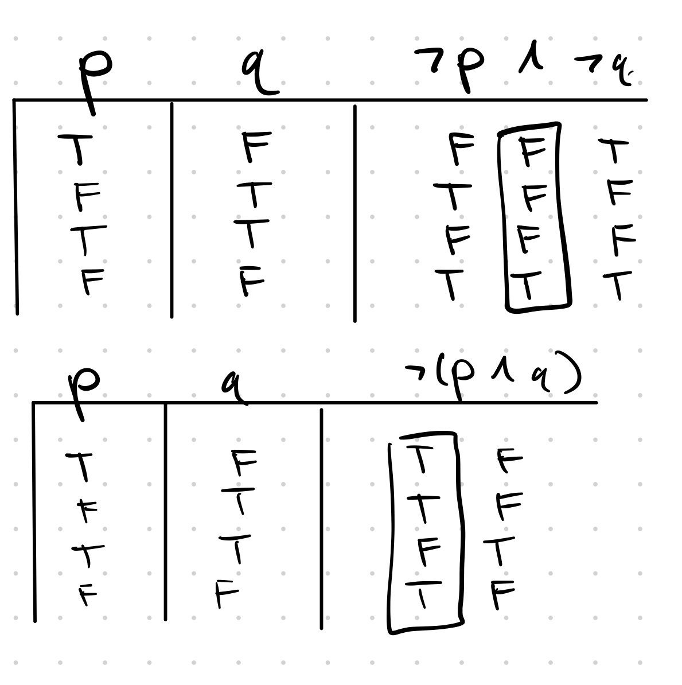

## Boolean Algebra

__Associative Property__: You can change the order in which you perform operations and not change the outcome. So, for example, (2+3)+5=2+(3+5) is true whereas (2-3)-5 $\neq$ 2-(3-5). 

For our case, we will be dealing with rules that operate over boolean values. 

Which symbols are associative?

* $\neg$ - __NO__: it is a unary operator
* $\lor$ - __YES__: switching the order doesn't matter
    * $(A \lor B) \lor C \equiv A \lor (B \lor C)$
    * Think of this as a Venn Diagram - both sides are equivalent!
* $\land$ - __YES__: switching the order doesn't matter
    * $A \land (B \land C) \equiv A \land (B \land C)$
    * Same - think of it as a Venn Diagram. 
* $\oplus$ - __YES__
* $\leftrightarrow$ - __YES__
* $\rightarrow$ - __NO__
    * Take a look at these two truth tables:
* Be careful when you use the property over different operators!! Note that expressions like $(A \land B) \lor C$ is not equivalent to $A \land (B \lor C)$!!

|A|B|C|$A \rightarrow (B \rightarrow C)$ | $(A \rightarrow B) \rightarrow C$|
|-|-|-|-|-|
0|0|0|__1__ 1|1 __0__
0|0|1|__1__ 1|1 __1__
0|1|0|__1__ 0|1 __0__ 
0|1|1|__1__ 1|1 __1__
1|0|0|__1__ 1|0 __1__
1|0|1|__1__ 1|0 __1__
1|1|0|__0__ 0|1 __0__ 
1|1|1|__1__ 1|1 __1__

Note how we could have stopped on the first row of the $(A \rightarrow B) \rightarrow C)$ since those two rows aren't equal. If you say something is $\equiv$ then it must be true for all possibilities!

### Associativity

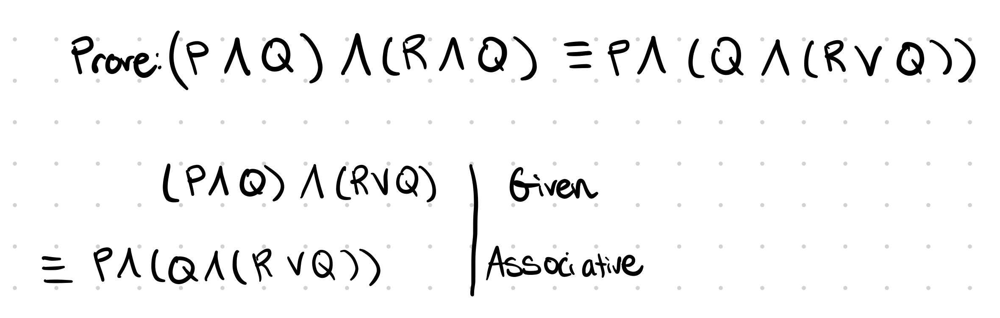

### Communitive Property

Communative property is when you can swap the operands' position.

Which symbols are communative:

* $\neg$ - __NO__
* $\lor$ - __YES__
* $\land$ - __YES__
* $\oplus$ - __YES__
* $\leftrightarrow$ - __YES__
* $\rightarrow$ - __NO__

Here's an example of a proof using associativity and commutativity

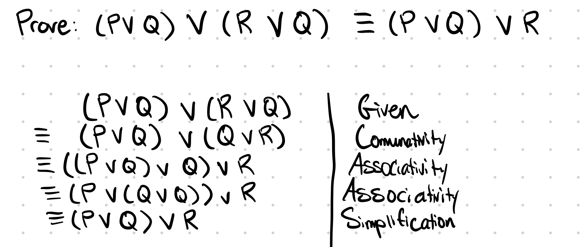

### DeMorgan's and/or

* Or lends itself to union
* And lends itself to intersection

So, that is, 

* $\neg (P \lor Q) \equiv \neg P \land \neg Q$
* That is to say that $(p \cup q)^{c} \equiv p^{c} \cap q^{c}$
* Same in the opposite direction!

Here's an example of a proof using DeMorgan's Laws:

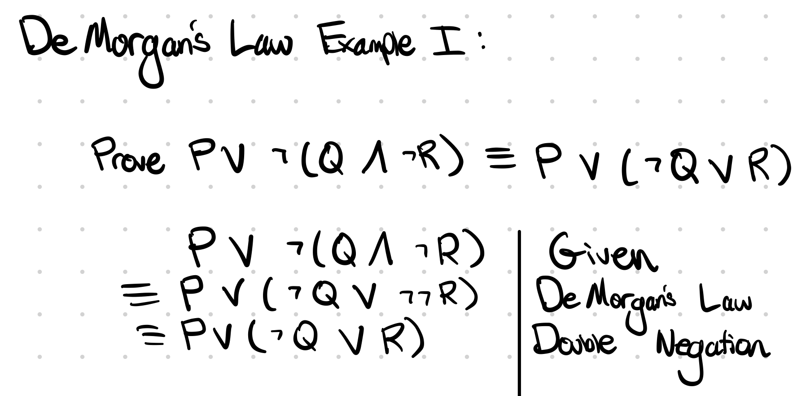

### Distributive Property

Here's an example proof using the Distributive Property:

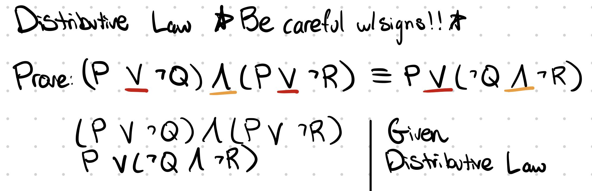

# Feb 10

## Do Now

Represent the problem with voting we discussed earlier as a venn diagram.    _hint_: Make one set (or variable) to represent __people who are 18+__ and a second intersecting set to represent __people who voted__.

How can i write that with an "if-then" statement? 

* "if you voted, then you _must_ be over 18."
* "if you're under 18, then you can't vote."

### Truth Table Example

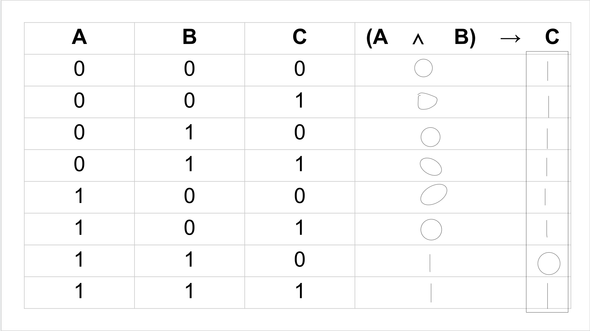

## Boolean Algebra

Example: Prove 3(x+y) = 3x+3y. Let $x, y \in \mathbb{N}$. 

Try:

* x=0 and y=0. 3(0+0) = 3(0)+3(0).
* x=1 and y=0. 3(1+0) = 3(1)+3(0).
* x=2 and y=0. 3(2+0) = 3(2)+3(0).
* ...

## "Is equivlent to" $\equiv$. 

### Anatomy of an Equivalence Proof

Here's an example of a proof: Prove $(P \lor Q) \lor (R \lor Q) \equiv (P \lor Q) \lor R$

You must start with the left-hand side of the equation and must end with the right-hand side of the equation. You must provide justification for each step, and every expression in between must be equivalent.

|sign|proposition|reasoning|
|-|-|-|
||$(P \lor Q) \lor (R \lor Q)$ | Given
$\equiv$ | $(P \lor Q) \lor (Q \lor R)$|commutativity
$\equiv$ | $((P \lor Q) \lor Q) \lor R$|associativity
$\equiv$ | $(P \lor (Q \lor Q)) \lor R$ | associativity
$\equiv$ | $(P \lor Q) \lor R$ | simplification

## IMPORTANT LOGICAL RULES

__[Logical Rules](https://www.cs.virginia.edu/~emo7bf/cs2120/s2023/axioms.html)__

## Equivalences 

### Simplifications

Simplifications have the property that they make expressions smaller, with fewer operators. The first five important ones are:

|long|simplified|name of rule|
|-|-|-|
$\neg \neg P$ | P | double negation
$\neg \top$ | $\bot$ | definition of $\bot$
$P \land \bot$ | $\bot$ | simplification
$P \land \top$ | P | simplification
$P \lor \bot$ | P | simplification
$P \lor \top$ | $\top$ | simplification

#### Proof using opposite of simplificaiton

Prove: $P \equiv P \land (P \leftrightarrow \top)$. Sneaky tactic is to switch the sides and solve. 

* Start with the parenthesis. How do I simplify $p \leftrightarrow \top$?
    * $\top$ : Simplification!
* Now do $P \land \top$
    * $P$: Simplification!
* Thus, $P \equiv P$

|sign|proposition|rule
|-|-|-|
x|$P \land (P \leftrightarrow \top)$ | given
$\equiv$ | $P \land P$ | simplification
$\equiv$ | P | simplification.

Now you can rewrite the table to "expand" it and properly write the equation:

|sign|proposition|rule|
|-|-|-|
||P|given
$\equiv$|$P \land P$ | simplification
$\equiv$ | $P \land (P \leftrightarrow \top)$ | simplification

### Definition of Implication

Prove: $A \rightarrow (B \oplus A) \equiv \neg A \lor (B \oplus A)$

* think about it: $A \rightarrow B \equiv \neg A \lor B$ where $A = P$ and $B = (Q \oplus P)$

|sign|proposition|rule|
|-|-|-|
||$p \rightarrow (Q \oplus P)$ |given
$\equiv$| $\neg p \lor (Q \oplus P)$ | definition of implication

# Feb 8 

## Reminders from Quizzes

* Any powerset must be a set, i.e. $P(S) = \{\emptyset, ..., S\}$
* Sequences are in params (...)
* Sets are in curly braces {...}
* $\{\emptyset\} \neq \{\}$

## Regrade Requests

Drop by a TA office hours _first_, then if the TA affirms that you got it right, then request points back. 

## Do Now - Thought Experiment

There are four cars below, each with a letter __on one side__, and a __number on the other__ side.I make the unsubstantiated claim that __"if a card has a number less than 18, then there must be a vowel (A) on the other side of that card.__" You are allowed to flip over __only two cards__ to prove or disprove my claim.

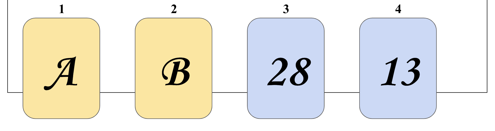

### Evaluating Propositions

A proposition: __"If a card has a number less than 18, then there must be a vowel on the other side of that card."__

How do we evaluate this proposition with this thought experiment? Use a truth table!

||A |B
|-|-|-|
n < 18 | T | F
$\neg ( n < 18)$ | T | T

Note that: $\neg(n < 18) \equiv (n \ge 18)$

A proposition: __"Either card does _not_ have a number less than 18, or it has a vowel."__ Let's rephrase it as __"either the number the number is $\ge 18$ or it has a vowel, or both."__ Here is the associated truth table:

||A |B
|-|-|-|
n < 18 | T | F
$\neg ( n < 18)$ | T | T

### Same problem, rephrased

We now have a group of 4 people at a polling place. Some people are casting a ballot, others are not. You must be at least 18 years old to vote. Each person has an ID card -- one side their age, the other with a letter. The letter _A_ on the voter's ID card indicates they didn't vote. The letter _B_ indicates that they did vote. Your job is to figure out if anyone voted illegally. You can flip over two cards to decide. 

Which one do you flip? 

* not 1, they didn't vote
* yep, flip 2 since you don't know whether or not it's right.
* Nope, not 3, you know they're a legal voter
* yep, flip 4. 

So, $(n \ge 18)$ OR (isVowel) $\equiv$ if ($n < 18$) then (isVowel)

### "Implies" Operator

Truth table for "implies" operator. If it helps, think p = "the person voted" and q = "they're over 18."

|p|q|p$\rightarrow$q|
|-|-|-|
0|0|1
0|1|1
1|0|0
1|1|1

Note that $\neg p \lor q$ is the same as $p \rightarrow q$

### Doin this Truth Table Her Way

Remember that $\neg$ is a unary operator, if there aren't any parenthesis (like in this example) you should be evaluating $\neg p$ first. Each operator has its own column.

Make sure to put a BOX around your answers (my answers are bolded lol)

|p|q|$\neg p \lor q$
|-|-|-|
0|0|1  __1__
0|1|1  __1__ 
1|0|0  __0__
1|1|0  __1__

Another truth table her way. Make sure to put the final answer under the $\land$ symbol. the first one you evaluate is within the parenthesis, second one (final answer) is under the $\land$, in a box/bolded.

|A | B | C | $(A \lor B ) \land C$
|-|-|-|-|
|0|0|0|-|
|0|0|1|-|
|0|1|0|-|
|0|1|1|-|
|1|0|0|-|
|1|0|1|-|
|1|1|0|-|
|1|1|1|-|

### Another way to understand implication

P = My animal is a poodle
Q = it is a dog

|p|q|p$\rightarrow$q|
|-|-|-|
0|0|1
0|1|1
1|0|0
1|1|1

### Venn Diagram of "Implies"

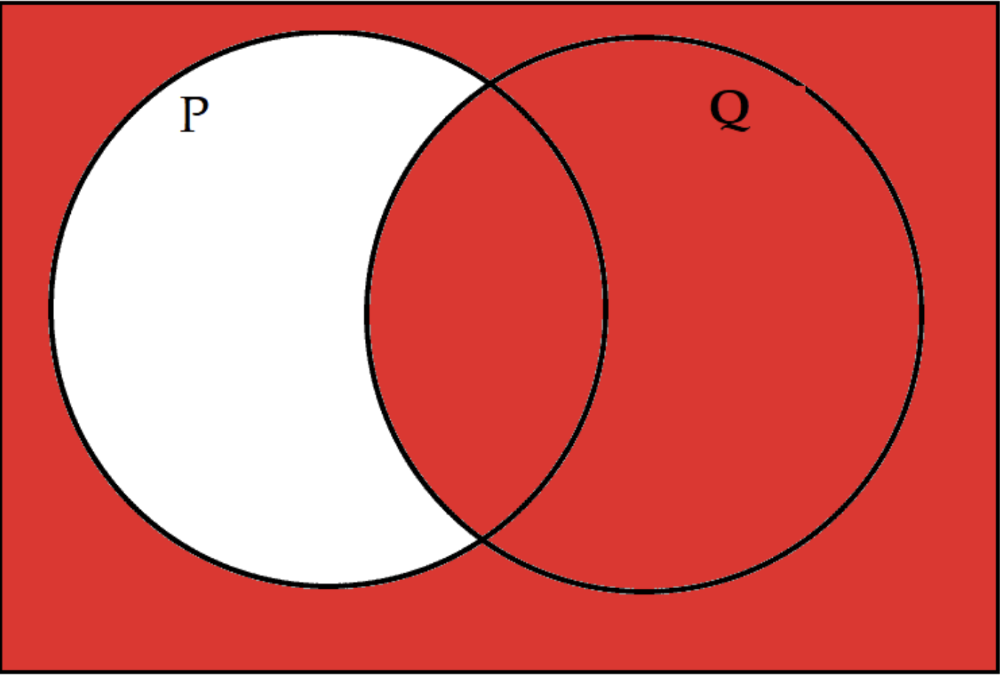

# Feb 6 - Conditionals

## Review

### Quiz Review

$\{\{x\} \times \{y\} \vert x \in \{-1, 0, 1, 2\} y \in \mathbb{N} \ y < x\}$

* {{(1, 0)}, {(2, 0)}, {(2,1)}}

$S = \{x - y \vert (x, y) \in (\{8\} \times \{3, 5\})\}$

* $\{3, 5\} \subset S$ is False.

### Symbols

* $\in$ element of 
* $\subset$ proper subset of
* $\subseteq$ subset of
* P(S) power set of s
* $\vert S \vert$ cardinality
* $S \times T$ S cross T
* $S^{2}$ S cross S

## Propositions

A proposition is a statement that is either true or false.

|Examples of a proposition| Examples of things that aren't a proposition|
|-|-|
Jeremy got the question right| What score did you get on the quiz?
There is only one Jeremy in the class | Is Jeremy the only jeremy in the class?
Taco bell can be used as a laxative | How are you?
Something that is true or false | any imperative statement (i.e. do this, don't do this)

When dealing with propositions, we abstract away difficulties of defining, and we can give them letters (define variables), like P. So, we can say (2+2=5)=P, or ("I am a human") = Q.

### True vs. False

|Concept|Java/C|Python|This class| Bitwise|Name|other
|-------|------|------|----------|--------|----|-----|
true|`true`|`True`|$\top$ or 1| 1|tautology|T
false|`false`|`false`|$\bot$ or 0|0|contradiction|F

The most "mathematically rigorous" way to describe True or False is: $\top$: True; and $\bot$: False. You can also use 1: True; 0: False. 

### Connectives

A proposition is a statement that is either true or false. We can modify, combine, and relate propositions with connectives:

$\land$, (logical and), $\lor$, (logical or), $\neg$, (not), $\leftrightarrow$, (iff), $\rightarrow$, (implication), $\oplus$, exclusive or.

### Propositions

We can modify, combine, and relate propositions with _connectives_:

* $\lor$ is "or"
* $\land$ is "and"
* $\neg$ is "not"

### Truth Table

How to define: make a truth table!

There are two possible inputs to a "not" operator - it is either a $\top$ input or a $\bot$ input. Note that the first column, "P" is the input and $\neg P$ is the output. Notice how "not" only takes in one input, it is a "unary operator."

|P|$\neg P$|
|-|-|
0|1
1|0

Here is an image that contains all the truth tables for the truth table values for "not" 

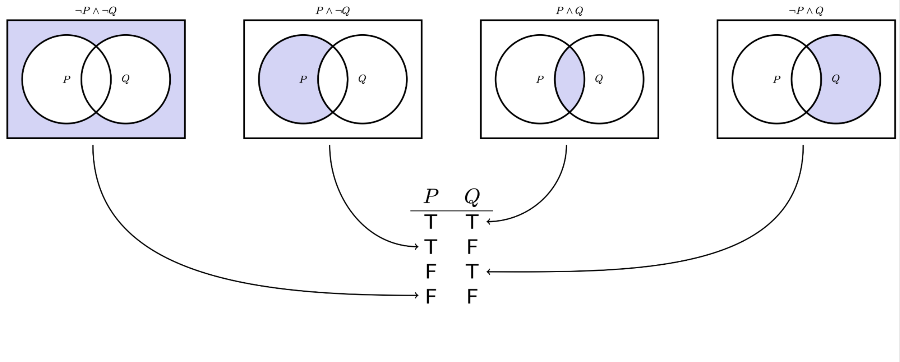

### "And" Operator

Think of this as the "intersection" for example. Note how this is a "binary operator" as there are two inputs. Thus, there are four possible cases - there are _four_ regions in the venn diagram! 

* if you have three intersecting venn diagrams, you have 8 possible inputs.
* if you have n venn diagrams, you have $2^{n}$ inputs

|p|q|$p \land q$
|-|-|-|
1|1|1
1|0|0
0|1|0
0|0|0

### "Or" Operator

Think of this as the "union" sign, for example. 

|p|q|$p \lor q$
|-|-|-|
0|0|0
0|1|0
1|0|1
1|1|1

### "Xor" operator

An example: 
* I want fries __or__ a drink. - you can have both!
* I want it for here __or__ I want it to go. - you can only have one!! Note that this is the use of $\oplus$

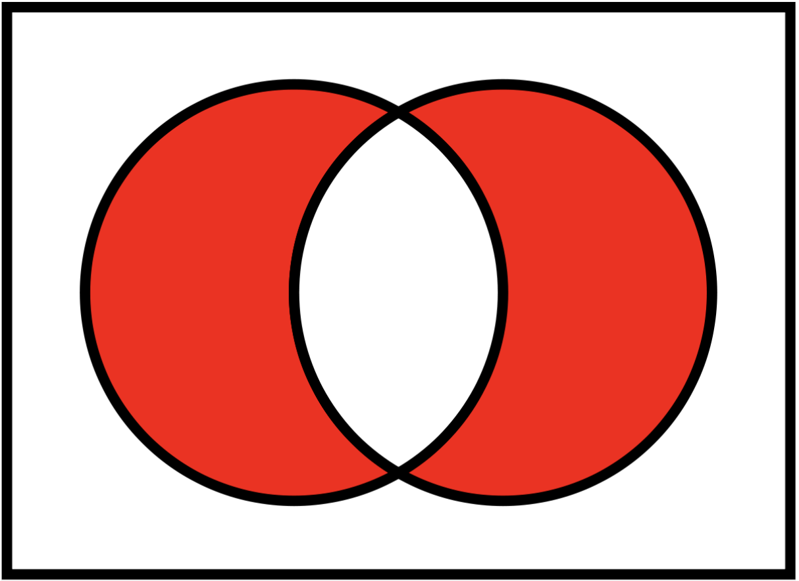

Truth Table:

|p|q|$p \oplus q$|
|-|-|-|
|0|0|0
|0|1|1
|1|0|1
|1|1|0

## "Bi-implies" operator (iff)

This is the negation of $\oplus$.

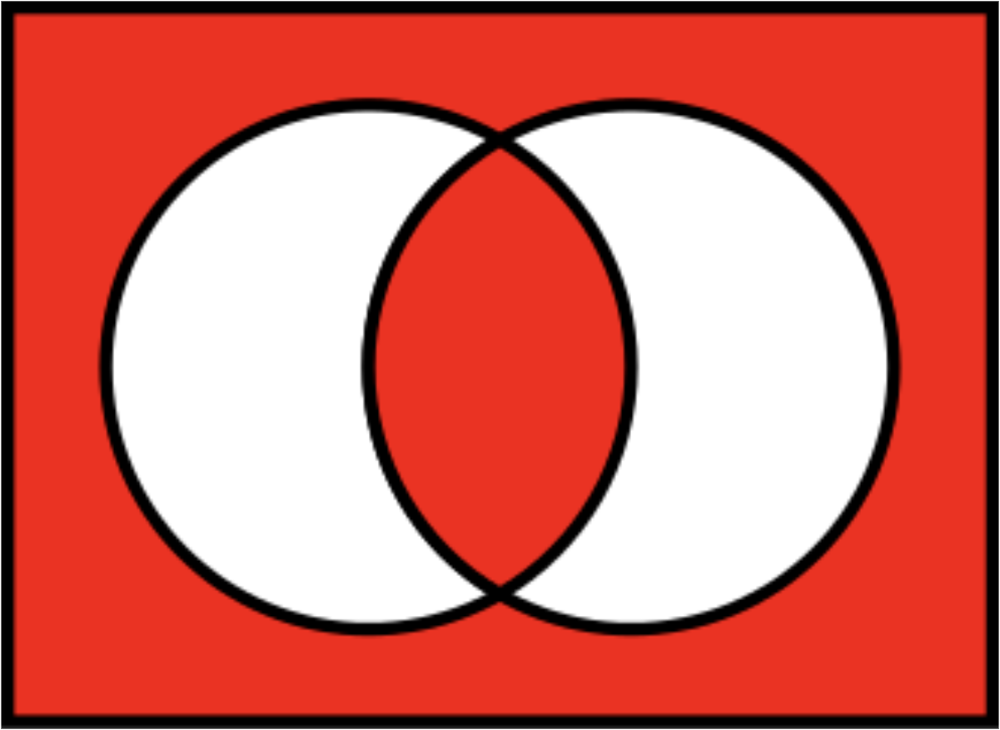

|p|q|$p \leftrightarrow q$
|-|-|-|
0|0|1
0|1|0
1|0|0
1|1|1

### Putting Conditionals Together

|p|$\neg$|p|$\lor$|p|
|-|-|-|-|-|
0|1|0|1|x
1|0|1|1|x

### How to Do Elizabeth's Truth Tables

This is the order of how to do the truth tables 

|p|q|$\neg(p \land q)$|
|-|-|-|
T|T|-|
T|F|-|
F|T|-|
F|F|-|

First apply the $\land$ rule for the parenthesis

|p|q|$\neg(p \land q)$|
|-|-|-|
T|T|T|
T|F|F|
F|T|F|
F|F|F|

Next apply the $\neg$ operator

|p|q|$\neg(p \land q)$|
|-|-|-|
T|T|__F__ T|
T|F|__T__ F|
F|T|__T__ F|
F|F|__T__ F|

The bolded outcome is the final answer!

# Feb 3 - Quiz 1 In-Class! 

## Review before Quiz

Note that what's on review is _really_ important.

### Cartesian (Cross) Product

If $x = 3,$ then what is $x\in A \times B$? = False
The point is, the cartesian product returns the set of ordered pairs! Think of the cartesian product as a table:

### Power Set

Recall that a power set returns a set of all possible subsets. It is a set of sets!

### Other

What is $\vert \{\{x, y\} \vert x, y \in H\ \vert$ when H = {1, 2, 3}?

Think of it as a table, again! This is cartesian product of H with itself!

* $\vert$ { {1}, {2}, {3}, {1, 2}, {2, 3}, {1, 3} } $\vert$ = 6

What is $\{x + y \vert (x \in \{1, 2\}) \land (y \in \mathbb{N}) \land (y < x)\}$? = {1, 2, 3}

Which of the following contain the empty set as a number when H = {} and K = {}

* $\mathbb{N}$? No.
* P($\mathbb{Z}$)? Yes.
* $\{x \vert x \in (K \backslash H)\}$? 
* $\{x \vert (x \subseteq K ) \land (x \subseteq H)\}$? True
* $\{\{x+y, x-y\} \vert (x \in H) \land (y \in H) \}$

# Feb 1 - Popular Sets, Power Set, Set-Builder Notation, Disjoint Sets

## Some Popular Sets

|Symbol|Set|elements|
|-|-|-|
$\emptyset$ | the empty set | none
$\mathbb{N}$ | nonnegative integers | 0, 1, 2, 3...
$\mathbb{Z}$ | integers |...3, 2, 1, 0, 1, 2, 3...
$\mathbb{Q}$ | rational numbers | $\frac{1}{2}$ 16, etc
$\mathbb{R}$ | real numbers | $\pi$, $e$, $\sqrt{2}$
$\mathbb{C}$ | complex numbers | $i$, $\frac{19}{2}$, etc. 

A superscript restricts its set to its positive elements, for example $\mathbb{R}^{+}$ denotes the set of positive real numbers, and for example $\mathbb{Z}^{-}$ denotes the set of negative integers.

## Power Sets

The set oef all subsets of a set, _A_, is called a _power set_, pow(A), of _A_. So: $B \in pow(A) \leftrightarrow B \subseteq A$

For example, the elements of pow({1, 2}) are $\emptyset$, {1}, {2}, and {1, 2}.

Questions:

* What is pow({})?
    * $\{\emptyset \}$ (the set containing the empty set).
* What is pow({a, b, c})?
    * pow({a, b, c}) = $\{\emptyset, \{a\}, \{b\}, \{c\}, \{a, b\}, \{b, c\}, \{a, b, c\}\}$
    * note the distinction between what pow(stuff) evaluates to versus the _elements_ of pow(stuff).
* What is the power set of {W, X, Y, Z}?
    * pow({W, X, Y, Z}) = {{$\emptyset$}, {W}, {X}, {Y}, {Z}, {W, X}, {W, Y}, {W, Z}...}

How can we determine a rule/pattern to determine the cardinality of a powerset?

* $\vert P(X) \vert = 2^{\vert X \vert}$

## Disjoint Sets

Formal definition for disjoint sets: _two sets are disjoint if their intersection is the empty set_. An example of two sets that are __not__ disjoint are {1, 2, 3} and {3, 4, 5} since they both share the element 3. However, the set {New York, Washington} and {3, 4} are disjoint.

* {1, 2} and $\emptyset$ are disjoint.
* the empty set is always disjoint with any set
* $\emptyset$ and $\emptyset$ are disjoint!

## Set builder Notation

Example: $S = \{x \in A \vert \text{x is blue}\}$

* The set of all _x_ in A "such that" property (or properties) of _x_ that must be met in order to be an element of _S_. 

A common breakdown of set-builder notation is with numbers:  $E = \{x \in \mathbb{N} \vert x \ge 3\}$

* "the set of all x in the natural numbers such that x is greater than 2."

Let's formalize our set operations in "set-builder notation." Quick side note - we need to link together multiple "conditions" with "and's," "not's," and "or's."

* $\lor$ is "or." (notice similarity to $\cup$)
* $\land$ is "and." (notice similarity to $\cap$)
* $\neg$ is "not."

### Intersection

We want to define __intersection__: $S \cap T$: the elements that belong both to _S_ and to _T_. 

* $S \cap T =  \{x \in U \vert x \in T \land x \in S \}$
    * Note that "U" is the "universe."
* Another interesting answer: $S \cap T = \{x \in S \vert x \in T\}$

### Union

We want to define the __union__: $S \cap T$: the elements that belong in either _S_ or _T_ (or both):

* $S \cup T\{x \in U \vert x \in T \lor x \in S\}$
* the "or" $\lor$ symbol is inclusive - includes All elements in S, T, __or__ both.

### Difference

We want to define __difference__ $S \backslash T$: 

* $S \backslash T = \{x \in U \vert x \in S \land x \notin T\}$
* "Better" answer: $S \backslash T = \{x \in U \vert x \in S \land \neg(x \in T)\}$
* Another cheeky answer: $S \backslash T = \{x \in S \vert x \notin T\}$

### Complement

We want to define __complement__: $\bar{S}$: elements (of the universe) that don't belong to _S_. 

* $\bar{S} = \{x \in U \vert x \notin S\}$
* $\bar{S} = \{x \notin S\}$

### Evaluation Practice

$\{\{a, b\} \vert (a \in X) \land (b \in Y)\}$ = ?

* = { {1, 2}, {1, 3}, {1, 4}, {2}, {2, 3}, {2, 4}, {3}, {3, 4} }

# Jan 30 - propositions, operators, set-builder notation

<!-- 
notes from the week of Jan 23 - Jan 30:
https://docs.google.com/presentation/d/1BXSO-TkmlSSkd3IIVM2yxjG03KVn0roCMBNhjLEHjK0/edit?usp=sharing 
-->

## Describing Sets

Listing out the elements of a set works well for sets that are small and finite. What about larger sets? Use set builder notation!!

$S = \{x \in A \vert x \space is \space blue\}$

* _S_ us the set of all _x_ in A such that...

$E = \{x \in \mathbb{N} \vert x > 2\}$ 

* E is {3, 4, 5, ..., $\infty$} 
* Recall that 0 is a natural number btw. 
* The cardinality of _E_ is infinity. 

# Jan 27 - intersection, union, difference, complement, and cartesian (cross) product

## $\cap, \cup, \backslash$

### $\cap$ : the __intersection__ of two sets

The intersection of two sets S and T, denoted by $S \cap T$, that is the set containing all elements of S that also belong in T.  (or equivalently, all elements of T that also belong in S)

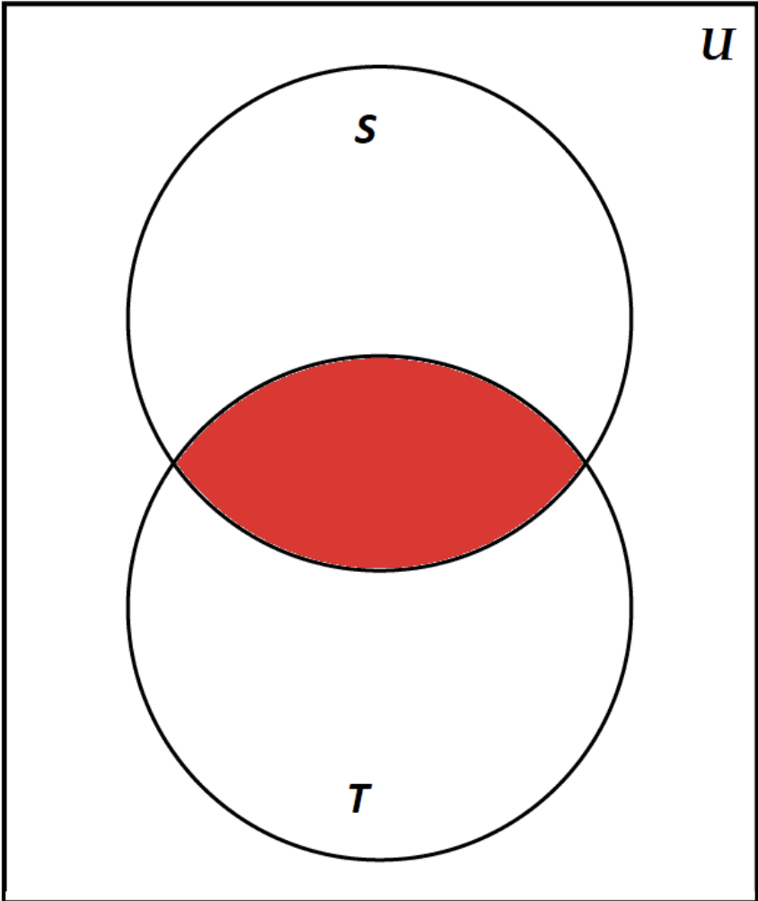{height=20%}

### $\cup$: the __union__ of two sets

The union of two sets S and T, denoted by $S \cup T$, is the set containing all the elements of S and also all the elements in T. (or equivalently, everything either in S or T or both)

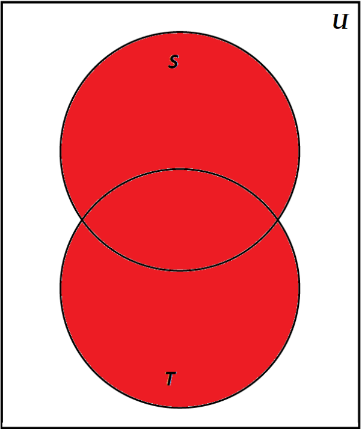{height=20%}

### __Difference__ $S \backslash T$: the element that belong to S but not T

Note that the difference of two sets is _not_ commutative. It's like division!

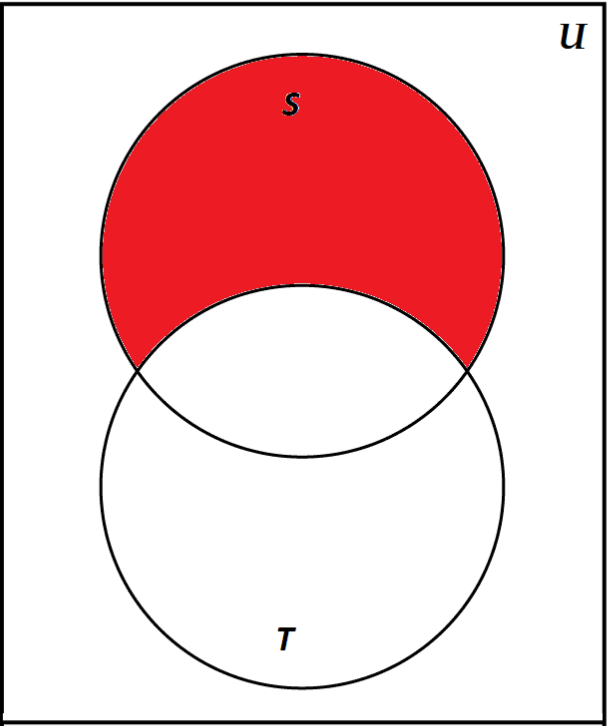{height=20%}

### Complement: $\bar{S}$ or $S^{C}$: All the elements of the universe that don't belong to S. 

You have to consider the universe _u_, not just the "venn diagram" too. See images attached! 

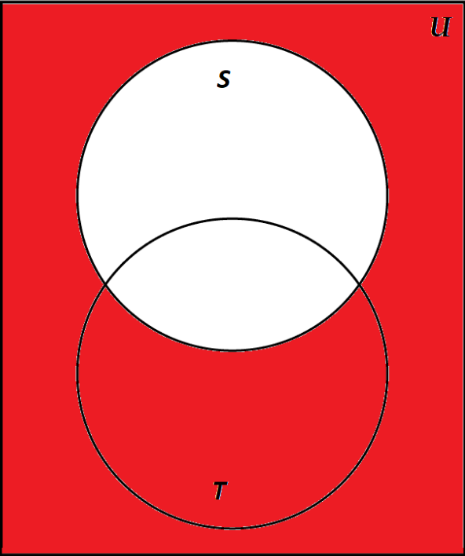{height=20%}

## High Level Sets and Sequences

1. Sequences vs. Sets
1. Cartesian Product
3. Set builder notation
4. Set Operator Review

### High Level: Sets vs Sequences

* Sets:
    * no duplicates
    * no order
    * has cardinality
* Sequences
    * can have duplicates
    * has order
    * has length
    * lists, arrays, ordered pairs, tuples, etc!
* Both: 
    * Contain anything
    * Can have a sequence of sequences, set of sets, sequence of sets, set of sequences
    * Cannot be modified

### Cartesian Products of Sets

__Ordered Pair:__ An ordered pair is a __sequence with 2 elements.__ It is a pair of objects where one element is designated as first and the other element is designated as second, denoted (a, b)

__Cartesian Product:__ The Cartesian product of two sets A and B is denoted $A \times B$, si the set of all possible ordered pairs where the elements of A are the first and the elements of B are second. This is also called the "cross product." 

Example: {1, 2} $\times$ {3, 4, 5} = {(1, 3), (1, 4), (1, 5), (2, 3), (2, 3), (2, 4), (2, 5)}. This returns a set of sequences. The cardinality of this cross product is 6. 

Example: {1, 2} $\times$  {3, 4} $\times$ {4, 5} = ... 

What is {1, 2} $\times$ {2, 3} = {(1, 2), (1, 3), (2, 2), (2, 3)}

* note sequences can have duplicates so (2, 2) is valid! 
* Cardinality is 4

### Cardinality of Cross Product

$\vert A \times B \vert = \vert A \vert \vert B \vert$ (aka, the cardinality of the cross product of two sets is the product of the cardinality of each set)

* Weird Question $\vert$ { {} } $\times$ {1, 2, 3} $\vert$ = ??? 
    * 3 ... since the cross product is = { ({}, 1), ({}, 2), ({}, 3) } !!
* Weird Question $\vert$ {} $\times$ {1, 2} $\vert$ = ?  
    * 0 ... since $\vert \emptyset \vert$ = 0
* Let A= $\{-6, -5, -4, -3, -2, -1, 0, 1, 2, 3, 4, 5, 6\}$. What is $A^{2}$ = ?
    * $A^{2} = A \times A$
    * $A^{3} = A \times A \times A$
    * etc...
    * Note that $A^{2}$ is every single (x, y) coordinate that falls in the grid created by A. So, $\mathbb{R} \times \mathbb{R}$ is the coordinate plane!

# Jan 25 - subsets & supersets

## $\subseteq, \subset, \supseteq, \supset$

These operators compare two sets. 

* $\subseteq$: subset: think about as $\le$
* $\supset$: superset: think about as $\ge$
* $\subset$: proper subset: think about as <
* $\supset$: proper superset: think about as >

### $\subseteq$

Set A is a __subset__ of B, or $A \subseteq B$, if and only if __all elements of A are also in B__. 

### $\supseteq$

Same thing as subset, but flipped direction!

### $\subset$

Set a is a __proper subset__ of B, $A \subset B$ if and only if $A \subseteq B$ and $A \neq B$. 

Consequences of this definition, $A \subset B$:

* $A \subseteq A$  (this is trivial but true)
* $\vert A \vert < \vert B \vert$ 

Example:

Given P={1, 2, 3}, Q={1, 3}, R={1, 3, 4}, determine whether to use subset, superset, proper subset, or proper superset to have all these equations evaluate to $\top$. 

* $P \supseteq Q$ $\land$ $P \supset Q$ = $\top$ 
    * (however, $\supset$ is more specific)
* $P \not\subseteq R$ $=\top$ 
    * There is no answer for this one!
* $P \supseteq P \land P \subseteq P = \top$

Example 2:

Given P={$\emptyset$, {1, 2}, 3}, Q={1, 2}, R={}, S={3}. Determine how to evaluate to $\top$:

* $P \not\supseteq Q = \top$
    * Think about it!
* $P \supseteq R = \top$
    * Think about it, $\emptyset$ is in P! $\emptyset \subseteq$ every set!
    * And, by extension, $\emptyset \subseteq \emptyset$
* $P \supseteq S \land P \supset S = \top$

if you're tripped up on the first and third bullets, notice the difference and see why they're different.

# Jan 23

## Set Definition

A __set__ is a structure that contains elements.  A __set__ has no other properties other than the _elements_ it contains. A set can contain other sets. Duplicate values aren't allowed, and order doesn't matter! A __member__ or __element__ is something inside the set. A set is written with curly braces, its members separated by commas. 

* {1, 3} or {dog, cat, mouse} or {3, thimble, Jules} or {{1, 2}, 1}
* Sets can be members of other sets!: 
    * {{1, 2}, {3, 4}}
* Sets order doesn't matter;
    * {1, 3, 4} and {4, 3, 1} are the same set
* No duplicates!
    * {1, 3, 4, 1} will "knock" out the duplicate, should be {1, 3, 4}
    * {{1, 2}, {2, 1}} is redundant - this is not a set! It can be just written as {{1, 2}}

The __empty set__ is a set with no members, which is expressed as $\{\}$ or $\emptyset$ (or sometimes "null")

__Cardinality__ is the number of elements in a set. Cardinality is denoted using $\vert A \vert$. What are the cardinality of these sets: 

* $\vert \{1, -13, 4, -13, 1\} \vert$: 3
* $\vert \{3, {1, 2, 3, 4}, 0\} \vert$: 3
    * note that {1, 2, 3, 4} is an element of the bigger set, _not_ a subset.
* $\vert \emptyset \vert$: 0
* |{{}, {{}}, {{{}}} }|: 3

Examples of Infinite Sets

* $\mathbb{N}$: Natural numbers
    * includes 0!
* $\mathbb{Z}$: Integers
* $\mathbb{Q}$: Rational - the ratio of two integers, $\frac{a}{b}$ that is a finite or repeating decimal
* $\mathbb{R}$: Real - 
    * $\infty$ is not a real number!!!
* $\mathbb{C}$: Complex
* $\mathbb{I}$: Imaginary

## $\in \space :$ "Element of"

checks membership of aan element

Examples:

* $2 \in \{1, 2\} = \top$ 
* $3 \in \{1, 2\} = \bot$ 
* $3 \notin \{1, 2\} = \top$ 
* $\{2\} \in \{1, 2\} = \bot$
* $\{2\} \in \{1, \{2\}\} = \top$
* $2 \in \{\{1, 2\}\} = \bot$
* $2 \in \{\{\}\} = \bot$
* $2 \in \{\{\{2\}\}\} = \bot$
* $\{2\} \in \{\{1, 2\}\} = \bot$
* $\{2\} \in \{\{2\}\} = \top$
* $\{2\} \in \{\{\{2\}\}\} = \bot$

    

