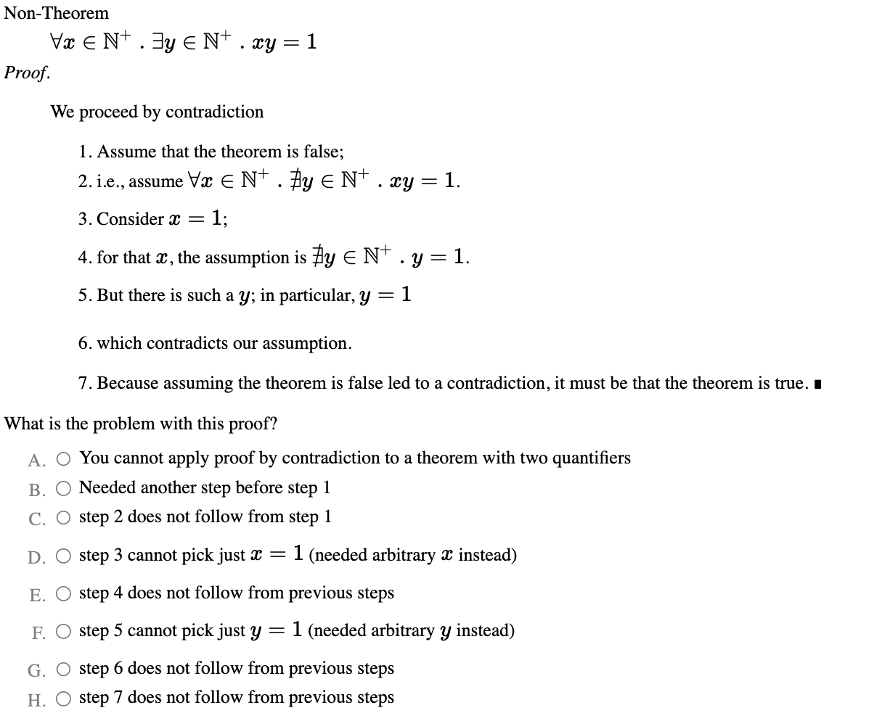

# Practice 3-1 - Integers and Contradiction

## Zoom Review

### Question 1

Prove $4 \cdot 6^{\frac{1}{3}}$ is not a ratinoal number.

1. we proceed by contradiction.
1. Assume $4 \cdot 6^{\frac{1}{3}}$ is rational.
1. By the definition of the rational numbers, this means that $4 \cdot 6^{\frac{1}{3}} = \frac{a}{b}$ for some integers $a$ and $b$.
1. We can rewrite this as $4b \cdot \frac[3]{6} = a$
1. We can rewrite this as $4^3 \cdot 6 b^3 = a^3$
1. The multiplicity of every prime factor of $a^3$ must be divisible by 3.
1. For the same reason, the multiplicity of every prime factor of $b^3$ is divisible by 3. However, this cannot be the case for $4^3 \cdot 6 \cdot b^3$, because the multiplicity of 3 is not divisible by 3. 
1. Therein lies the contradiction, as the multiplicity of 3 on the left side must be a multiple of 3 plus 1 rather than 3, but the left and right sides do not have the same prime factorization. 
1. Since our assumption that $4 \cdot 6^{\frac{1}{3}}$ is rational was false, $4 \cdot 6^{\frac{1}{3}}$ is not rational $\square$.

### Question 2

Prove by contradiction that for any set S and member x:

$$(\vert S \cup \{x\} \vert = \vert S \vert ) \rightarrow (x \in S)$$

1. We proceed by contradiction. 
1. Assume tat there exists some S and x for which the cardinality of $S \cup \{x\}$ is equal to the cardinality of S, but x is not in S. 
1. Since $x \not\in S, \text{ this means that } \vert S \cup \{x\} \vert$

## Proof by Contradiction Worksheet

The link for this sheet is here. [Contradiction Worksheet](https://www.cs.virginia.edu/~emo7bf/discrete2120.pdf). I didn't do all the problems since some of them are labor-intensive for writing, but i did the ones that make sense and are easy. 

## General Rubric 

1. "We proceed by contradiction"
1. State an assumption
1. Assumption/theorem is negated.
1. Instantiates a (counter)example, given the negated theorem
1. Any algebra is correct
1. Any appeal to definitions is correct and appropriately applied
1. Correct derivation of contradiction
1. Concludes that the contradiction means the original theorem is true
1. Written in (mostly) prose. 

### Question 1

Prove that the function $f(x) = \vert 2x \vert$ is not injective.

We proceed by contradiction. Assume that $f(x) = \vert 2x \vert$ is injective. If a function is injective, then it it the case that every unique member of the domain maps ot a unique member of the range. So, since $f(x)$ is injective, every integer maps to a unique value. However, this is not the case since _f_ evaluates two unique members of its domain, -1 and 1, to 2. Therein lies the contradiction. Therefore, $f(x)$ is not injective $\square$.

### Question 2

Prove $4 \sqrt[3]{6}$ is not rational. 

We proceed by contradiction. Assume that $4 \sqrt[3]{6}$ is rational. Then, there exists integers $a$ and $b$ such that $4 \sqrt[3]{6} = \frac{a}{b}$. With algebra, we get that $4^3 \cdot 2 \cdot 3 \cdot b^3 = a^3$. By the fundamental theorem of arithmetic, both sides of the equals sign must have the same prime factors. Consider the multiplicity of 3s in each value's prime factorization. No matter the value of _a_, it must be the case that the multiplicity of 3s in the prime factorization of $a^3$ is a multiple of 3. Likewise, the multiplicity of the 3s in the prime factorization of $b^3$ must be a multiple of 3. However, this means that the multiplicity of 3s in the prime factorization of $4^3 \cdot 2 \cdot 3 \cdot b^3$ is one more than a multiple of 3. This means that $4^3 \cdot 2 \cdot 3 \cdot b^3$ and $a^3$ cannot have the same prime factors, which is a contradiction. Since our assumption that we could find integers _a_ and _b_ such that $4 \sqrt[3]{6} = \frac{a}{b}$ was false, $4 \sqrt[3]{6}$ is not rational $\square$.

### Question 3

Prove that if x is an element of A, and A is disjoint with B, then x is not in B. That is, $((x \in A) \land (A \cap B) = \emptyset) \implies (x \not\in B)$. 

We proceed by contradiction. Assume $\neg (((x \in A)) \land (A \cap B = \emptyset)) \rightarrow (x \not\in B))$. This is equivalent to $(x \in A) \land (x \in B) \land (A \cap B = \emptyset)$. Consider some choice _x_ that makes both $x \in A$ and $x \in B$ true. Ay such value _x_ would also be a member of $A \cap B$, meaning that $A \cap B \neq \emptyset$, which contradicts our assumption. Since our assumption entails a contradiction it must be that it was false, so $((x \in A) \land (A \cap B) = \emptyset) \implies (x \not\in B)$ $\square$.

### Question 4

Prove 0.8 is not an integer.

We proceed by contradiction. Assume that 0.8 is an integer. Then, there exists an integer $x \in \mathbb{Z}$ such that $0.8 = x$. With algebra, we can then write this as $x = \frac{4}{5}$. By algebra, we get $5x=4$. By the fundamental theorem of arithmetic, 5x and 4 must have the same prime factorization. The prime factorization of 4 does not have a 4, so they dot not have the same prime factorization. Therein lies the contradiction. Since our assumption that 0.8 is an integer was false, 0.8 is not an integer $\square$.

### Question 5

Prove that every individual set has its own unique powerset, that is the _powerset function__ (P(S)) is _injective_.

We proceed by contradiction. Assume that the powerset function is not injective. That is, asssume we can find two sets $S_1$ and $S_2$ such that $S_1 \neq S_2$ but $P(S_1) = P(S_2)$. If $S_1 \neq S_2$, then there must either be some member of $S_1$ that is not a member of $S_2$, or else there is some member of $S_2$ that is not a member of $S_1$. Suppose $x \in S_1$ and $x \not\in S_2$. Since $x \in S_1$ we know $\{x\} \subseteq S_1$ and so $\{x\} \in P(S_1)$. However, since $\{x\} \not\in S_2$ it must be that $\{x\} \not\in P(S_2)$. This means that $P(S_1) \neq P(S_2)$, which is a contradiction. Therefore, $P(S_1) = P(S_2)$ $\square$.

### Question 6

Prove that g(x) = x-5 is _not total_ given a domain and co-domain of $\mathbb{N}$. 

We proceed by contradiction. Assume g(x) = x-5 is total. By definition, a total function means that $\forall_x \in \mathbb{N} . g(x) \in \mathbb{N}$. However, this means that it must be the case that $x - 5 \in \mathbb{N}$. However this is not the case, as if _x_ = 0, then $-5 \not\in \mathbb{N}$. This contradicts our assumption that $\forall_x \in \mathbb{N} . g(x) \in \mathbb{N}$. Therefore, g(x) = x-5 is not total $\square$.

### Question 8

Prove that for all Sets, the subset relation is transitive.

We proceed by contradiction. Suppose that the subset relation is not transitive. This means that we can find $A \subseteq B$ and $B \subseteq C$ but $\neg(A \subseteq C)$. Since it is not the case that $A \subseteq C$, there must be some value $x \in A$ where $x \not\in C$. Since $x \in A$ and $A \subseteq B$, we can conclude that $x \in B$. Since $B \subseteq C$ we can conclude that $x \in C$. This contradicts our assumption that $x \not\in C$.  Therefore, since our assumption that the subset is not transitive let to a contradiction, it must be that the subset relation is transitive $\square$.

### Question 10

Prove that there exists a single smallest natural number. That is, $\exists_x \in \mathbb{N} . \forall_y \in \mathbb{N} . (x = y) \lor x < y$.

We proceed by contradiction. Assume that there is _not_ a smallest natural number. Consider the number 0. For all natural numbers, it is the case that they are either equal to zero or zero is less than them . Therein lies the contradiction. Therefore, there exists a single smallest natural number $\square$.

### Question 11

Prove that "divides evenly" is transitive. That is, if a divides b, and b divides c, then a will evenly divide c. 

We proceed by contradiction. Assume that "divides evenly" is not transitive. This means that suppose we can find values a, b, c such that $\frac{a}{b} \in \mathbb{Z} \land \frac{b}{c} \in \mathbb{Z}$ but $\frac{a}{c} \not\in \mathbb{Z}$. Since both $\frac{a}{b}$ and $\frac{b}{c}$ are in $\mathbb{Z}$, we know that multiplication of two integers together produces another integer. By algebra we get that $\frac{a}{b} \cdot \frac {b}{c} = \frac{a}{c}$. Therein lies the contradiction, as our original assumption stated that $\frac{a}{c} \not\in \mathbb{Z}$. since our original assumption led to a contradiction, it must be that "divides evenly" is transitive $\square$.

## Integers and Contradiction Practice Online

### Question 1

Prove $5\sqrt{5} \not\in \mathbb{Q}$. 

We proceed by contradiction. Assume that $5\sqrt{5} \in \mathbb{Q}$. By definition, a rational number can be expressed by a fraction of two integers _x_ and _y_, meaning $5\sqrt{5} = \frac{x}{y}$. By algebra, we get that $125y^2 = x^2$. By the fundamental theorem of arithmetic, both sides of the equality must have the same prime factorization. $125y^2$ has an odd multiplicity of 5s in its prime factorization while $x^2$ has an even multiplicity of _all_ of its factors. Therefore, since a number cannot have both even and odd multiplicity of 5s at the same time, therein lies the contradiction. Since the assumption led to a contradiction, it must be that $5\sqrt{5} \not\in \mathbb{Q}$ $\square$.

### Question 2

What are the prime factors of 50? 

$5*5*2$

### Question 3

What are the 1-digit numbers relatively prime with 9? 

* 2, 4, 5, 7, 8

### Question 4

What is the greatest common divisor of 15 and 25?

* 5

### Questions 5-7

Consider the number $20^{50} \cdot 14^5$. 

#### Question 5

What is the multiplicity of 2 in the prime factorization of $20^{50} \cdot 14^5$?

* 105. YOu can find this by doing $(2^2 \cdot 5)^{50} \cdot (2 \cdot 7)^5$. Thus, 105.

#### Question 6

What is the multiplicity of 3 in this number $20^{50} \cdot 14^5$?

* 0

#### Question 7

What is the multiplicity of the prime factor 7 in this number $20^{50} \cdot 14^5$?

* 5

### Questions 8 and 9

Consider the numbers 14 and 33.

#### Question 8

What is the smallest __prime__ number that is co-prime (relatively prime) to both 14 and 33?

* 5

#### Question 9

What is the smallest composite number (non-prime greater than 1) that is co-prime (relatively prime) to both 14 and 33?

* 25. 

### Question 10

Consider the following incorrect proof by contradiction. What is the problem with this proof? 

C - step 2 does not follow from step 1. 

### Questions 11-20

The following are about primes and factors.

#### Question 11

What is the prime factorization of 18?

* $2*3*3$

#### Question 12

What is the prime factorization of 81? 

* $3*3*3*3$

#### Question 13

What is the prime factorization of $9^10 \cdot 6^20$?

* $3^{20} \cdot (2 \cdot 3)^{20}$ -> $3^{40} \cdot 2^{20}$

#### Question 14

What is the set of positive 1-digit integers relatively prime with 10?

* {1, 3, 7, 9}

#### Question 15

What is the prime factorization of 28? 

* $2*2*7$

#### Question 16

What is the prime factorization of 256?

* $2^8$

#### Question 17

What is the prime factorization of 31?

* 31 (it is prime)

#### Question 18

What is the prime factorization of $4^8 \cdot 14^9$?

* $2^{16} \cdot (2 \cdot 7)^9$ -> $2^{25} \cdot 7^9$

#### Question 19

What is the set of positive 1-digit integers relatively prime with 15?

* {1, 2, 4, 7, 8}

#### Question 20

What is the set of positive 1-digit integers relatively prime with 81? 

* {1, 2, 4, 5, 7, 8}

### Question 22

Prove that $\frac{2}{3} \not\in \mathbb{Z}$

|Step|Rule Used|
|-|-|
Assume $\frac{2}{3} \in \mathbb{Z}$ | 
$\exists_x \in \mathbb{Z} . \frac{2}{3} = x$ | definition of set membership 
$\frac{2}{3} = x$ | existential relationship
2 = 3x | algebra
3 is a factor of 2 | fundamental theorem of arithmetic
$\bot$ | contradiction
assumption is false | proof by contradiction
$\frac{2}{3} \not\in \mathbb{Z}$ | conclusion

### Question 23

Prove $\sqrt{2} \not\in \mathbb{Q}$

|Step|Rule Used|
|-|-|
Assume $\sqrt{2} \in \mathbb{Q}$ |
$\exists_{x, y} \in \mathbb{Z} . \sqrt{2} = \frac{x}{y}$ | definition of set membership
$\sqrt{2} = \frac{x}{y}$ | existential relationship
$2y^2 = x^2$ |  algebra
2 is a factor of $2y^2$ with odd multiplicity | fundamental theorem of arithmetic 
all factors of $x^2$ have even multiplicity | fundamental theorem of arithmetic
$\bot$ | contradiction
assumption is false | proof by contradiction
$\sqrt{2} \not\in \mathbb{Q}$ | conclusion

### Question 24

skip

### Questions 25 - 28 

Prove the following by contradiction.

#### Question 25

Skip already done

#### Question 26

Prove that $2^{-1} \not\in \mathbb{Z}$.

We proceed by contradiction. Assume $2^{-1} \in \mathbb{Z}$. By definition, being an integer means that $\exists_x \in \mathbb{Z} . x = 2^{-1}$. By algebra, we get that 1 = 2x. By the fundamental theorem of arithmetic, that means 2 is a factor of 1, but it is not. Therein lies the contradiction. Because the assumption led to a contradiction, it must be the case that $2^{-1} \not\in \mathbb{Z}$.

#### Question 27

Prove that $\sqrt{7} \not\in \mathbb{Q}$.

We proceed by contradiction. Assume $\sqrt{7} \in \mathbb{Q}$. By definition, being a rational number means that $\exists_{x, y} \in \mathbb{Z} . \sqrt{7} = \frac{x}{y}$. By algebra, we get that $7y^2 = x^2$. By the fundamental theorem of arithmetic, that means 7 is a factor of $7y^2$ with odd multiplicity. By the fundamental theorem of arithmetic, that means all factors of $x^2$ have even multiplicity. But that is not the case, because $x^2$ has a factor of 7 with odd multiplicity. Therein lies the contradiction. Because the assumption led to a contradiction, it must be the case that $\sqrt{7} \not\in \mathbb{Q}$.

#### Question 28

Prove that $3^{1.5} \not\in \mathbb{Q}$. 

We proceed by contradiction. Assume $3^{1.5} \in \mathbb{Q}$. By definition, being a rational number means that $\exists_{x, y} \in \mathbb{Z} . 3^{1.5} = \frac{x}{y}$. By algebra, we get that $x^2 = 3^3y^2$. $x^2$ has an even number of 3s in its prime factorization, as does y^2. meaning $3^3y^2$ has an odd number. But the prime factorization are unique, meaning equal values cannot have differing numbers of 3as in their prime factorization. Therein lies the contradiction. Because the assumption led to a contradiction, it must be the case that $3^{1.5} \not\in \mathbb{Q} \square$.

### Questions 29-30

Recall that:

* gcd(x, y) is the greatest common divisor of x and y
* $x \vert y$ is true iff x divides y without a remainder.

#### Question 29

Which of the following is true? 

1. $(x \vert y) \rightarrow (gcd(x, y) = 1)$
1. $(x \vert y ) \rightarrow (gcd(x, y) = x)$
1. $(x \vert y) \rightarrow (gcd(x, y) = y)$
1. $(x \vert y) \rightarrow (gcd(x, y) = xy)$

* correct answer - 2

#### Question 30

Which of the following is true? If several are true, pick the one that entails the others.

1. $(\{z \vert z \vert x\} = \{z \vert z \vert y\}) \rightarrow (x = y)$
1. $(x = y) \rightarrow (\{z \vert z \vert x\} = \{z \vert z \vert y\})$
1. $(\{z \vert z \vert x\} = \{z \vert z \vert y\}) \leftrightarrow (x = y)$
1. $(\{z \vert z \vert x\} = \{z \vert z \vert y\}) \oplus (x = y)$

Correct answer - 3

### Question 31

What is the multiplicity of the prime factor 7 in the value $35 \cdot 56^100 \cdot 7^4$?

* 105

### Question 32

What is the multiplicity of the prime factor 11 in the value $35 \cdot 56^100 \cdot 11^4$?

* 0

### Question 33 

Prove by contradiction that $\sqrt{2} \sqrt[3]{3} \not\in \mathbb{Q}$.

We proceed by contradiction. Assume $\sqrt{2} \sqrt[3]{3} \in \mathbb{Q}$. By definition, being a rational number means that $\exists_{x, y} \in \mathbb{Z} . \sqrt{2} \sqrt[3]{3} = \frac{x}{y}$. By algebra, we get that $2\cdot 3^{\frac{2}{3}} = \frac{x}{y}$. Solving for x and y, we get two solutions: $x=\sqrt{2\cdot 3^{\frac{2}{3}}}y$ and $x=-\sqrt{2\cdot 3^{\frac{2}{3}}}y$.   The only solution to this quadratic is when x = 0 and y = 0, which is undefined. Therein lies the contradiction. Because the assumption led to a contradiction, it must be the case that $\sqrt{2} \sqrt[3]{3} \not\in \mathbb{Q}$. 

### Question 34

Prove by contradiction that $\frac{1+\sqrt{5}}{2} \not\in \mathbb{Q}$.

We proceed by contradiction. Assume $\frac{1+\sqrt{5}}{2} \in \mathbb{Q}$. By definition, being a rational number means that $\exists_{x, y} \in \mathbb{Z} . \frac{1+\sqrt{5}}{2} = \frac{x}{y}$. By algebra, we get that $\frac{1}{2} + \frac{\sqrt{5}}{2} = \frac{x}{y}$. We know that the sum of two rational numbers also must result in a rational number. However, $\frac{\sqrt{5}}{2}$ is not a rational number. Therein lies the contradiction. Because the assumption led to a contradiction, it must be the case that $\frac{1+\sqrt{5}}{2} \not\in \mathbb{Q}$.

Prove that $(\vert A \cup B \vert = \vert A \vert) \rightarrow (B \subseteq A)$.

1. We proceed by contradiction. 
1. Assume $(\vert A \cup B \vert = \vert A \vert) \rightarrow (B \not\subseteq A)$.
1. By definition, $B \not\subseteq A$ means that there exists an element $b \in B$ such that $b \not\in A$.
1. Since $x \in B$, it must also be in $A \cup B$. But since $x \not\in A$, this means that $\vert A \cup B \vert > \vert A \vert$, which contradicts our assumption that $\vert A \cup B \vert = \vert A \vert$. Therefore, our assumption that $B \not\subseteq A$ must be false, and we conclude that $B \subseteq A$.

Suppose that $B$ is not a subset of $A$. Then there exists an element $x$ in $B$ that is not in $A$. Since $x$ is in $B$, it must also be in $A \cup B$. But since it is not in $A$, this means that $\vert A \cup B \vert > \vert A \vert$, which contradicts our assumption that $\vert A \cup B \vert = \vert A \vert$. Therefore, our assumption that $B$ is not a subset of $A$ must be false, and we conclude that $B$ must be a subset of $A$.

