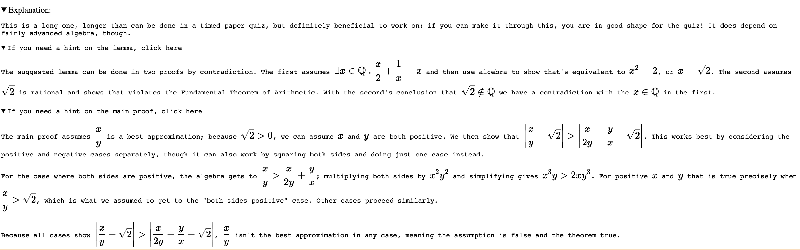

# Practice 3-2: Difficult Contradiction Proofs (WOP)

## Review 

Two proof styles:

### Style 1

This is where you instantiate C, establish that x is some smallest counterexample, and then prove x-1 to be true through algebra. However, by finding x-1 true, you find that you found x, which directly contradicts the initial assumption.

Prove that $\forall_n \in \mathbb{N} . (\sum_{i=0}^{n} (2i+1)) = (n+1)^2$

We proceed by contradiction. Assume that $\exists_n \in \mathbb{N} . (\sum_{i=0}^{n} (2i+1)) \neq (n+1)^2$. For this to be the case, there must be some non-empty set of conuterexamples (set C) that is a subset of the natural numbers. Since it is a subset of the naturals, then by the WOP there must exist some least element of C, let's call it $x$, such that $\sum_{i=0}^{x} (2i+1) \neq (x-1+1)^2$. By adding the next term to both sides, we find $\sum_{i=0}^{x-1} (2i+1) + 2x+1 = (x-1+1)^2+2x+1$. With math, we then get $\sum_{i=0}^{x}(2i+1) = x^2+2x+1$ which simplifies to $\sum_{i=0}^{x}(2i+1) = (x+1)^2$. Our assumption that a smallest counterexample exists lead to a contradiction, since contradicts our assumption that $\sum_{i=0}^{n} (2i+1) \neq (n+1)^2$. That assumption must be incorrect, and the set of counterexamples must be empty. Also, this does not apply to the base case where $x=0$, since $x-1$ would be outside of the domain. However, we can directly evaluate the base case: $\sum_{i=0}^{0} (2i+1) = (n+1)^2$ we get $1 = 1^2$ which is true. Therefore our contradiction holds for al possible $x$, and so our assumption of a non-empty set $C$ is incorrect and the theorem holds for all $n \in \mathbb{N}$. 

### Style 2

This is where you instantiate C, establish that x is some is some smallest counterexample, then prove x-1 to be also false through algebra. By finding that x-1 is also false, that contradicts the idea that x is the smallest element in C. Since the assumption led to a contradiction, then...

Prove that $\forall_n \in \mathbb{N} . (\sum_{i=0}^{n} (2i+1)) = (n+1)^2$

Let $C \subseteq \mathbb{N}$ be the set of all counterexamples to the theorem, i.e. $C = \{x \vert \sum_{i=0}^{n} (2i+1) \neq (n+1)^2\}$. To prove the theorem, we will demonstrate that $C = \emptyset$. We proceed by contradiction. Assume that $C \neq \emptyset$. Since $C \subseteq \mathbb{N}$, and $C$ is non-empty, by the well-ordering principle $C$ must have a least element, call that $x$. First, observe that $x > 0$, since $\sum_{i=0}^{0} (2i+1) = 1.$ Consider $y=x-1$. Since $x > 0$, it must be that $y \in \mathbb{N}$. Because $x \in C$ it must be that $\sum_{i=0}^{x} (2i+1) \neq (x+1)^2.$ Therefore, $2x+1 + \sum_{i=0}^{x-1} (2i+1) \neq (x+1)^2$, and so $\sum_{i=0}^{x-1} (2i+1) \neq (x+1)^2 - 2x+1$. By algebra, the right hand side  simplifies just to $x^2$. This means that $\sum_{i=0}^{x-1} (2i+1) \neq (x-1+1)^2$, and so $\sum_{i=0}^{y} (2i+1) \neq (y+1)^2$. This means that $y$ is also a counterexample to the theorem, and so $y \in C$. However, we defined $y=x-1$, and so $y < x$ which contradicts our assumption that $x$ was the smallest member of $C$. Since assuming $C \neq \emptyset$ resulted in a contradiction, it must be that $C = \emptyset$, and so the theorem holds true for all $\mathbb{Z}^+$. 

Another example:

Prove that $\forall_x \in \mathbb{N} . \sum_{i=0}^{n} 2^i = 2^{m+1} -1$

We proceed by contradiction. Suppose the statement is false, that is assume $\exists_n \in \mathbb{N} . \sum_{i=0}^{n} 2^i \neq 2^{m+1} -1$. In htis case, we'll let $C$ be the set of all values of $n$ which makes this statement true, i.e. the set of all counterexamples. Since we assume that ast least one value of $n$ satisfies $\sum_{i=0}^{n} 2^i \neq 2^{m+1} -1$, it must be that $C$ is non-empty. By applying WOP, it must be that $C$ has a smallest element, we'll call that $y$. By our definition of $y$, we have that $\sum_{i=0}^{y} 2^i \neq 2^{y+1} -1.$ This means that $\sum_{i=0}^{y} 2^i - 2^y \neq 2^{y+1} -1 - 2^y.$ which is the same as $\sum_{i=0}^{y-1} 2^i \neq 2^{y+1} - 1 - 2^y$. That right hand side can be simplified to $2^y-1$. Therefore we have that $\sum_{i=0}^{y-1} 2^i \neq 2^y-1$ and it must be that $y \in C$. This contradicts that $y$ was the smallest element of $C$. Since our assumption that $C$ was not empty produced a contradiction, it must be that $C$ is empty and we can conclude that $\forall_x \in \mathbb{N} . \sum_{i=0}^{n} 2^i = 2^{m+1} -1$

## Discord Review

Prove the following using the proof by contradiction that utilizes the WOP. 

Theorem: $\forall_n \in \mathbb{N} \backslash \{0,1, 3, \} \sum_{i=4}^{n} 4i = 2n^2 + 2n - 24$

We proceed by contradiction. Assume that the theorem is false. That is, assume $\exists_n \in \mathbb{N} \backslash \{0,1, 2,3 \} \sum_{i=4}^{n} 4i \neq 2n^2 + 2n - 24$. Let $C$ be the set of counterexamples. Assume $C$ is not empty. Because $C$ is a non-empty subset of the natural numbers, then by the well-ordering principle there must be some smallest integer $x \in C$. Now consider $x-1$. $x-1$ must make the theorem true.

$$P(x-1): \sum_{i=4}^{x-1} 4i = 2(x-1)^2+2(x-1)-24$$

Now to get P(x), we can add $4x$ to both sides:

$$P(x): \sum_{i=4}^{x} 4i = 2(x-1)^2+2(x-1)-24 + 4x$$

Simplifying, we get:

$$P(x): \sum_{i=4}^{x} 4i = 2(x^2-2x+1)+2x-2-24+4x$$
$$P(x): \sum_{i=4}^{x} 4i = 2x^2-4x+2+2x-2-24+4x$$
$$P(x): \sum_{i=4}^{x} 4i = 2x^2+2x-24$$

Furthermore, consider the base case:

$$\sum_{i=4}^{4} 4i = 32 + 8 - 24$$
$$16=16$$

We must consider the base case of when i = 4 because x -1 will not be in the domain in that case. Since the base case is true and our assumption led to a contradiction, we must conclude that the theorem is true.

## Elizabeth's Office Hours

Prove $$\forall_n \in \mathbb{Z}+ . (\sum_{k=1}^{n} k^2 = \frac{n(n+1)(n+2)}{6})$$ by contradiction.

Here is a proof by contradiction that $\forall_n \in \mathbb{Z}+ . (\sum_{k=1}^{n} k^2 = \frac{n(n+1)(n+2)}{6})$:

Suppose for the sake of contradiction that there exists an $n \in \mathbb{Z}+$ such that $\sum_{k=1}^{n} k^2 \neq \frac{n(n+1)(n+2)}{6}$. Let $S = {n \in \mathbb{Z}+ : \sum_{k=1}^{n} k^2 \neq \frac{n(n+1)(n+2)}{6}}$ be the set of all positive integers for which the expression is false. By the well-ordering principle, there exists a smallest element $m$ in $S$.

Since $m$ is the smallest element in $S$, we know that $\sum_{k=1}^{m-1} k^2 = \frac{(m-1)m(m+1)}{6}$ for all $m > 1$. Adding $m^2$ to both sides, we get $\sum_{k=1}^{m} k^2 = \frac{(m-1)m(m+1)}{6} + m^2$. However, the result of this equation is false, meaning that x is not the least counterexample in C. Therein lies the contradiction. Since our assumption led to a contradiction, the set $C$ of all counterexamples must be empty, meaning that the expression is true for all $n \in \mathbb{Z}+$.

## Question 1

What three quantified statements represent the well-ordering principle?

1. $\forall A \subseteq \mathbb{N} . \exists_x \in A . \forall_y \in A . (y \le x) \rightarrow (x = y)$
1. $\forall A \subseteq \mathbb{N} . \exists_x \in A . \forall_y \in (A \backslash \{x\}) . x < y$
1. $\forall A \subseteq \mathbb{N} . \exists_x \in A . \forall_y \in A . (x \le y)$

## Question 2

The following differ only in the set used in the quantifier: $\mathbb{N}$ vs. $\mathbb{Z}$. If you identify multiple problems with a proof, answer with the issue made in the first flow of the proof itself.

Consider the following _incorrect_ proof by contradiction:

Theorem: $\forall_x \in \mathbb{N} . x = x + 1$

__Proof__: Assume the theorem is false; let the set of x that make it false be called _B_. By the well-ordering principle _B_ must have a smallest element, call that element _k_. Because $k \in B$ we know that $k \neq k+1$. Consider $r = k-1$. Because $r < k$ it follows that $r \not\in B$, meaningg that the theorem holds for $r: r = r+1$. Substituting, this means that $k-1=k$; adding one to both sides, we get that $k = k+1$, which contradicts $k \neq k+1$. Because assuming the theorem was false led to a contradiction, it must be the case that the theorem is true.

What is the problem with this proof? 

* _r_ is not covered by the theorem, since if k=0 so r = -1, which is outside of $\mathbb{N}$, so the theorem doesn't say anythting abour _r_. For this theorem to work, we'd need toshow that $k > 0$, typically by showing that the theorem holds for 0 and thus $k \neq 0$. 

## Question 3

Consider the following _incorrect_ proof by contradiction:

Theorem: $\forall_x \in \mathbb{Z} . x = x + 1$

__Proof__: Assume the theorem is false; let the set of x that make it false be called _B_. By the well-ordering principle _B_ must have a smallest element, call that element _k_. Because $k \in B$ we know that $k \neq k+1$. Consider $r = k-1$. Because $r < k$ it follows that $r \not\in B$, meaningg that the theorem holds for $r: r = r+1$. Substituting, this means that $k-1=k$; adding one to both sides, we get that $k = k+1$, which contradicts $k \neq k+1$. Because assuming the theorem was false led to a contradiction, it must be the case that the theorem is true.

What is the problem with this proof?

* The well-ordering principle does not apply since the WOP applies to subsets of $\mathbb{N}$, not $\mathbb{Z}$.

## Question 4

Prove that $\forall_n \in \mathbb{N} . 4 \vert (5^n - 1)$. Use the well-ordering principle to derive a contradiction by showing that if $m > 0$ is the smallest $n$ that makes the expression false, then $m-1$ also makes it false. Include a case that shows that the expression holds for $n=0$. 

1. We proceed by contradiction. Assume that $\neg(\forall_n \in \mathbb{N} . 4 \vert (5^n - 1))$. Since we assumed that, then there is some non-empty set C that contains all values that make the equation false. Since C is a non-empty subset of the natural numbers, it must follow the well-ordering principle and we will call the smallest value in C _m_. Since $m \in C$, we know that $m$ is the smallest number making the theorem false. Then, $m-1$, being smaller, must make the theorem true, meaning 4 is a factor of $5^{m-1} - 1$. We can then multiply this by 5, since multiplying by 5 won't remove any factors: $5(5^{m-1} -1)$. Multiplying through, we get $5^{m}-5$ We can then add 4, so we get $5^m - 1$. But because m makes the theorem false, 4 must not be a factor of $5^m - 1$. However, we must also consider the base case when $n=0$, and since 4 divides 0, the expression holds for $n=0$. Therefore, since our assumption led to a contradiction, we can conclude that the theorem is true.

## Question 5

Skipping because I don't know what the notation of the bar above it means, ask during office hours/review session

## Question 6

Write a prose proof given the symbolic proof outline:

1. Assume $\sqrt[3]{4} \in \mathbb{Q}$. 
1. $\exists_{x, y} \in \mathbb{Z} . \sqrt[3]{4} = \frac{x}{y} \land gcd(x, y) = 1$.
1. $\sqrt[3]{4} = \frac{x}{y}$
1. $4y^2 = x^3$
1. $\neg(2 \vert x) \lor \neg(2 \vert y)$ because gcd(x, y) = 1
1. Case Analysis:
    * Case 1: $\neg(2 \vert x)$. -> $\neg (2 \vert x^3)$ contradicts line 4.
    * Case 2: $\neg(2 \vert y)$ -> $(2 \vert x^3)$ (line 4) -> $(2 \vert x)$ -> $(8 \vert x^3)$ -> $\neg(8 \vert 4y^3)$ (line 4 and case assumption ) -> contradiction
1. $\bot$
1. Assumption false
1. $\sqrt[3]{4} \in \mathbb{Q}$

We proceed by contradiction. Assume that $\sqrt[3]{4}$ is a rational number, write that rational in lowest terms as $\frac{x}{y}$. This means that $4y^3 = x^3$. Because $\frac{x}{y}$ is in lowest terms, 2 cannot be both a factor of x and y; we consider these two cases:

1. 2 is not a factor of x
    * This contradicts the fundamental theorem of arithmetic because 2 must be a factor of $x^3$ and hence a factor of x as well.
1. 2 is not a factor of y
    * By the fundamental theorem of arithmetic, 2 must be a factor of $x^3$ and hence 8 must be a factor of $x^3$. But this contradicts the fact that $4y^3 = x^3$.

Because both cases resulted in a contradiction, we have a contradiction in general. Because assuming $\sqrt[3]{4}$ is rational led to a contradiction, we can conclude that $\sqrt[3]{4}$ is irrational.

## Question 7

Skip

## Question 8

Prove there are infinitely many integers. Use $z+1$ where $z$ is the largest integer to derive the contradiction.

We proceed by contradiction. Assume that there only a finite number of integers. Let $z$ be the largest integer. Then, $z+1$ is larger than $z$, but since $z$ is an integer and 1 is an inteer, the sum of two integers is an integer and thus $z+1$ is an integer larger than $z$. Therein lies the contradiction. Because assuming that there were only a finite number of integers led to a contradiction, we can conclude that there are infinitely many integers.

## Question 9

Prove that there are infinitely many finite-length strings containing the digits 0 and 1. Use the concatenation of _s_ and _s_, where _s_ is one of the strings of maximal length, to derive the contradiction.

We proceed by contradiction. Assume that there are only a finite number of finite-length strings containing the digits 0 and 1. Let _s_ be the string of maximal length. Then, _s_ + _s_ is longer than _s_, but since _s_ is a finite-length string and _s_ is a finite-length string, the concatenation of two finite-length strings is a finite-length string and thus _s_ + _s_ is a finite-length string longer than _s_. Therein lies the contradiction. Because assuming that there were only a finite number of finite-length strings containing the digits 0 and 1 led to a contradiction, we can conclude that there are infinitely many finite-length strings containing the digits 0 and 1.

## Question 10

Prove there are infinitely many natural numbers. Use $n+1$ where $n$ is the largest natural number to derive the contradiction.

We proceed by contradiction. Assume that there are a finite number of natural numbers. Since there are a finite number of natural numbers, we can assume that some number $n$ is the largest natural number. Consider $n+1$. Since $n$ is a natural number (and thus an integer) and 1 is an integer, the sum of two integers is an integer. Since $n+1$ > $n$ and $n+1$ is also a natural number, this contradicts our assumption that $n$ is the largest natural number. Since our assumption led to a contradiction, we can conclude that there are infinitely many natural numbers.

## Question 11

Prove there is no smallest positive real number. Derive a contradiction by showing a smaller positive real number than the smallest positive real. Tools like $n / 2$ or $n \times n$ might help.

We proceed by contradiction. Assume that there is a smallest positive real number. With this assumption, consider the smallest positive real number $n$. Then, $n/2$ is smaller than $n$, but since $n$ is a positive real number and $2$ is a positive real number, the difference of two positive real numbers is a positive real number and thus $n/2$ is a positive real number smaller than $n$. Therein lies the contradiction. Because assuming that there was a smallest positive real number led to a contradiction, we can conclude that there is no smallest positive real number.

## Question 12

Very similar to question 11, you can skip it.

## Question 13

Prove that there is no best rational approximation of $\sqrt{2}$ by showing that for every approximation of $x$, the value of $\frac{x}{2} + \frac{1}{x}$ is a better approximation; you may need to know a lemma to show that $\forall_x \in \mathbb{Q} . \frac{x}{2} + \frac{1}{x} \neq x$. 

Here's a response by BingAI:

Suppose for the sake of contradiction that there exists a best rational approximation $x$ of $\sqrt{2}$. Let $y = \frac{x}{2} + \frac{1}{x}$. We will show that $y$ is a better approximation of $\sqrt{2}$ than $x$.

First, we need to show that $y \neq x$. Suppose $y = x$. Then $\frac{x}{2} + \frac{1}{x} = x$, which implies that $x^2 - 2x + 2 = 0$. This quadratic equation has no rational solutions, so we have a contradiction. Therefore, $y \neq x$.

Now, we will show that $y$ is closer to $\sqrt{2}$ than $x$ is. We have $$|y - \sqrt{2}| = \left|\frac{x}{2} + \frac{1}{x} - \sqrt{2}\right| = \left|\frac{x^2 + 2 - 2x\sqrt{2}}{2x}\right| = \left|\frac{(x - \sqrt{2})^2}{2x}\right| = \frac{|x - \sqrt{2}|^2}{2|x|}$$ Since $|x - \sqrt{2}| > 0$, it follows that $|y - \sqrt{2}| < |x - \sqrt{2}|$. Therefore, $y$ is a better approximation of $\sqrt{2}$ than $x$.

Since we can always find a better approximation of $\sqrt{2}$ than any given approximation, it follows that there is no best rational approximation of $\sqrt{2}$.

Here's elizabeth's explanation:

## Question 14

Prove by contradiction that every prime greater than 3 is either one more or one less than a multiple of 6.

We proceed by contradiction. Assume that there exists a prime number greater than 3 that is not either one more or one less than a multiple of 6, called $x$. 

* P cannot be 2 less than a multiple of 6 because then it would have at least one prime factor not equal to itself: 2
* p cannot be 1 less than a multiple of 6 by our assumption.
* p cannot be equal to a multiple of 6 because then it would have at least two prime factors: 2 and 3.
* p cannot be 1 more than a multiple of 6 by our assumption.
* p cannot be 2 more than a multiple of 6 because then it would have at least one prime factor not equal to itself: 2.
* p cannot be 3 more than a multiple of 6 because then it would have at least one prime factor not equal to itself: 3.

We've ruled out all possible 6 cases, therein lies the contradiction. Because assuming there was a prime $p > 3$ that was neither one more than nor one less than a multiple of 6 led to a contradiction, we can conclude that there must not be such a prime. 

## Question 33

$\forall_n \in \mathbb{N} . (\sum_{i=0}^{n} (2i+1)) = (n+1)^2$.

We proceed by contradiction. Assume $\exists_n \in \mathbb{N} . (\sum_{i=0}^{n} (2i+1)) \neq (n+1)^2$. For this to be the case, the set of counterexamples,$C$, must be non-empty. 1. Since $C$ is a non-empty subset of the natural numbers, then by the WOP there must exists some least element of $C$, $x$ such that $\sum_{i=0}^{x} (2i+1) \neq (x+1)^2$. If $x$ is the smallest counterexample, then $x-1$ must satisfy the theorem.

$$\sum_{i=0}^{x-1} (2i+1) = (x-1+1)^2.$$ 

By adding the next term to both sides, we find:

$$\sum_{i=0}^{x-1} (2i+1) + 2x+1 = (x-1+1)^2 + 2x+1$$

$$\sum_{i=0}^{x} (2i+1) = x^2+2x+1$$

$$\sum_{i=0}^{x} (2i+1) = (x+1)^2$$

Our assumption that a smallest counterexample exists led to a contradiction, so that assumption must be incorrect, and the set of counterexamples $C$ must be empty. However, this does not apply to the case where $x=0$, since $x-1$ would be outside the domain. However, evaluating the theorem at $x=0$ shows:

$$\sum_{i=0}^{0} (2*0 + 1) = (0+1)^2$$

$$1=1$$

Therefore, our contradiction holds for all possible $x$, and so our assumption of a non-empty $C$ is incorrect and the theorem holds for all $n \in \mathbb{N}$. 
