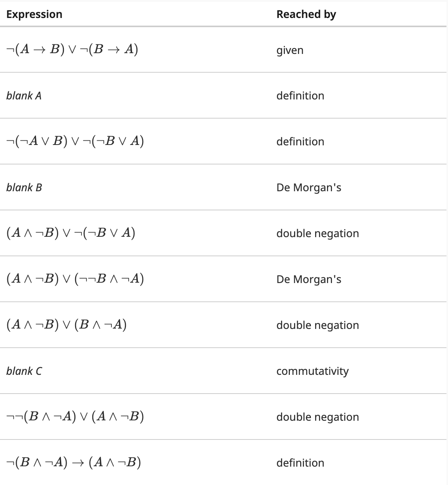
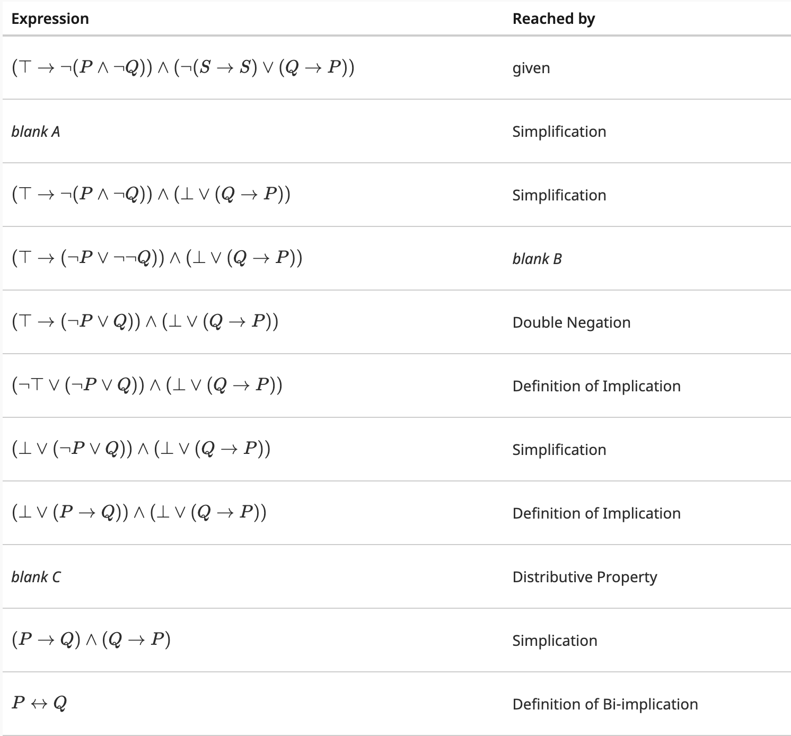

<!-- cd quizzes
pandoc -s -o weekend-quizzes.pdf weekend-quizzes.md -->
# Weekend Quizzes

This is the work that I did for the weekend quizzes. Hopefully I go back into my notes to correct the answers I get wrong (Most likely not). Or hopefully i get a 100% every time. 

## Mod3Multi2

## Question 1 - Set of Counter-Examples

In this group of problems, you are given two statements, A and B. Select the most specific relationship between the two. (if that means A entails B, and B entails A, select that the two are equivalent). Define:

* P(x) is a predicate with a domain of $\mathbb{N}$
* C is a set of counter-examples for when P is not true, so $C = \{n \vert n \in \mathbb{N} \land \neg P(n)\}$

### Question 1.1

* Statement A: $(C = \emptyset)$
* Statement B: $(\not\exists_a \in \mathbb{N} . \neg P(a))$

Options:

* A entails B
* B entails A
* A and B are equivalent
* A and B constitute a contradiction
* none of the above

My answer: A and B are equivalent

### Question 1.2

* Statement A: $(C = \emptyset)$
* Statement B: $(\exists_a \in \mathbb{N} . a \not\in C)$

Options:

* A entails B
* B entails A
* A and B are equivalent
* A and B constitute a contradiction
* none of the above

My answer: A entails B

### Question 1.3

* Statement A: $(C = \emptyset)$
* Statement B: $(\not\exists_a \in \mathbb{N} . P(a))$

Options:
* A entails B
* B entails A
* A and B are equivalent
* A and B constitute a contradiction
* none of the above

My answer: A and B constitute a contradiction

### Question 1.4

* Statement A: $(C = \emptyset)$
* Statement B: $(\forall_a \in \mathbb{N} . P(a) \leftrightarrow P(a-1))$

Options:
* A entails B
* B entails A
* A and B are equivalent
* A and B constitute a contradiction
* none of the above

My answer: none of the above

### Question 1.5

* Statement A: $(C = \emptyset)$
* Statement B: $(\forall_a \in \mathbb{Z}^+ . P(a) \rightarrow P(a-1))$

Options:
* A entails B
* B entails A
* A and B are equivalent
* A and B constitute a contradiction
* none of the above

My answer: none of the above

### Question 1.6

* Statement A: $(C = \emptyset)$
* Statement B: $(\forall_a \in C . P(a))$

Options:
* A entails B
* B entails A
* A and B are equivalent
* A and B constitute a contradiction
* none of the above

My answer: equivalent

## Question 2

To which of the following sets does the Well-Ordering principle apply?

### Question 2.1

Does the well-ordering principle apply to the following set?

$\{x - y \vert (x \in \mathbb{N}) \land (y \in \mathbb{Z}) \land (x > 2y)\}$

* yes

### Question 2.2

Does the well-ordering principle apply to the following set?

$\mathbb{Z} \backslash \mathbb{N}$? 

* no

### Question 2.3

Does the well-ordering principle apply to the following set?

* $\mathbb{Z} \cap \mathbb{N}$?

* yes

### Question 2.4

Does the well-ordering principle apply to the following set?

$\{2x-y \vert (x \in \mathbb{N}) \land (y \in \mathbb{Z}) \land (2x > y)\}$?

* yes

### Question 2.5

Does the well-ordering principle apply to the following set?

$\mathbb{N}^2$

* no

### Question 2.6

Does the well-ordering principle apply to the following set?

$\{x^2 \vert x \in \mathbb{Z}\}$?

* yes

## Question 3 - Summation Notation

Select which is equivalent to each expression. Assume function f(x) is defined for all natural numbers including 0. 

### Question 3.1

$\sum_{x=-5}^{-6} x^2 = $?

* None of these (0)

### Question 3.2

$(\sum_{i=0}^{6} 2i) + (\sum_{i=6}^{n} 2i) = $?

Options:

* $2(\sum_{i=0}^{n} (i+6))$
* $\sum_{i=0}^{n} 2i$
* $\sum_{i=1}^{n} 2i$
* $2(\sum_{i=0}^{n} i) + 6$
* $2((\sum_{i=0}^{n} i) + 6)$
* none of the above.

My answer: $2((\sum_{i=0}^{n} i) + 6)$
the correct answer is: none of these, but the answer above is probably what they're shooting for. They didn't consider that the base value is 42 no matter what.

### Question 3.3

$\sum_{i=0}^{n} f(i) = $?

Options:
* $(\sum_{i=0}^{n-2} f(i)) + f(n) + f(n-1) + f(n-2)$
* None of these
* $(\sum_{i=0}^{n-2} f(i)) + f(n-1)$
* $(\sum_{i=0}^{n-2} f(i)) + f(n-2)$
* $(\sum_{i=0}^{n-2} f(i)) + f(n)$
* $(\sum_{i=0}^{n-2} f(i)) + f(n) + f(n-1)$

My answer: $(\sum_{i=0}^{n-2} f(i)) + f(n) + f(n-1)$

## Question 4 - WOP, Entailment, and Equivalence

Select whether each of the following statements is equivalent, is entailed by, or has no such relation to the Well-Ordering Principle. Let variable $S$ refer to a set.

### Question 4.1

How is the following statement related to the Well-Ordering Principle?

"All non-empty subsets of the naturals have a greatest element"

Options:

* The well-ordering principle entails this statement
* They are equivalent
* They are not related

My answer: they are not related

### Question 4.2

How is the following statement related to the well-ordering principle?

$\forall S \subseteq \mathbb{N} . (\exists_x \in \mathbb{N} . x \in S) \rightarrow (\exists_x \in S . \forall_y \in S . x \le y)$

Options:

* They are equivalent
* They are not related
* the well-ordering principle entails this statement

My answer: they are equivalent

### Question 4.3

How is the following statement related to the well-ordering principle?

"All non-empty subsets of the naturals have a second smallest element"

Options:

* They are equivalent
* They are not related
* the well-ordering principle entails this statement

My answer: not related

### Question 4.4

How is the following statement related to the well-ordering principle?

"All non-empty subsets of the rationals have a lest element"

Options:

* They are equivalent
* They are not related
* the well-ordering principle entails this statement

My answer: not related

### Question 4.5

How is the following statement related to the well-ordering principle?

"All non-empty proper subsets of the naturals have a least element"

Options:

* They are equivalent
* They are not related
* the well-ordering principle entails this statement

My answer: entailed

### Question 4.6

How is the following statement related to the well-ordering principle?

$\forall S \subseteq \mathbb{N} . (S \neq \emptyset) \rightarrow (\exists_y \in S . \forall_x \in S . x \le y)$

My answer: equivalent

### Question 4.7

How is the following statement related to the well-ordering principle?

$\forall S \subseteq \mathbb{N} . (S \neq \emptyset) \rightarrow (\forall_y \in S . \exists_x \in S . x \le y)$

Options:

* They are equivalent
* They are not related
* the well-ordering principle entails this statement

my answer: entails 

## Mod3Multi1

### Question 1

Which of the following constitutes a contradiction? Assume A(x) is a predicate defined for all integers, and that _S_ is a non-empty finite subset of the integers.

* $(\forall_x \in \mathbb{Z} . A(x)) \land (\exists_x \in \mathbb{N} . \neg A(x))$
* $(\forall_x \in \mathbb{N} . A(x) ) \land (\exists_x \in \mathbb{Z} . \neg A(x))$
* $(\forall_x \in S . A(x)) \land (\exists_x \in \mathbb{Z} . \neg A(x))$
* $(\forall_x \in \mathbb{N} . A(x)) \land (\exists_x \in S . \neg A(x))$
* none of these

* 1

### Question 2

Answer the questions below concernign the relation in which two positive integers greater than 1 are related if they are coprime, meaning C(x, y) : gcd(x, y) = 1.

#### Question 2.1 - Reflexivity

Select which property below applies to the "coprime" relation defined over positive integers greater than 1 as $C(x, y) : gcd(x, y) = 1$ (reflexive, irreflexive, none of the other options)

* Irreflexive

#### Question 2.2 - Symmetry

Select which property below applies to the "coprime" relation defined over positive integers greater than 1 as $C(x, y) : gcd(x, y) = 1$ (Symmetric, antisymmetric, asymmetric, none of the other options)

* Symmetric

##### Question 2.3 - Transitivity

Is the "coprime" relation, defined over the positive integers greater than 1 as $C(x, y) : gcd(x, y) = 1$, transitive?

* no

### Question 3 - "Evenly Divides" Relation

Answer the questions below concerning the relation in which two positive integers are related if the first one evenly divides the second one, meaning $V(x, y) : \frac{y}{x} \in \mathbb{Z}$.

#### Question 3.1 - Reflexivity

Select which property below applies to the relation defined over positive integers as $V(x, y) : \frac{y}{x} \in \mathbb{Z}$ (reflexive, irreflexive, none of the other options, both)

* Reflexive

#### Question 3.2 - Symmetry

Select which property below applies to the relation defined over the positive integers as $V(x, y) : \frac{y}{x} \in \mathbb{Z}$ (Symmetric, antisymmetric, asymmetric, none of the other option, more than one option)

* Antisymmetric

### Question 4

For each subquestion below, indicate whether or not it constitutes a contradiction. In each sub-problem:

* S and R are non-empty subsets of $\mathbb{Z}$.
* A(x), B(x) and C(x) are predicates over the domain $\mathbb{Z}$ that are sometimes true and sometimes false
* _n_ and _m_ are members of $\mathbb{Z}^+$. 

#### Question 4.1

Is $(S \cap R = \emptyset) \land (\forall_a \in \mathbb{Z} . a \in S) \land (\exists_a \in \mathbb{Z} . a \in R)$ a contradiction?

* no 

#### Question 4.2

Is $(S \cap R = \emptyset) \land (\exists_a \in \mathbb{Z} . a \not\in S \land a \not\in R)$ a contradiction?

* no

#### Question 4.3

Is $(\forall_x \in S . \exists_y \in R . gcd(x, y) = 1) \land (\not \exists_x \in R . \text{ x is prime })$ a contradiction?

* no

#### Question 4.4

Is $(\forall_x \in \S . A(x)) \land (\forall_x \not\in S . A(x))$ a contradiction?

* yes

#### Question 4.5 

Is $(\forall_x \in S . A(x) \rightarrow B(x)) \land (\forall_x \in S . B(x) \rightarrow C(x)) \land (\exists_x \in S . A(x) \land \neg C(x))$ a contradiction?

* yes

#### Question 4.6  

Is $\neg(\text{ n divides m}) \land \neg(\text{ m divides n}) \land (gcd(n, m) > 1)$ a contradiction?

* no

### Question 5 

Which of the following statements is entailed by the Fundamental Theorem of Arithmetic? 

1. $\forall_x \in \mathbb{Z}^+ . \forall_y \in \mathbb{Z}^+ .(gcd(x, y) = 1) \rightarrow (x \neq y)$
1. $\forall_x \in \mathbb{Z}^+ . \forall_y \in \mathbb{Z}^+ .(x \neq y) \rightarrow (\exists_z \in \mathbb{Z}^+ . (z \text{ divides } x ) \oplus (z \text{ divides } y))$
1. Every member of $\mathbb{Z}^+$ has at least one prime factor.

* 2

### Question 6

Which of the following expressions represent cases that produce a correct proof of $\forall_x \in \mathbb{Z} . P(x)$? 

#### Question 6.1 

Does this expression $(\forall_x \in \mathbb{N} . P(x)) \land (\forall_x \in \mathbb{N} . P(-x))$ entail $\forall_x \in \mathbb{Z} . P(x)$?

* yes

#### Question 6.2

Let S = {x | x is prime}. Does $(\forall_x \in S . \forall_y \in \mathbb{Z} . x \text{ divides } y \rightarrow P(y)) \land P(1) \land P(-1)$ entail $\forall_x \in \mathbb{Z} . P(x)$?

* yes

#### Question 6.3

Let S = {x | x is prime}. Does $(\forall_x \in S . \forall_y \in \mathbb{Z} . x \text{ divides } y \rightarrow P(y)) \land P(0)$ entail $\forall_x \in \mathbb{Z} . P(x)$?

* no

### Question 7

Which of the following are prime factors of 48? 

* {2, 3}

### Question 8

Is the following proposition true or false? 

Every member of the set $\mathbb{Z}^+ \backslash \{1\}$ has at least 2 integers which divide it. 

* true

### Question 9

for the following subquestions, consider the prime factorization of the value $k = 3^08^29^215^5$

#### Question 9.1

What is the multiplicity of 2 in the prime factorization of $k$?

* 6

#### Question 9.2

What is the multiplicity of 3 in the prime factorization of $k$?

* 9

## Mod2Multi2

### Question 1: The "Everything but equals" relation

Answer the questions below concerning the relation in which all pairs of integers are related, except for the pairs of equal integers, $R(x, y) : (x < y) \lor (x > y)$

#### Question 1.1 

Select the properties below that apply to the relation defined over the integers defined as follows: $R(x, y) : (x < y) \lor (x > y)$ (reflexive, irreflexive, none of the other options)

* Irrreflexive 

#### Question 1.2

Select all the properties below that apply to the relation defined over integers as $R(x, y) : (x < y) \lor (x > y)$ (Symmetric, antisymmetric, asymmetric, none of the other options)

* Symmetric

### Question 1.3

Is the relation defined over the integers as $R(x, y) : (x < y) \lor (x > y)$ transitive?

* no

### Question 2 - Disjoint Relation 

Answer the questions below concerning the relation in which two subsets of integers are related if they are disjoint, meaning $D(A, B) : \vert A \cap B \vert = 0$. This means two sets A and B are related by D if they have an empty intersection, $A \cap B = \emptyset$.

#### Question 2.1 

Select all the properties that apply to the relation defined over subsets of integers as $D(A, B): \vert A \cap B \vert = 0$ (reflexive, irreflexive, none of the other options)

* Irreflexive

* CORRECT ANSWER: NEITHER

#### Question 2.2

Select all the properties below that apply to the relation defined over subsets of integers as $D(A, B) : \vert A \cap B \vert = 0$ (Symmetric, antisymmetric, asymmetric, none of the other options)

* Symmetric

#### Question 2.3

Consider the "is disjoint" relation defined as $D(A, B) : \vert A \cap B \vert = 0$. Is this relation transitive?

* no

#### Question 2.4 

Consider the "is disjoint" relation defined as $D(A, B) : \vert A \cap B \vert = 0$. If set Q and set R are related by D, pick one of the six.

1. $\forall_x \in \mathbb{Z} . (x \in Q) \oplus (x \in R)$
1. $\forall_x \in \mathbb{Z} . (x \in Q) \lor \neg (x \in R)$
1. $\forall_x \in \mathbb{Z} . (x \in Q) \rightarrow \neg (x \in R)$
1. $\forall S \in P(\mathbb{Z}) . (S \subseteq Q) \rightarrow \neg (S \subseteq R)$
1. $\forall S \in P(\mathbb{Z}) . (S \subseteq Q) \lor \neg (S \subseteq R)$.
1. None of the other answer choices. 

* $\forall_x \in \mathbb{Z} (x \in Q) \rightarrow  
\neg(x \in R)$

#### Question 2.5

Consider the "is disjoint" relation defined as $D(A, B) : \vert A \cap B \vert = 0$. If set Q and set R are related by D, which of the following is entailed? 

1. $\vert Q \backslash R \vert = \vert Q \vert - \vert R \vert$
1. $\vert Q \times R \vert = \vert Q \vert^2$
1. $\vert Q \cup R \vert = \vert Q \vert * \vert R \vert$
1. $\vert Q \cup R \vert = \vert Q \vert + \vert R \vert$
1. $(\vert Q \cup R) \cap Q \vert = \vert Q \vert * \vert R \vert$
1. $\vert (Q \cup R) \cap Q \vert = \vert Q \vert + \vert R \vert$
1. None of the other answer choices.

* $\vert Q \cup R \vert = \vert Q \vert + \vert R \vert$

### Question 3 - "Equal Cardinalities" Relation

Answer the questions below concerning the relation in which ets of integers are related if and only if they have equal cardinalities, $E(A, B) : \vert A \vert = \vert B \vert$.

#### Question 3.1

Consider the relation defined over sets of integers as $E(A, B) : \vert A \vert = \vert B \vert$. Is this relation transitive? 

* yes

#### Question 3.2

Select all the properties below that apply to the relation defined over sets of integers as $E(A, B) : \vert A \vert = \vert B \vert$. (Symmetric, asymmetric, antisymmetric, none of the other options)?

* Symmetric

#### Question 3.3

Select all the properties below that apply to the relation defined over the sets of integers as $E(A, B) : \vert A \vert = \vert B \vert$. (Reflexive, irreflexive, none of the other options)?

* Reflexive

#### Question 3.4

Consider the "equal cardinalities" relation defined as $E(A, B) : \vert A \vert = \vert B \vert$. If set Q and set R are related by E, which of the following is entailed?

1. $\vert Q \cap R \vert = \vert Q \vert + \vert R \vert$
1. $\vert Q \cap R \vert > 0$
1. $\vert Q \cup R \vert = \vert Q \vert * \vert R \vert - \vert R \vert$
1. $\vert Q \cup R \vert = \vert Q \vert + \vert R \vert + \vert Q \cap R \vert$
1. $\vert Q \times R \vert = \vert Q \vert ^2$
1. $Q \times R = R \times Q$

* $\vert Q \times R \vert = \vert Q \vert ^2$

### Question 4

Define the function _f_ to be the floor function, with a domain of$\mathbb{R}$ (real numbers) and a codomain of $\mathbb{Z}$ (the integers), which 'rounds down' a real number -- that is $f(r) = x$ such that _x_ is an integer, and $0 \leq (r-x) < 1$. For example, $f(-1.3) = -2, f(0.2) = 0, \text{ and } f(4) = 4$.

#### Question 4.1

Which properties apply to function _f_? (total, not total)

* total

#### Question 4.2

Which of the following is a valid reasoning why _f_ is not surjective? (I.e. the answer you select must be true and demonstrate why _f_ is not surjective)

* _f_ is surjective  

#### Question 4.3 

Which of the following is a valid reasoning why _f_ is not injective? 

* $\exists_{x, y} \in \mathbb{R} . \exists_z \in \mathbb{Z} . (f(x) = z) \land (f(y) = ) \land \neg (x = y)$

### Question 5

Consider a function _p_ that maps members of its domain A = {1, 2, 3, 4} to members of its co-domain B = {1,2, 3, 5}. 

$$p(x) = {x \text{ if x < 3 }, 2 \text{ if x = 3 }}$$

#### Question 5.1

Which of the following is a valid reasoning why _p_ is not total?

* $\not\exists_y \in B . y = p(4)$

#### Question 5.2

Which of the following is a valid reasoning why _p_ is not surjective?

* None of the answer choices.

#### Question 5.3

Which of the following is valid reasoning why _p_ is not injective? 

* $(p(3) = 2) \land (p(2) = 2)$

### Question 6

Consider a function _c_ that maps subsets of the natural numbers to the naturals, and counts how many odd numbers there are in a set. For example, $c(\{1, 2, 3\}) = 2, c(\{1\}) = 1$, and $c(\emptyset) = 0$ Consider _c_ to have a domain of $P(\mathbb{N})$ and a codomain of $\mathbb{N}$.

#### Question 6.1

Is _c_ bijective?

* not bijective because it is not injective, but it is total.

#### Question 6.2

Which of the following is a valid reason why _c_ is surjective? 

* $\forall_y \in \mathbb{N} . \exists_x \in P(\mathbb{N}) . c(x) = y$

## Mod2Multi1

Assume the following symbols below. The domain is _all people._

|Symbol|Meaning|
|-|-|
M(x) | x is a medalist
A(x) | x is an athlete
C(x, y) | x coaches y
F(x, y) | x and y are friends 
T(x, y) | x and y are teammates
D(x, y) | x defeated y

Question 1.1: Translate the logic into english: $\exists_x . \forall_y M(y) \rightarrow C(x, y)$

* "There is a coach who has coached every medalist."

Question 1.2: Which of the following is equivalent ot the statement "Not all teammates are friends?"

* $\exists_x \exists_y T(x, y) \land \neg F(x, y)$

Question 1.3: Which of the following is equivalent to "Somebody who didn't win a medal defeated someone."

* $\exists_x \exists_y \neg M(x) \land D(x, y)$
* None of the other answer choices

Question 1.4: Which of the following are _equivalent_ to the statement "Nobody defeated everyone?"

* $\not\exists_x \forall_y D(x, y)$

Question 2: Suppose that the following are true:

* A, B and C are all finite subsets of the natural numbers: I.e. $A \subset \mathbb{N}, B \subset \mathbb{N}, C \subset \mathbb{N}$
* A, B, and C are all non-empty
* $A \subset B$
* The intersection of B and C is non-empty

Select true $\top$, false $\bot$, or "not enough information to answer" for each of the following.

Question 2.1 $\exists_x \in \mathbb{N} . (x \in A) \rightarrow (x \in B)$

* $\top$

Question 2.2 $\exists_x \in \mathbb{N} . (x \in B) \rightarrow (x \in A)$

* $\top$

Question 2.3: $\forall_x \in \mathbb{N} (x \in A) \rightarrow (x \in B)$

* $\top$

Question 2.4: $\forall_x \in \mathbb{N} (x \in B) \rightarrow (x \in A)$

* $\bot$

Question 2.5: $\forall_x \in \mathbb{N} (x \in B) \rightarrow (x \in C)$

* Not enough information to answer

Question 2.6: $\exists_x \in \mathbb{N} . (x \in B) \rightarrow (x \in C)$

* $\top$

Question 2.7: $\exists_x \in \mathbb{N} . (x \in B) \land (x \in C)$

* $\top$

Question 2.8: $\forall_x \in \mathbb{N} . (x \in B) \land (x \in C)$

* $\bot$

Question 2.9: $\exists_x \in \mathbb{N} . (x \in A) \land (x \in B)$

* $\top$

Question 2.10: $\forall_x \in \mathbb{N} . (x \in A) \land (x \in B)$

* $\bot$

Question 3: Suppose that each of the following is true:

* A, B, and C are all finite subsets of the natural numbers: I.e. $A \subset \mathbb{N}, B \subset \mathbb{N}, C \subset \mathbb{N}$
* A, B, and C are all non-empty
* A $\subseteq$ B

Let the following table define predicates P, Q, R all of which have the domain of the integers.

|Symbol|Meaning|
|-|-|
P(x) | $x \in A$
Q(y) | $y \in B$
R(z) | $z \in C$

Given these subsequent statements, answer the questions below with either true, false, or could be either true or false

Question 3.1: If we know Q(3) is true, then we know P(3) is...

* true

Question 3.2: If we know Q(3) is true then we know R(3) is...

* could be either true or false

Question 3.3: If we know P(3) is true, then we know R(3) is...

* false

Question 3.4: If we know R(3) is true, then we know P(3) is ...

* False

Question 3.5: If we know Q(3) is false, then we know P(3) is...

* false

Question 3.6: If we know $\neg(\exists_x \in B . R(x))$ is true, then we know

* $(\forall_x \in B . \neg R(x))$ is true

Question 3.7: If we know $\forall_x \in B . \neg R(x))$ is true, then we know... $(\forall_x \in B . P(x))$...

* could be either true or false

Question 4: Define a predicate H(x, y) which has two natural numbers as arguments, G(x) which has one natural number as an argument. Define set D = {1, 2, 3} and F = {3, 4}. Which of the following are true equivalences?

Q4.1: $\exists_x \in F . \neg G(x)$?

* $\neg G(3) \lor \neg G(4)$

Q4.2: Which is equivalent to $\forall_x \in F . G(x)$

* $G(3) \land G(4)$

Q4.3 Write boolean algebra that is equivalent to $\forall_x \in F . \exists_y \in D .H(x, y)?$

* 

DONE!

## Mod1Multi2

Q1: For each sub-question below, indicate whether the rule can nbe directly applied (with no intermediate steps) to the expression $((P \rightarrow Q) \rightarrow R) \lor (P \land Q)$

Q1.1: Double Negation

* Yes, this can be directly applied

Q1.2: Associativity

* No, this cannot be directly applied

Q1.3: Commutativity

* Yes, this can be directly applied

Q1.4: Definition of implication

* Yes, this can be directly applied

Q1.5: Distributive Law

* Yes, this can be directly applied

Q1.6: DeMorgan's Law

* No, this cannot be directly applied

Q1.7: Definition of Exclusive Or

* Recall that definition of exclusive or is $P \oplus Q \equiv (P \lor Q) \land \neg (P \land Q)$
* Therefore, no, this cannot be directly applied

Q1.8: Simplification

* No, this cannot be directly applied

Question 2: Which of the following is equivalent to $((P \land \neg P) \lor (P \rightarrow P)) \rightarrow ((P \land \neg P) \lor \bot)$

|equation| rule used|
|-|-|
$((P \land \neg P) \lor (P \rightarrow P)) \rightarrow ((P \land \neg P) \lor \bot)$ | Given
$((P \land \neg P) \lor (P \rightarrow P)) \rightarrow (\bot \lor \bot)$ |simplification
$((P \land \neg P) \lor (P \rightarrow P)) \rightarrow \bot$ | simplification
$((P \land \neg P) \lor \top) \rightarrow \bot$ | simplification
$(\bot \lor \top) \rightarrow \bot$ | simplification
$\top \rightarrow \bot$ | simplification
$\bot$ | simplification

Question 3: For each sub-question below, indicate which expressions are logically equivalent to:
$(\neg A \lor B) \land (\neg B \lor A)$

Q3.1: $(\neg A \lor B) \land \neg (B \land \neg A)$

* Yes, this is logically equivalent through use of demorgan and double negation: $(\neg A \lor B) \land \neg(B \land \neg A) \equiv (\neg A \lor B) \land (\neg B \lor \neg \neg A) \equiv (\neg A \lor B) \land (\neg B \lor A)$

Q3.2: $A \leftrightarrow B$

* Yes, this is logically equivalent through using definition of biimplication and definition of implication. $A \leftrightarrow B \equiv (A \rightarrow B) \land (B \rightarrow A) \equiv (\neg A \lor B) \land (\neg B \lor A)$

Q3.3: $A \lor (B \land \neg B)$ 

* $A \lor (B \land \neg B) \equiv A \lor \bot \equiv A$. Thus, not equivalent.
* $A \lor (B \land \neg B) \equiv (A \lor B) \land (A \lor \neg B) \not\equiv (\neg A \lor B) \land (\neg B \lor A)$. Also just distrubute to see it's not equivalent.

Q3.4 $\neg (\neg A \lor B) \lor (\neg B \land A)$

* $\neg (\neg A \lor B) \lor (\neg B \land A) \equiv (A \land B) \lor (\neg B \land A)$. Therefore not logically equivalent.

Question 4: For each sub-question below, indicate whether the rule can be directly applied (with no intermediate steps) to the expression $P \land (\neg P \lor Q)$. 

Q4.1: Double Negation

* Yes

Q4.2: Associativity

* No

Q4.3: Commutativity

* Yes

Q4.4: Definition of Implication 

* Yes

Q4.5: Distributive Law

* Yes

Q4.6: DeMorgan's Law

* No (need an intermediate double negation step)

Q4.7: Definition of Bi-Implication

* No

Q4.8: Definition of exclusive or

* No.

Q5: Which of the following is equivalent to $\neg ((\neg Q \lor Q) \rightarrow ((Q \leftrightarrow P) \oplus Q))$?
statement | rule used|
|-|-|
$\neg ((\neg Q \lor Q) \rightarrow ((Q \leftrightarrow P) \oplus Q))$ | given 
$\neg (\top \rightarrow ((Q \leftrightarrow P) \oplus Q))$ | simplification
$\neg (\neg \top \lor ((Q \leftrightarrow P) \oplus Q))$ | definition of implication
$\neg (\bot \lor ((Q \leftrightarrow P) \oplus Q))$ | simplification
$(\top \land \neg ((Q \leftrightarrow P) \oplus Q))$ | DeMorgan's
$(\top \land \neg (\neg(P \oplus Q) \oplus Q))$ | other definition of bi-imp
$\top \land \neg (\neg P \oplus (Q \oplus Q))$ | associative
$\top \land \neg (\neg P \oplus \bot)$ | simplification
$\top \land \neg \neg P$ | simplification
$P$ | double negation + simplification

The step between "other definition of bi-imp" and "associative" is a little sus but the truth tables check out so it makes sense. Plus, the truth table for the entire equation is: 

|q|p|$\neg ((\neg Q \lor Q) \rightarrow ((Q \leftrightarrow P) \oplus Q))$|
|-|-|-|
1|1|1
1|0|0
0|1|1
0|0|0

So, it looks like no matter what _q_ is, the value of the expression $\neg ((\neg Q \lor Q) \rightarrow ((Q \leftrightarrow P) \oplus Q))$ is always just _p_!

Q6: Which of the following expressions are equivalent to $(P \land Q) \lor (\neg R \leftrightarrow Q)$? 

Q6.1: $(P \land Q) \lor ((R \lor Q) \land (\neg Q \lor R))$

|expression|rule used|
|-|-|
$(P \land Q) \lor ((R \lor Q) \land (\neg Q \lor R))$ | given
$(P \land Q) \lor ((\neg R \rightarrow Q) \land (Q \rightarrow \neg R))$ | def bi implication
$(P \land Q) \lor ((R \lor Q) \land (\neg Q \lor R))$ | definition of implication (twice)

Not equivalent, consider the instance when p = 0, q = 1, and r = 0.

Q6.2: $(P \land Q) \lor (R \lor Q)$

|expression|rule used|
|-|-|
$(P \land Q) \lor (R \lor Q)$ | given
$((P \land Q) \lor R) \lor ((P \land Q) \lor Q)$ | distributive
$((P \land Q) \lor R) \lor (Q \lor (P \land Q))$ | commutative
$(P \land Q) \lor (R \lor Q) \lor (P \land Q)$ | associative
$((P \land Q) \lor (P \land Q)) \lor (R \lor Q)$ | associative and commutative in one step cuz im lazy
$(P \land Q) \lor (R \lor Q)$ | simplification

I just went in a circle there so I don't see any way to get to $\neg R \leftrightarrow Q)$. So I think they're not equivalent. Also consider the case where p = 0, q = 0, and r = 1; they're not the same.

6.3: $(P \land Q) \lor (R \oplus Q)$ 

|expression|rule used|
|-|-|
$(P \land Q) \lor (R \oplus Q)$ | given
$(P \land Q) \lor \neg(R \leftrightarrow Q)$ | simplification / xnor

Through truth tables these are equivalent.

6.4: $(P \lor R) \land (Q \lor R) \oplus (P \lor Q)$ 

|statement|rule|
|-|-|
$(P \lor R) \land (Q \lor R) \oplus (P \lor Q)$ | given
$(R \lor (Q \land P)) \oplus (P \lor Q)$ | associativity and distributive

There's no way! Therefore, not equivalent. Also check through truth tables, in the instance where p = 1, q = 1, and r = 0 they are not equivalent.

6.5: $(P \oplus R) \oplus (P \lor Q)$

* $\neg ((P \oplus R) \leftrightarrow (P \lor Q))$
* $\neg ( ((P \oplus R) \rightarrow (P \lor Q)) \land ((P \lor Q) \rightarrow (P \oplus R)))$
* $\neg((\neg(P \oplus R) \lor (P \lor Q) \land \neg (P \lor Q) \lor (P \oplus R)))$

Using truth tables, not equivalent. If $P = \top \land Q = \top \land R = \bot$, this is a counterexample.

For $(P \land Q) \lor (\neg R \leftrightarrow Q)$, you get $\bot$, but when you do the same for $(P \oplus R) \oplus (P \lor Q)$

Question 7: 

Which expressions are equivalent to $A \lor B$?

Q7.1 $(((A \land B) \lor B) \oplus (A \lor B)) \oplus B$

* yes (truth table)

Q7.2: $((A \lor B) \rightarrow (A \land B)) \oplus (A \land B)$

* No (truth table). In fact, it's the exact opposite truth table output.

Q7.3: $((\neg B \land A) \oplus \neg B) \lor (A \land B)$

* no (truth table)

Q7.4: $\neg (\neg (A \lor B) \land \neg A)$

* yes (truth table)

Q7.5: $(\neg (A \leftrightarrow B) \rightarrow B) \rightarrow B$

* Yes (truth table)

Q8: Consider the proof: 

Q8.1: What goes in blank A?

* $\neg(\neg A \lor B) \lor \neg (B \rightarrow A)$

Q8.2: What goes in blank B?

* $(\neg \neg A \land \neg B) \lor \neg (\neg B \lor A)$

Q8.3: What goes in blank C?

* $(B \land \neg A) \lor (A \land \neg B)$

Question 9: Consider the following proof: 

Q9.1: What is blank A?

* $(\top \rightarrow \neg (P \land \neg Q)) \land (\neg \top \lor (Q \rightarrow P))$

Q9.2: What is blank B?

* DeMorgan's

Q9.3: What is blank C?

* $\top \lor ((P \rightarrow Q) \land (Q \rightarrow P))$

## Mod1Multi1

Q1 Set builder Triple {x, y, z}: What is the cardinality of $\{\{x, y, z\} \vert (x \in \{0, 1, 2\}) \land (y \in \{0, 1, 2\}) \land (z \in \{1, 8\})\}$?

* An intuitive way to think about this problem is find the set of all sets where x can be either {0,1, 2}, y can be either {0, 1, 2} and z can be either {1, 8}. So here's the output of all of those, disregarding duplicates and stuff at first.
* {{0,0,1},{0,0,8},{0,1,1},{0,1,8},{0,2,1},{0,2,8},{1, 0, 1}, {1,0,8}, {1,1,1}, {1,1,8},{1,2,1},{1,2,8},{2,0,1},{2,0,8},{2,1,1},{2,1,8},{2,2,1},{2,2,8} }
* now, just cut down all the sets that have duplicate elements in them:
* {{0,1},{0,8},{0,1},{0,1,8},{0,2,1},{0,2,8},{0, 1}, {1,0,8}, {1}, {1,8},{2,1},{1,2,8},{2,0,1},{2,0,8},{2,1},{2,1,8},{2,1},{2,8} }
* now remove duplicate sets within the bigger set:
* {{0,1},{0,8},{0,1,8},{0,2,1},{0,2,8}, {1},{1,8},{2,1},{1,2,8},{2,8} }. The cardinality thus is 10.

Q2: What is the following set: $\{\{x\} \times \{y\} \vert x \in \{-1, 0,1, 2\} \land y \in \mathbb{N} \land y < x\}$

* This is the set of ordered pairs (x, y) such that $x \in \{-1, 0, 1, 2\} \land y \in \mathbb{N} \land y < x$
* {{(1, 0)}, {(2, 0)}, {(2,1)}}

Q3: For each subquestion below, indicate whether the provided set is disjoint with its own power set. Recall that a set is disjoint with another set when the only element it shares is teh empty set.

Q3.1 - $\{0, \{0\}\}$

* P($\{0, \{0\}\}$) = $\{\emptyset, \{0\}, \{\{0\}\}, \{0, \{0\}\}\}$
* since the original set and the power set of the original set both contain  the set {0}, They are not disjoint.

Q3.2 - $\{\{\}, 0\}$

* P($\{\{\}, 0\}$) = {{{}}, {0}}. Thus, the original set and its power set are NOT disjoint.

Q3.3 - $\{\{\}\}$

* P({ {} }) = { {} {{}} }. , the set is NOT disjoint with its own powerset.

Q3.4 - $\{\{0\}, \{1\}\}$

* P({ {0}, {1} }) = { {},  {{0}}, {{1}}, {{0}, {1}} }. Thus, this set is disjoint wtih its own powerset.

Q3.5 - $\{0, \{0\}, 1, \{1\}\}$

* P($\{0, \{0\}, 1, \{1\}\}$) = { {0}, {{0}}, {1}, {{1}},...etc}. I don't need to write it all out, but you can see that they are not disjoint.

Question 4 - each sub-question includes a blank. Fill in the blank with an operation that makes the statement true for every choice of _S_ that is a non-empty subset of the natural numbers. 

Q4.1 - $\vert S \vert$___$\vert S \times P(S)\vert$

* <

Q4.2 - $\vert S \vert$____$\vert S \times \{0\} \vert$

* =
* Since the cartesian product of any (non-empty) subset of the natural numbers with a set with one element produces a set with the cardinality of the subset of the natural numbers. So, it's equal!

Q4.3 - $\vert S \vert$____$\vert S \times \emptyset \vert$

* $>$

Q4.4 - $\vert S \vert$____$\{\{x, y\} \vert x \in S \land y \in S \land y = x\} \vert$

* =

Question 5 - is {3, 5} a subset? For each of the choices below, indicate whether {3,5} $\subset S$

Q5.1 - S = {1, 3, 5, 7} $\cap$ {1, 2, 3, 4}

* S = {1, 3} -> {3, 5} is not a proper subset of S.

Q5.2 - S={1, 3, 5, 7} \ {1, 2, 3, 4}

* S = {5, 7} -> {3,5} is not a proper subset of S

Q5.3 - S = {1, 3, 5, 7} $\cup$ {1, 2, 3, 4}

* S = {1, 2, 3, 4, 5, 7}, so $\{3, 5\} \subset S$ is true!

Q5.4 - S = {1, 2, 3, 4} $\cap$ {5, 7}

* S = {}, so $\{3, 5\} \subset S$ is false.

Q5.5 - S = {1, 2, 3, 4} \ {5, 7}

* S = {1, 2, 3, 4}, so $\{3, 5\} \subset S$ is false.

Q5.6 - S = {1, 2, 3, 4} $\cup$ {5, 7}

* S = {1, 2, 3, 4, 5, 7}, so $\{3, 5\} \subset S$ is True!

5.7 - $S = \{x-y \vert (x, y) \in (\{8\} \times \{3, 5\})\}$

* First of all, $\{8\} \times \{3, 5\}$ is {(8, 3), (8, 5)}. So, S = {8-3, 8-5} = {5, 3} = {3, 5}. Therefore, $\{3, 5\} \subset S$ is false. 

5.8 - S = $\mathbb{N}$

* $\{3, 5\} \subset S$ is true

5.9 - S = $\mathbb{Z} \backslash \mathbb{N}$

* $\{3, 5\} \subset S$ is false, since $\mathbb{Z} \backslash \mathbb{N}$ is the negative integers.

5.10 - $S = \mathbb{N} \backslash \mathbb{Z}$ 

* $\{3, 5\} \subset S$ is false since $\mathbb{N} \backslash \mathbb{Z}$ is the empty set. 

Question 6 - Elements of P({0, P({0})})

Select all elements of the set P({0,P({0})})

* First, what is P({0,P({0})})? Let's break it down first. We need to first solve P({0}).
    * P({0}) = {{}, {0}}
* Next, we need to find P({0, {{},{0}} }). This is the set containinig four elements:
    1. the empty set -> $\emptyset$
    1. the set containing 0 -> $\{0\}$
    1. the set containing $\{\emptyset,\{0\}\}$ -> $\{\{\emptyset, \{0\}\}\}$
    1. the set $\{0, \{\emptyset, \{0\}\}\}$
* So, the final output is $\{\emptyset, \{0\}, \{\{\emptyset, \{0\}\}, \{0, \{\emptyset, \{0\}\}\}$

Thus:

Q6.1 - $0 \in P(\{0,P(\{0\})\})$?

* False

Q6.2 - $\{0\} \in P(\{0,P(\{0\})\}$? 

* True

Q6.3 - $\{\{0\}\} \in P(\{0,P(\{0\})\}$? 

* False

Q6.4 - $\emptyset \in P(\{0,P(\{0\})\}$? 

* True

Q6.5 - $\{\emptyset \} \in P(\{0,P(\{0\})\}$?

* False

Q6.6 - $\{\{\empty \}\} \in P(\{0,P(\{0\})\}$? 

* False

Q6.7 - $\{\{\{0\}, \emptyset \}\} \in P(\{0,P(\{0\})\}$? 

* True

6.8 - $\{0, \{\emptyset, \{0\}\}\} \in P(\{0,P(\{0\})\}$? 

* True

Question 7 - Select exactly the elements of the set $\{0\} \times \{0, \{0\}\}$. 

First of all, we need to find what the cartesian product actually is. We know that the outcome of a cartesian product is a set of ordered pairs. So, we can evaluate it imagining it as a table to get this output:

* $\{0\} \times \{0, \{0\}\} = \{(0,0), (0, \{0\})\}$.

Q7.1 - $\emptyset \in \{0\} \times \{0, \{0\}\}$

* False

Q7.2 - $0 \in \{0\} \times \{0, \{0\}\}$

* False

Q7.3 - $(\emptyset) \in \{0\} \times \{0, \{0\}\}$ 

* False

Q7.4 - $(0,0) \in \{0\} \times \{0, \{0\}\}$

* True

Q7.5 - Same as Q7.2

Q7.6 - $(0, \{0\}) \in \{0\} \times \{0, \{0\}\}$ 

* True

Q7.7 - $(\{0\}, \{0\}) \in \{0\} \times \{0, \{0\}\}$

* False

Question 8 - What is the cardinality of $\vert (A \times B) \cap (B \times A) \vert$ where A = {1, 2, 3} and B = {2, 3}?

Break the problem down into parts. 

* $(A \times B)$ = {(1, 2), (1, 3), (2, 2), (2, 3), (3, 2), (3, 3)}
* $(B \times A)$ = {(2, 1), (2, 2), (2, 3), (3, 1), (3, 2), (3, 3)}
* $(A \times B) \cap (B \times A)$ = {(3, 3), (2, 2), (3, 2), (2, 3)}
* $\vert (A \times B) \cap (B \times A) \vert$ = 4

